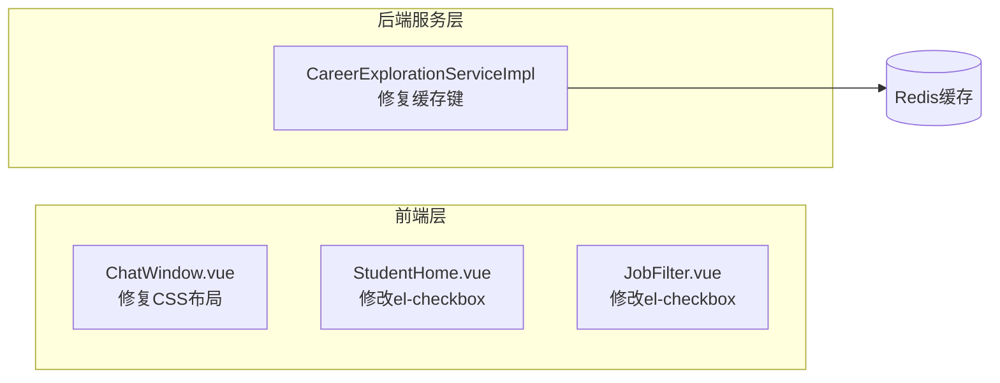

## 需求描述

修复"方向探索"模块的3个问题：

1. **头像和对话内容位置颠倒**：在ChatWindow组件中，用户消息(.user)的头像和气泡位置左右颠倒，头像在气泡左边而非右边。

2. **不同问题返回相同回答**：方向探索API调用时，Redis缓存键只包含用户ID("explore:1")，不包含用户输入的偏好文本内容，导致同一用户的后续提问都命中缓存，返回首次结果，实际DeepSeek API未被调用。

3. **el-checkbox label属性弃用警告**：Element Plus控制台警告显示label属性将在3.0.0版本弃用，需替换为value属性或插槽内容。

## 修复范围

- ChatWindow.vue（CSS布局）
- CareerExplorationServiceImpl.java（缓存键逻辑）
- StudentHome.vue、JobFilter.vue（el-checkbox用法）

## 技术栈

- **前端**：Vue 3 + TypeScript + Element Plus + SCSS
- **后端**：Spring Boot 3 + Java 17 + MyBatis-Plus + Redis
- **AI集成**：DeepSeek API + Redis缓存

## 实现方案

### 问题1：ChatWindow头像位置颠倒

**方案**：移除 `.message.user` 的 `flex-direction: row-reverse`。

**原理**：当前.user消息的HTML顺序是 `[msg-body] → [user-avatar]`，加上 `row-reverse` 后视觉顺序变为 `[avatar] → [bubble]`，导致头像在左侧、气泡在右侧，位置颠倒。去掉 `row-reverse` 后自然呈现 `[bubble] → [avatar]`（头像在右侧），符合聊天UI规范。

**影响范围**：仅修改CSS，不影响任何JS逻辑。

### 问题2：缓存键不含用户输入

**方案**：在缓存键中加入用户偏好文本的SHA-256哈希摘要。

**原理**：当前缓存键 `"explore:" + userId` 对同一个用户的所有提问都相同，第一次请求缓存后后续全部命中。加入偏好文本哈希后，不同提问生成不同缓存键，保证每个新提问都调用API。

**实现细节**：

- 在 `CareerExplorationServiceImpl` 中添加私有 `sha256Hex()` 辅助方法（使用Java内置的 `MessageDigest`，无需引入新依赖）
- 将第60行改为 `String cacheKey = "explore:" + userId + ":" + sha256Hex(req.getPreferences());`
- 对null或空文本使用空字符串哈希

### 问题3：el-checkbox label弃用警告

**方案**：按Element Plus官方建议修改两处：

1. **StudentHome.vue** 第163-164行：`label="附近"` / `label="最新"` 改为默认插槽传递文本，因这两个checkbox的v-model是boolean类型，label仅作显示文本用。

- `<el-checkbox v-model="onlyNear" size="small">附近</el-checkbox>`
- `<el-checkbox v-model="onlyNew" size="small">最新</el-checkbox>`

2. **JobFilter.vue** 第20行：`:label="d"` 改为 `:value="d"`，因 `el-checkbox-group` 中 label 被用作选项值。

- `<el-checkbox v-for="d in directions" :key="d" :value="d">{{ d }}</el-checkbox>`

**无需修改**：RegisterView.vue和LoginView.vue中的el-checkbox未使用label属性，无警告。

## 架构设计

三个问题相互独立、无依赖关系，可并行或顺序修改：



## 目录结构

被修改的文件列表：

```
软件实训项目-code/
├── frontend/src/
│   ├── components/
│   │   ├── common/
│   │   │   └── ChatWindow.vue       # [MODIFY] 移除.user的flex-direction: row-reverse
│   │   └── job/
│   │       └── JobFilter.vue        # [MODIFY] :label替换为:value
│   └── views/student/
│       └── StudentHome.vue          # [MODIFY] label属性内容移至插槽
└── backend/src/main/java/com/xuelian/career/service/impl/
    └── CareerExplorationServiceImpl.java  # [MODIFY] 缓存键加入偏好文本哈希
```

## Agent Extensions

### SubAgent

- **code-explorer**
- 用途：已用于搜索项目中所有 el-checkbox 使用位置，辅助精确定位问题文件
- 预期结果：找到所有 el-checkbox 标签所在文件及行号

### Skills（按执行顺序引用）

- **subagent-driven-development**：用于遵循执行计划，在会话中按步骤依次完成三个独立问题的修复，每个任务独立验证
- **systematic-debugging**：用于在遇到任何bug或测试失败时先系统性地调试，再提出修复方案