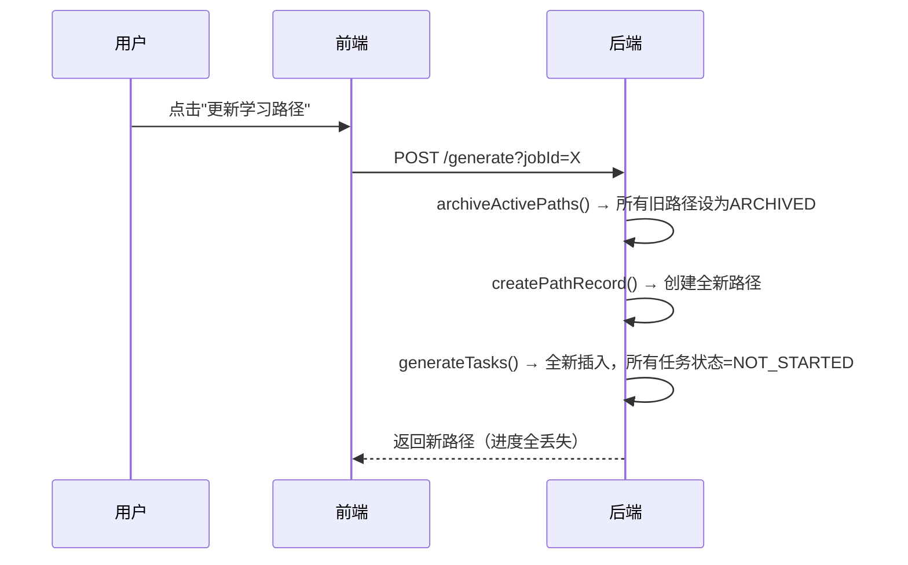
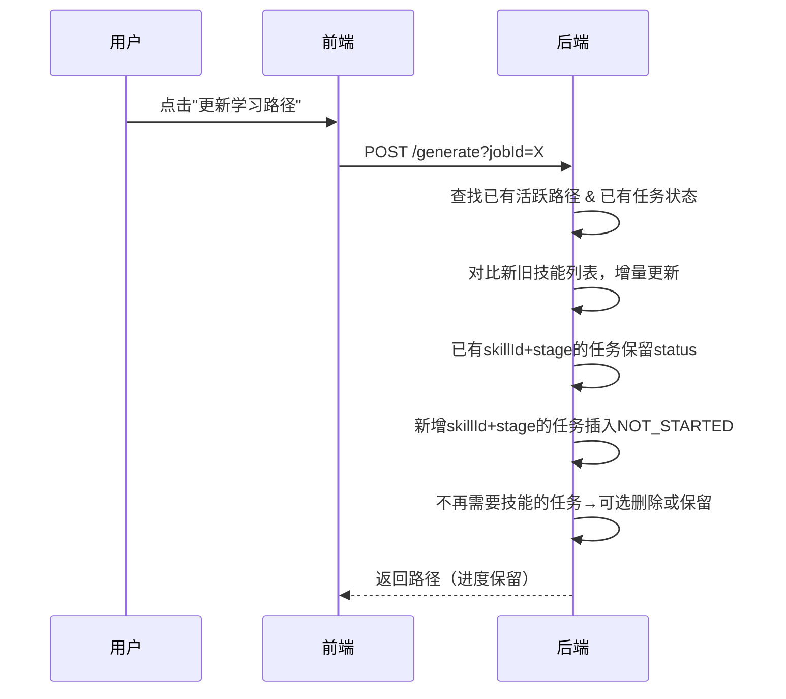

# 学习路径模块综合修复计划

## 问题汇总

| 编号 | 问题 | 严重程度 | 影响范围 |
|------|------|---------|---------|
| P1 | 不同岗位生成学习路径不能切换 | 高 | 用户流程断点 |
| P2 | 多岗位合并不能显示对应岗位需求 | 高 | 多岗位场景不可用 |
| P3 | 学习技能太少，未覆盖岗位需求 | 中 | 学习路径质量 |
| P4 | 技能学习完没有测试验证 | 中 | 功能缺失 |
| P5 | 直接进入不显示具体路径，需先选择再进入 | 高 | 用户体验 |
| P6 | 更新学习路径丢失已有学习状态 | 严重 | 数据丢失 |

---

## 方案设计

### P6（最核心）: 更新学习路径不丢失进度

#### 现状


#### 目标


#### 改动点（后端）

**`LearningPathServiceImpl.java` — 核心改造**

1. **`generatePath(userId, jobId)`**: 不再调用 `archiveActivePaths()`
   - 改为先查询该用户该 jobId 是否已有 ACTIVE 路径
   - 已有 → 复用路径ID，调用新的 `refreshTasks(pathId, userId, skills)`
   - 没有 → 创建新路径，调用 `generateTasks()`

2. **新增 `refreshTasks(pathId, userId, skills)`** 方法:
   ```java
   private void refreshTasks(Long pathId, Long userId, List<Skill> newSkills) {
       // 1. 查询该路径已有旧任务
       List<LearningTask> existingTasks = taskMapper.selectList(
           new LambdaQueryWrapper<LearningTask>()
               .eq(LearningTask::getPathId, pathId));
       
       // 2. 建立 Map<skillId+"_"+stage, existingTask>
       Map<String, LearningTask> existingMap = existingTasks.stream()
           .collect(Collectors.toMap(t -> t.getSkillId() + "_" + t.getStage(), t -> t));
       
       // 3. 遍历新技能组合，保留已有进度
       int order = getMaxSortOrder(pathId);
       Set<String> newKeys = new HashSet<>();
       for (String stage : STAGES) {
           for (Skill skill : newSkills) {
               String key = skill.getId() + "_" + stage;
               newKeys.add(key);
               List<LearningResource> resources = resourceMapper.selectList(/* LIMIT放宽到5 */);
               
               if (existingMap.containsKey(key)) {
                   // 保留已有任务状态，只更新内容
                   LearningTask existing = existingMap.get(key);
                   existing.setTitle(res.getTitle());
                   existing.setDescription(res.getDescription());
                   existing.setResourceUrl(res.getUrl());
                   // status 保持不变！不重置为 NOT_STARTED
                   taskMapper.updateById(existing);
               } else {
                   // 真正的"新"任务，插入 NOT_STARTED
                   insertNewTask(pathId, userId, skill, ..., "NOT_STARTED");
               }
           }
       }
       
       // 4. 删除不再需要的技能任务（可选：保留ARCHIVED状态）
       // 或者标记为 OBSOLETE 状态，用户可见但提示"已被新版替代"
   }
   ```

3. **合并生成和独立生成**都使用相同的 `refreshTasks` 逻辑

4. `archiveActivePaths()` **只保留给"重置"场景**，新增独立接口 `POST /reset` 或按钮文案区分。

#### 改动点（前端）

1. **区分"更新"和"重新生成"**
   - "更新学习路径" → 调用现有的 `generate` 接口，保留进度
   - 新增"重新生成"次级操作 → 调用新接口 `POST /learning/reset`，归档旧路径创建全新路径
   - 在UI上清晰显示区别

---

### P5: 路径选择+进入具体路径

#### 方案：路由拆分 + 路径选择页

**新增路由配置**（`router/index.ts`）:
```typescript
{ path: '/student/learning-path', name: 'LearningPathList', component: () => import('@/views/student/LearningPathListView.vue') },
{ path: '/student/learning-path/:pathId', name: 'LearningPathDetail', component: () => import('@/views/student/LearningPathDetailView.vue') }
```

**LearningPathListView.vue**（新增）:
- 显示用户所有 ACTIVE 学习路径列表
- 每条路径显示：
  - 岗位名称（targetJobId → jobTitle）
  - 阶段进度：各阶段完成百分比
  - 总进度百分比 + 进度条
  - 任务数量 + 已完成/总数量
  - 创建时间
- 点击进入 `/student/learning-path/:pathId` 详情页

**LearningPathDetailView.vue**（从原 LearningPathView 提取）:
- 接受 `pathId` 参数
- 显示该路径的四阶段时间线
- 任务管理（切换状态、跳转资源）
- 如果有多条路径，显示面包屑导航/返回按钮回到列表

**HeaderBar.vue 链接**:
- "学习路径"链接→ `/student/learning-path`（列表页）
- 从差距分析/测评结果页跳转 → 直接带 `pathId` 进入详情页

---

### P1: 不同岗位路径切换

**现状**: 从岗位A的差距分析点"生成学习路径"→ 归档A的路径 → 生成岗位B的路径，A的路径丢失。

**解决方案**:

1. **后端改造**: `generatePath(userId, jobId)` 改为按jobId查找已有路径:
   - 已有该jobId的ACTIVE路径 → 刷新任务（保留进度）
   - 没有该jobId的ACTIVE路径 → 创建新路径

2. **跳转逻辑优化**:
   - 从差距分析页跳转时：`router.push(/student/learning-path/${pathId})`
   - 如果该jobId已有路径，直接跳转到该路径详情
   - 如果没有，先生成再跳转

3. **GapAnalysisView.vue 的 goToLearningPath() 改造**:
   ```typescript
   async function goToLearningPath() {
     if (!report.value) return
     loading.value = true
     try {
       if (report.value.mode === 'multi') {
         const ids = Array.from(selectedJobIds.value).join(',')
         // 调用多岗位生成，返回路径ID
         const res: any = await generateLearningPathMulti(Array.from(selectedJobIds.value), 'SEPARATE')
         const paths = res.data || []
         router.push(`/student/learning-path`)
       } else {
         const jobId = report.value.jobId || selectedJobId.value
         // 先查是否已有该岗位的路径
         const pathsRes: any = await getLearningPaths()
         const existing = (pathsRes.data || []).find((p: any) => p.targetJobId === jobId)
         if (existing) {
           router.push(`/student/learning-path/${existing.id}`)
         } else {
           // 没有则生成
           const genRes: any = await generateLearningPath(jobId)
           const newPath = genRes.data
           router.push(`/student/learning-path/${newPath.id}`)
         }
       }
     } finally {
       loading.value = false
     }
   }
   ```

---

### P2: 多岗位合并路径标注岗位需求

#### 后端改造

1. **LearningTask 新增字段**: `sourceJobIds`（JSON格式，存储该技能对应的岗位ID列表）
   - 或者通过 gap_report 的 `sourceJobs` 信息回传

2. **LearningPath 新增字段**: `jobIds`（JSON，存储该路径涉及的所有岗位ID）

3. **`getPathMeta(pathId)` 增强**:
   ```java
   @Override
   public Map<String, Object> getPathMeta(Long pathId) {
       // 已有逻辑：获取path、jobTitle
       // 新增：获取该路径下各技能对应的来源岗位
       List<LearningTask> tasks = taskMapper.selectList(/* pathId */);
       Set<Long> skillIds = tasks.stream().map(LearningTask::getSkillId).collect(toSet());
       // 通过 job_skill_requirement 反查 skillId → jobId 映射
       List<JobSkillRequirement> reqs = requirementMapper.selectList(/* skillIds in */);
       Map<Long, List<Long>> skillToJobs = reqs.stream()
           .collect(groupingBy(JobSkillRequirement::getSkillId, mapping(JobSkillRequirement::getJobId, toList())));
       // 获取岗位名称
       // ...
       meta.put("skillJobMap", skillToJobNames); // skillId → [岗位名列表]
       return meta;
   }
   ```

4. **新增接口** `GET /api/student/learning/path/{id}/skills-matrix`:
   - 返回该路径所有技能与岗位的矩阵映射

#### 前端改造

1. **任务卡片新增"岗位来源"标签**:
   ```html
   <div class="task-job-tags" v-if="task.sourceJobs?.length">
     <el-tag v-for="job in task.sourceJobs" :key="job" size="small" type="info">
       {{ job }}
     </el-tag>
   </div>
   ```

2. **路径详情头部显示覆盖岗位列表**:
   ```html
   <div class="path-jobs" v-if="pathMeta.skillJobMap">
     <span class="pj-label">覆盖岗位：</span>
     <el-tag v-for="(jobs, skillId) in pathMeta.skillJobMap" :key="skillId">
       {{ jobs.join('、') }}
     </el-tag>
   </div>
   ```

3. **加载路径时拉取 meta**:
   ```typescript
   async function loadPathMeta(pathId: number) {
     const res: any = await getLearningPathMeta(pathId)
     pathMeta.value = res.data || {}
   }
   ```

---

### P3: 扩大学习技能覆盖

#### 后端改造

1. **`generateTasks()` 中放宽 LIMIT 限制**:
   ```java
   // 从 LIMIT 2 改为 LIMIT 5 或者不限制
   // 1个技能每阶段最多5个学习资源
   .last("LIMIT 5")
   ```

2. **按 stage 分组排序，每个技能每个阶段至少1个任务**:
   - 如果没有对应 stage 的 learning_resource，自动生成任务标题：
   ```java
   // 当没有 learning_resource 时，用技能名+阶段生成默认任务
   if (resources.isEmpty()) {
       String defaultTitle = skill.getName() + " - " + stageLabel(stage);
       // 插入一个占位任务
       insertTask(path.getId(), userId, skill.getId(), defaultTitle, null, stage, "NOT_STARTED", order++);
   }
   ```

3. **`getSkillsForJob` 优化**: 确保获取岗位要求的全部技能，不限制数量
   - 当前 `requirementMapper.selectList` 没有 limit，问题可能出在：
     - 数据本身 skill 不够多
     - 或 `distinct().limit(8)` 在无 jobId 时的兜底中
   - 需要确保 job_skill_requirement 表数据完整

4. **排序优化**: 短板技能优先保留，但每个技能至少分到一定数量任务

---

### P4: 技能学习后测试

#### 方案：启用 TEST_PASSED 状态 + 简单测试入口

1. **后端新增**: `POST /api/student/learning/tasks/{id}/test`
   - 生成简单的选择题测试（3-5题）
   - 可使用 DeepSeek API 根据任务title和skill生成题目
   - 也可以从预设题库中抽取

2. **前端改造**:
   - 任务状态新增"去测试"中间状态
   - 已完成学习的任务显示"去测试"按钮
   - 测试通过后状态变为 `TEST_PASSED`
   - 测试界面以弹窗形式展示

3. **状态流转**:
   ```
   NOT_STARTED → IN_PROGRESS → LEARNING_COMPLETED → [去测试] → TEST_PASSED
   ```

4. **学习进度计算**:
   - 当前：完成率 = LEARNING_COMPLETED / 总数
   - 改为：完成率 = (LEARNING_COMPLETED * 0.5 + TEST_PASSED * 1.0) / 总数
   - 更精确反映掌握程度

---

## 实施计划

### 阶段一（核心修复 — P6 + P5）

| 序号 | 任务 | 文件 | 预估工时 |
|------|------|------|---------|
| 1.1 | 后端：`archiveActivePaths` 只保留给重置；`generatePath` 改为复用/刷新策略 | LearningPathServiceImpl.java | 2h |
| 1.2 | 后端：新增 `refreshTasks()` 保留已有任务状态 | LearningPathServiceImpl.java | 1.5h |
| 1.3 | 前端：新增 LearningPathListView 路径选择页 | 新增文件 | 2h |
| 1.4 | 前端：改造 LearningPathDetailView 为接受 pathId 参数 | 从原LearningPathView改造 | 1.5h |
| 1.5 | 前端：路由配置 + HeaderBar 链接更新 | router/index.ts, HeaderBar.vue | 0.5h |

### 阶段二（针对性增强 — P1 + P2）

| 序号 | 任务 | 文件 | 预估工时 |
|------|------|------|---------|
| 2.1 | 后端：generatePath 按jobId查找已有路径复用 | LearningPathServiceImpl.java | 1h |
| 2.2 | 后端：getPathMeta 增加 skill→job 映射 | LearningPathServiceImpl.java | 1h |
| 2.3 | 后端：新增 /path/{id}/skills-matrix 接口 | LearningPathController.java | 0.5h |
| 2.4 | 前端：goToLearningPath 改为查已有路径再跳转 | GapAnalysisView.vue | 1h |
| 2.5 | 前端：任务卡片显示岗位来源标签 | LearningPathDetailView.vue | 1h |

### 阶段三（质量提升 — P3 + P4）

| 序号 | 任务 | 文件 | 预估工时 |
|------|------|------|---------|
| 3.1 | 后端：放宽LIMIT到5，无资源时自动生成默认任务 | LearningPathServiceImpl.java | 1h |
| 3.2 | 后端：新增测试生成接口 | LearningPathController + Service | 2h |
| 3.3 | 前端：状态流转支持 TEST_PASSED | LearningPathDetailView.vue | 1.5h |
| 3.4 | 前端：测试弹窗组件 | 新增组件 | 2h |
| 3.5 | 前端：进度计算包含测试通过率 | LearningPathDetailView.vue | 0.5h |

### 预估总工时: 约19h（3-4天）

---

## 用户侧效果预览

### 修复后
```
Q: 我学了岗位A的路径50%，现在去岗位B生成路径，A的进度还在吗？
A: 在的。每个岗位独立路径，生成新路径不会影响已有路径的进度。

Q: 怎么区别"更新"和"重新生成"？
A: "更新"保留已有学习状态，只补充新任务；"重新生成"会清除旧路径创建全新的。
   更新是默认操作，重新生成有二次确认。

Q: 合并路径能看到每个技能对应哪些岗位吗？
A: 可以。每个任务卡片上会标注"该技能来自XX岗位/XX岗位"的标签。

Q: 学习完任务后怎么确认掌握？
A: 任务从"学习中"改为"已完成"后，会显示"去测试"按钮。
   通过测试后任务标记为"测试通过"，进度计算更准确。

Q: 直接点导航栏的"学习路径"能看到什么？
A: 会先显示你的所有学习路径列表，选择一条进入查看详情。
```
