# 基于 DeepSeek 大模型的 AI 智能求职辅导平台概要设计说明书 V1.0

## 文档头部信息

| 项目 | 内容 |
|---|---|
| 项目名称 | 基于 DeepSeek 大模型的 AI 智能求职辅导平台 |
| 密级 | 仅供收件方查阅 |
| 项目编号 | Project ID_INIT_003 |
| 版本 | V1.0 |
| 文档编号 | Project ID_SD_HLD_001 |
| 文档名称 | 基于 DeepSeek 大模型的 AI 智能求职辅导平台概要设计说明书 V1.0 |
| 编制单位 | 武汉学链科技有限公司 |
| 编制日期 | 2026-05-29 |

| 拟制 | | 日期 | |
| 评审人 | | 日期 | |
| 批准 | | 日期 | |

## 修订记录 Revision Record

| 日期 | 修订版本 | CR/Defect号 | 修改章节 | 修改描述 | 作者 |
|---|---|---|---|---|---|
| 2026-05-29 | V1.0 | - | 全文 | 初始版本，基于需求规格说明书 V1.0 编写 | 成员B |

---

## 目录

1. 简介
2. 概要设计
3. 数据结构/数据库设计
4. 界面设计
5. 出错处理设计
6. 需求覆盖与架构评估

---

## Keywords 关键词

AI 智能求职辅导、DeepSeek 大模型、Spring Boot 3、Vue 3、REST API、微服务单体架构、能力差距分析、岗位匹配推荐

## Abstract 摘要

本文档为"基于 DeepSeek 大模型的 AI 智能求职辅导平台"的概要设计说明书，依据《需求规格说明书 V1.0》编写。文档描述了系统的整体架构设计（采用前后端分离 + 单体后端 + Docker Compose 部署方案）、L0/L1 层设计、各功能模块的详细分解（含 Controller、Service、DTO 等核心类与方法定义）、REST API 接口规范、数据库表结构设计、页面布局说明以及出错处理策略。预期读者包括开发人员、测试人员、项目管理人员及评审人员。

## List of abbreviations 缩略语清单

| 缩略语 | 英文全名 | 中文解释 |
|---|---|---|
| AI | Artificial Intelligence | 人工智能 |
| API | Application Programming Interface | 应用程序接口 |
| DTO | Data Transfer Object | 数据传输对象 |
| VO | View Object | 视图对象 |
| JWT | JSON Web Token | JSON Web 令牌 |
| ORM | Object-Relational Mapping | 对象关系映射 |
| RAG | Retrieval-Augmented Generation | 检索增强生成 |
| REST | Representational State Transfer | 表述性状态转移 |
| RBAC | Role-Based Access Control | 基于角色的访问控制 |
| MVP | Minimum Viable Product | 最小可行产品 |
| JD | Job Description | 岗位描述 |
| HR | Human Resource | 人力资源 |

---

# 1 简介

## 1.1 目的

本文档用于明确 AI 智能求职辅导平台 V1.0 的系统架构、模块分解、接口定义、数据库设计和界面布局，为后续详细设计、编码实现、测试和验收提供技术依据。

预期读者包括：
- 后端开发人员：了解模块划分、类设计、API 规范
- 前端开发人员：了解页面布局、组件交互、API 对接
- 测试人员：了解系统结构、接口定义，制定测试计划
- 项目管理人员：了解技术方案和开发工作量
- 评审人员/指导老师：评审技术方案合理性

## 1.2 范围

### 1.2.1 软件名称

**基于 DeepSeek 大模型的 AI 智能求职辅导平台**（简称：AI 智能求职辅导平台）

### 1.2.2 软件功能

本系统 V1.0 实现以下功能：

**包括的功能：**

| 角色 | 功能模块 | 说明 |
|---|---|---|
| 学生用户 | 注册登录、求职画像、职业能力测评、AI 职业方向探索、岗位匹配推荐、能力差距分析、学习路径规划、简历智能优化、AI 模拟面试、学习进度展示 | MVP 核心闭环 |
| 企业 HR | 注册登录、项目需求解析、岗位建议、候选人推荐、推荐理由展示 | 亮点演示 |
| 管理员 | 用户管理、岗位技能词典维护、基础运营数据看板 | 基础管理 |
| 智能客服 | 平台使用问答、岗位介绍问答、学习建议文字问答 | 基础辅助 |

**不包括的功能：**
- 移动 App、小程序端
- 真实招聘平台数据接入
- 语音客服、人工客服工单流转
- 高校管理后台完整业务闭环
- 企业端完整招聘流程（复杂转化漏斗、批量邀约、录用管理）
- 多租户、复杂权限审批、商业支付结算

### 1.2.3 软件应用

本系统应用于大学生求职辅导领域，面向三类用户：
- **大学生/应届毕业生**：通过 AI 辅助完成职业定位、能力评估、学习规划和求职准备
- **企业 HR**：通过 AI 解析项目需求，快速获得岗位建议和候选人推荐
- **平台管理员**：维护基础数据，监控平台运营状态

产品环境为 Web 浏览器（桌面端优先），不开发移动原生应用。

## 1.3 参考资料

| 序号 | 文档名称 | 版本 | 说明 |
|---|---|---|---|
| 1 | 基于 DeepSeek 大模型的 AI 智能求职辅导平台需求规格说明书 | V1.0 | 需求基线 |
| 2 | Spring Boot 3 官方文档 | 3.x | 后端框架参考 |
| 3 | Vue 3 官方文档 | 3.x | 前端框架参考 |
| 4 | MyBatis-Plus 官方文档 | 3.5.x | ORM 框架参考 |
| 5 | Element Plus 官方文档 | 2.x | UI 组件库参考 |
| 6 | DeepSeek API 文档 | - | AI 服务接口参考 |
| 7 | Docker Compose 官方文档 | - | 容器化部署参考 |

---

# 2 概要设计

## 2.1 第0层设计描述

### 2.1.1 软件系统上下文定义

系统与外部实体的交互关系如下：

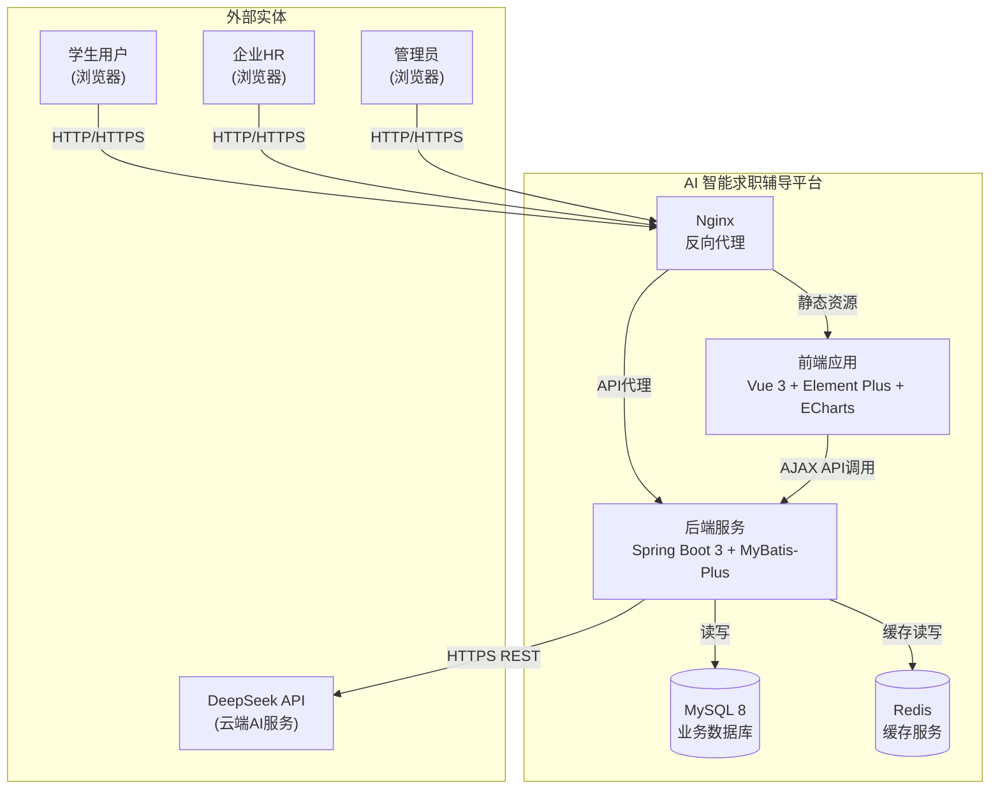
```mermaid
graph TB
    subgraph External["外部实体"]
        Student["学生用户<br/>(浏览器)"]
        HR["企业HR<br/>(浏览器)"]
        Admin["管理员<br/>(浏览器)"]
        DeepSeek["DeepSeek API<br/>(云端AI服务)"]
    end

    subgraph System["AI 智能求职辅导平台"]
        Frontend["前端应用<br/>Vue 3 + Element Plus + ECharts"]
        Backend["后端服务<br/>Spring Boot 3 + MyBatis-Plus"]
        MySQL[("MySQL 8<br/>业务数据库")]
        Redis[("Redis<br/>缓存服务")]
        Nginx["Nginx<br/>反向代理"]
    end

    Student -->|HTTP/HTTPS| Nginx
    HR -->|HTTP/HTTPS| Nginx
    Admin -->|HTTP/HTTPS| Nginx
    Nginx -->|静态资源| Frontend
    Nginx -->|API代理| Backend
    Backend -->|读写| MySQL
    Backend -->|缓存读写| Redis
    Backend -->|HTTPS REST| DeepSeek
    Frontend -->|AJAX API调用| Backend
```

**交互说明：**

| 外部实体 | 交互方式 | 数据流向 | 说明 |
|---|---|---|---|
| 学生用户 | 浏览器 HTTP/HTTPS | 双向 | 访问学生端页面，使用求职辅导功能 |
| 企业 HR | 浏览器 HTTP/HTTPS | 双向 | 访问企业端页面，输入项目需求获取推荐 |
| 管理员 | 浏览器 HTTP/HTTPS | 双向 | 访问管理端页面，维护基础数据 |
| DeepSeek API | HTTPS REST API | 双向 | 后端调用 AI 服务进行智能分析 |

### 2.1.2 设计思路

#### （1）架构设计思路

系统采用**前后端分离 + 单体后端**架构，主要设计考量：

| 架构决策 | 选择 | 理由 |
|---|---|---|
| 架构模式 | 前后端分离 + 单体后端 | 3 人团队 30 天交付，单体后端开发效率高，前后端分离便于并行开发 |
| 前端框架 | Vue 3 + Vite + Element Plus | 生态成熟，组件丰富，学习曲线平缓 |
| 后端框架 | Spring Boot 3 + MyBatis-Plus | Java 生态主流，ORM 便捷，开发效率高 |
| 数据库 | MySQL 8 | 结构化数据场景合适，团队熟悉 |
| 缓存 | Redis | 会话管理、验证码、AI 结果缓存 |
| AI 集成 | DeepSeek API + Prompt 模板 | 云端调用，本地不部署大模型，降低硬件要求 |
| 认证方案 | JWT Token | 无状态认证，适合前后端分离 |
| 部署方案 | Docker Compose 单机部署 | 一键启动，适合演示和实训交付 |

**层与层之间关系：**

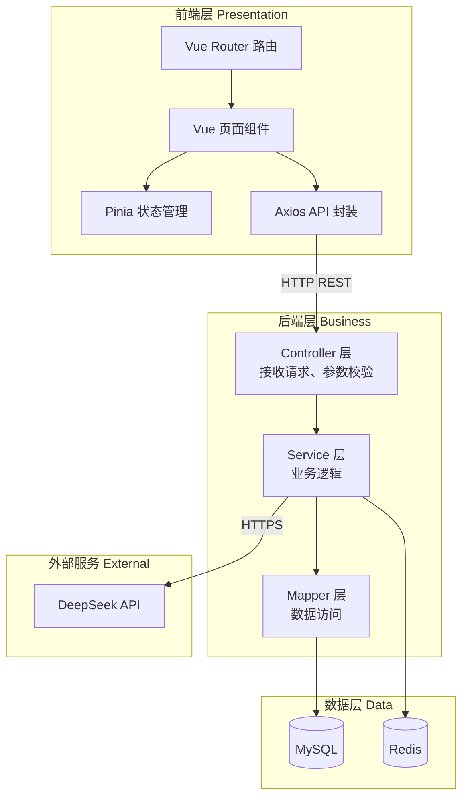
```mermaid
graph TB
    subgraph "前端层 Presentation"
        Pages["Vue 页面组件"]
        Stores["Pinia 状态管理"]
        Router["Vue Router 路由"]
        API["Axios API 封装"]
    end

    subgraph "后端层 Business"
        Controller["Controller 层<br/>接收请求、参数校验"]
        Service["Service 层<br/>业务逻辑"]
        Mapper["Mapper 层<br/>数据访问"]
    end

    subgraph "数据层 Data"
        MySQL[("MySQL")]
        Redis[("Redis")]
    end

    subgraph "外部服务 External"
        DeepSeek["DeepSeek API"]
    end

    Pages --> Stores
    Pages --> API
    Router --> Pages
    API -->|HTTP REST| Controller
    Controller --> Service
    Service --> Mapper
    Service -->|HTTPS| DeepSeek
    Mapper --> MySQL
    Service --> Redis
```

#### （2）程序框架与目录结构

**后端目录结构（Spring Boot 3）：**

```
src/main/java/com/xuelian/career/
├── CareerApplication.java              # 启动类
├── config/                             # 配置类
│   ├── SecurityConfig.java             # Spring Security 安全配置
│   ├── JwtConfig.java                  # JWT 配置
│   ├── RedisConfig.java                # Redis 配置
│   ├── MyBatisPlusConfig.java          # MyBatis-Plus 配置
│   ├── WebMvcConfig.java               # CORS 跨域配置
│   └── DeepSeekConfig.java             # DeepSeek API 配置
├── controller/                         # 控制器层
│   ├── AuthController.java             # 认证控制器
│   ├── StudentController.java          # 学生端控制器
│   │   ├── ProfileController.java      # 求职画像
│   │   ├── AssessmentController.java   # 能力测评
│   │   ├── CareerExplorationController.java  # 职业方向探索
│   │   ├── JobMatchingController.java  # 岗位匹配
│   │   ├── GapAnalysisController.java  # 差距分析
│   │   ├── LearningPathController.java # 学习路径
│   │   ├── ResumeController.java       # 简历优化
│   │   └── InterviewController.java    # 模拟面试
│   ├── EnterpriseController.java       # 企业端控制器
│   ├── AdminController.java            # 管理端控制器
│   └── CustomerServiceController.java  # 智能客服控制器
├── service/                            # 服务层接口
│   ├── AuthService.java
│   ├── UserService.java
│   ├── ProfileService.java
│   ├── AssessmentService.java
│   ├── CareerExplorationService.java
│   ├── JobMatchingService.java
│   ├── GapAnalysisService.java
│   ├── LearningPathService.java
│   ├── ResumeService.java
│   ├── InterviewService.java
│   ├── EnterpriseService.java
│   ├── AdminService.java
│   ├── CustomerServiceService.java
│   └── DeepSeekService.java            # DeepSeek API 调用服务
├── service/impl/                       # 服务层实现
│   ├── AuthServiceImpl.java
│   ├── UserServiceImpl.java
│   ├── ProfileServiceImpl.java
│   ├── AssessmentServiceImpl.java
│   ├── CareerExplorationServiceImpl.java
│   ├── JobMatchingServiceImpl.java
│   ├── GapAnalysisServiceImpl.java
│   ├── LearningPathServiceImpl.java
│   ├── ResumeServiceImpl.java
│   ├── InterviewServiceImpl.java
│   ├── EnterpriseServiceImpl.java
│   ├── AdminServiceImpl.java
│   ├── CustomerServiceServiceImpl.java
│   └── DeepSeekServiceImpl.java
├── mapper/                             # 数据访问层
│   ├── UserMapper.java
│   ├── CareerProfileMapper.java
│   ├── SkillMapper.java
│   ├── JobPositionMapper.java
│   ├── JobSkillRequirementMapper.java
│   ├── AssessmentQuestionMapper.java
│   ├── AssessmentResultMapper.java
│   ├── RecommendationRecordMapper.java
│   ├── LearningPathMapper.java
│   ├── LearningResourceMapper.java
│   ├── LearningTaskMapper.java
│   ├── ResumeAnalysisMapper.java
│   ├── InterviewRecordMapper.java
│   └── FaqMapper.java
├── entity/                             # 数据库实体
│   ├── User.java
│   ├── CareerProfile.java
│   ├── Skill.java
│   ├── JobPosition.java
│   ├── JobSkillRequirement.java
│   ├── AssessmentQuestion.java
│   ├── AssessmentResult.java
│   ├── RecommendationRecord.java
│   ├── LearningPath.java
│   ├── LearningResource.java
│   ├── LearningTask.java
│   ├── ResumeAnalysis.java
│   ├── InterviewRecord.java
│   └── Faq.java
├── dto/                                # 数据传输对象
│   ├── request/                        # 请求 DTO
│   │   ├── LoginRequest.java
│   │   ├── RegisterRequest.java
│   │   ├── ProfileRequest.java
│   │   ├── AssessmentSubmitRequest.java
│   │   ├── CareerExplorationRequest.java
│   │   ├── JobMatchingRequest.java
│   │   ├── GapAnalysisRequest.java
│   │   ├── LearningPathRequest.java
│   │   ├── ResumeAnalysisRequest.java
│   │   ├── InterviewRequest.java
│   │   ├── EnterpriseRecommendRequest.java
│   │   └── CustomerServiceRequest.java
│   └── response/                       # 响应 DTO
│       ├── ApiResponse.java            # 统一响应结构
│       ├── LoginResponse.java
│       ├── ProfileResponse.java
│       ├── AssessmentReportResponse.java
│       ├── CareerDirectionResponse.java
│       ├── JobMatchResponse.java
│       ├── GapReportResponse.java
│       ├── LearningPathResponse.java
│       ├── ResumeOptimizeResponse.java
│       ├── InterviewReportResponse.java
│       ├── EnterpriseRecommendResponse.java
│       └── DashboardResponse.java
├── vo/                                 # 视图对象
│   ├── UserVO.java
│   ├── SkillGapVO.java
│   ├── RadarChartVO.java
│   ├── CandidateVO.java
│   └── JobSuggestionVO.java
├── common/                             # 公共组件
│   ├── Result.java                     # 统一返回结果
│   ├── PageResult.java                 # 分页结果
│   ├── BusinessException.java          # 业务异常
│   └── GlobalExceptionHandler.java     # 全局异常处理
├── enums/                              # 枚举类
│   ├── UserRole.java                   # 用户角色
│   ├── SkillLevel.java                 # 技能等级
│   ├── TaskStatus.java                 # 任务状态
│   ├── AssessmentDimension.java        # 测评维度
│   ├── LearningStage.java              # 学习阶段
│   └── InterviewType.java              # 面试类型
├── util/                               # 工具类
│   ├── JwtUtil.java                    # JWT 工具
│   ├── PasswordUtil.java               # 密码加密工具
│   ├── FileUtil.java                   # 文件处理工具
│   └── PromptTemplateUtil.java         # Prompt 模板工具
└── interceptor/                        # 拦截器
    ├── JwtInterceptor.java             # JWT 认证拦截器
    └── RoleInterceptor.java            # 角色权限拦截器

src/main/resources/
├── application.yml                     # 主配置文件
├── application-dev.yml                 # 开发环境配置
├── application-prod.yml                # 生产环境配置
├── db/
│   └── init.sql                        # 初始化 SQL 脚本
└── prompts/                            # Prompt 模板文件
    ├── career_exploration.txt          # 职业方向探索 Prompt
    ├── resume_optimize.txt             # 简历优化 Prompt
    ├── mock_interview.txt              # 模拟面试 Prompt
    ├── project_parse.txt               # 项目需求解析 Prompt
    └── customer_service.txt            # 智能客服 Prompt
```

**前端目录结构（Vue 3 + Vite）：**

```
src/
├── main.js                             # 入口文件
├── App.vue                             # 根组件
├── router/                             # 路由配置
│   └── index.js                        # 路由定义
├── stores/                             # Pinia 状态管理
│   ├── user.js                         # 用户状态
│   ├── profile.js                      # 求职画像状态
│   └── assessment.js                   # 测评状态
├── api/                                # API 封装
│   ├── request.js                      # Axios 实例与拦截器
│   ├── auth.js                         # 认证 API
│   ├── student.js                      # 学生端 API
│   ├── enterprise.js                   # 企业端 API
│   ├── admin.js                        # 管理端 API
│   └── customerService.js              # 客服 API
├── views/                              # 页面组件
│   ├── login/
│   │   └── LoginView.vue               # 登录页
│   ├── register/
│   │   └── RegisterView.vue            # 注册页
│   ├── student/
│   │   ├── StudentHome.vue             # 学生首页
│   │   ├── ProfileView.vue             # 求职画像
│   │   ├── AssessmentView.vue          # 能力测评
│   │   ├── CareerExplorationView.vue   # 职业方向探索
│   │   ├── JobMatchingView.vue         # 岗位匹配推荐
│   │   ├── GapAnalysisView.vue         # 能力差距分析
│   │   ├── LearningPathView.vue        # 学习路径
│   │   ├── LearningProgressView.vue    # 学习进度展示
│   │   ├── ResumeOptimizeView.vue      # 简历优化
│   │   └── InterviewView.vue           # 模拟面试
│   ├── enterprise/
│   │   ├── EnterpriseHome.vue          # 企业首页
│   │   └── RecommendView.vue           # 项目推荐
│   ├── admin/
│   │   ├── AdminHome.vue               # 管理首页
│   │   ├── UserManagement.vue          # 用户管理
│   │   ├── SkillDictionary.vue         # 技能词典维护
│   │   └── Dashboard.vue               # 数据看板
│   └── customer/
│       └── CustomerServiceView.vue     # 智能客服
├── components/                         # 公共组件
│   ├── layout/
│   │   ├── AppLayout.vue               # 主布局
│   │   ├── Sidebar.vue                 # 侧边栏
│   │   └── HeaderBar.vue               # 顶部导航
│   ├── charts/
│   │   ├── RadarChart.vue              # 雷达图组件
│   │   ├── GapMatrix.vue               # 差距矩阵组件
│   │   └── ProgressBar.vue             # 进度条组件
│   └── common/
│       ├── FileUpload.vue              # 文件上传组件
│       ├── SkillTag.vue                # 技能标签组件
│       └── ChatWindow.vue              # 对话窗口组件
├── assets/                             # 静态资源
│   └── styles/
│       └── global.scss                 # 全局样式
└── utils/                              # 工具函数
    └── index.js                        # 公共工具方法
```

---

## 2.2 第1层设计描述

### 2.2.1 系统结构

#### 2.2.1.1 系统结构描述

系统整体分为 6 大功能模块：


```mermaid
graph TB
    Platform["AI 智能求职辅导平台"]

    Platform --> M1["M1 用户认证模块"]
    Platform --> M2["M2 学生求职辅导模块"]
    Platform --> M3["M3 企业项目推荐模块"]
    Platform --> M4["M4 管理后台模块"]
    Platform --> M5["M5 智能客服模块"]
    Platform --> M6["M6 AI 集成模块"]

    M1 --> M1F1["F1.1 注册"]
    M1 --> M1F2["F1.2 登录"]
    M1 --> M1F3["F1.3 密码重置"]

    M2 --> M2F1["F2.1 求职画像"]
    M2 --> M2F2["F2.2 能力测评"]
    M2 --> M2F3["F2.3 AI 职业方向探索"]
    M2 --> M2F4["F2.4 岗位匹配推荐"]
    M2 --> M2F5["F2.5 能力差距分析"]
    M2 --> M2F6["F2.6 学习路径规划"]
    M2 --> M2F7["F2.7 简历智能优化"]
    M2 --> M2F8["F2.8 AI 模拟面试"]

    M3 --> M3F1["F3.1 项目需求解析"]
    M3 --> M3F2["F3.2 岗位建议生成"]
    M3 --> M3F3["F3.3 候选人推荐"]

    M4 --> M4F1["F4.1 用户管理"]
    M4 --> M4F2["F4.2 技能词典维护"]
    M4 --> M4F3["F4.3 数据看板"]

    M5 --> M5F1["F5.1 平台使用问答"]
    M5 --> M5F2["F5.2 岗位介绍问答"]
    M5 --> M5F3["F5.3 学习建议问答"]

    M6 --> M6F1["F6.1 Prompt 模板管理"]
    M6 --> M6F2["F6.2 DeepSeek API 调用"]
    M6 --> M6F3["F6.3 AI 结果缓存与兜底"]
```

#### 2.2.1.2 业务流程说明

**学生端核心业务流程：**

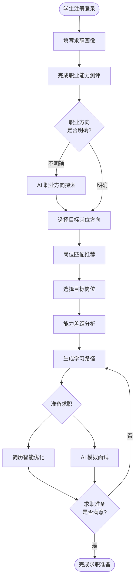
```mermaid
flowchart TD
    Start([学生注册登录]) --> A[填写求职画像]
    A --> B[完成职业能力测评]
    B --> C{职业方向<br/>是否明确?}
    C -->|不明确| D[AI 职业方向探索]
    D --> E[选择目标岗位方向]
    C -->|明确| E
    E --> F[岗位匹配推荐]
    F --> G[选择目标岗位]
    G --> H[能力差距分析]
    H --> I[生成学习路径]
    I --> J{准备求职}
    J --> K[简历智能优化]
    J --> L[AI 模拟面试]
    K --> M{求职准备<br/>是否满意?}
    L --> M
    M -->|否| I
    M -->|是| End([完成求职准备])
```

**企业端业务流程：**

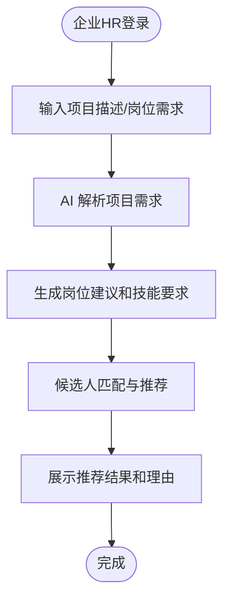
```mermaid
flowchart TD
    Start([企业HR登录]) --> A[输入项目描述/岗位需求]
    A --> B[AI 解析项目需求]
    B --> C[生成岗位建议和技能要求]
    C --> D[候选人匹配与推荐]
    D --> E[展示推荐结果和理由]
    E --> End([完成])
```

**管理端业务流程：**

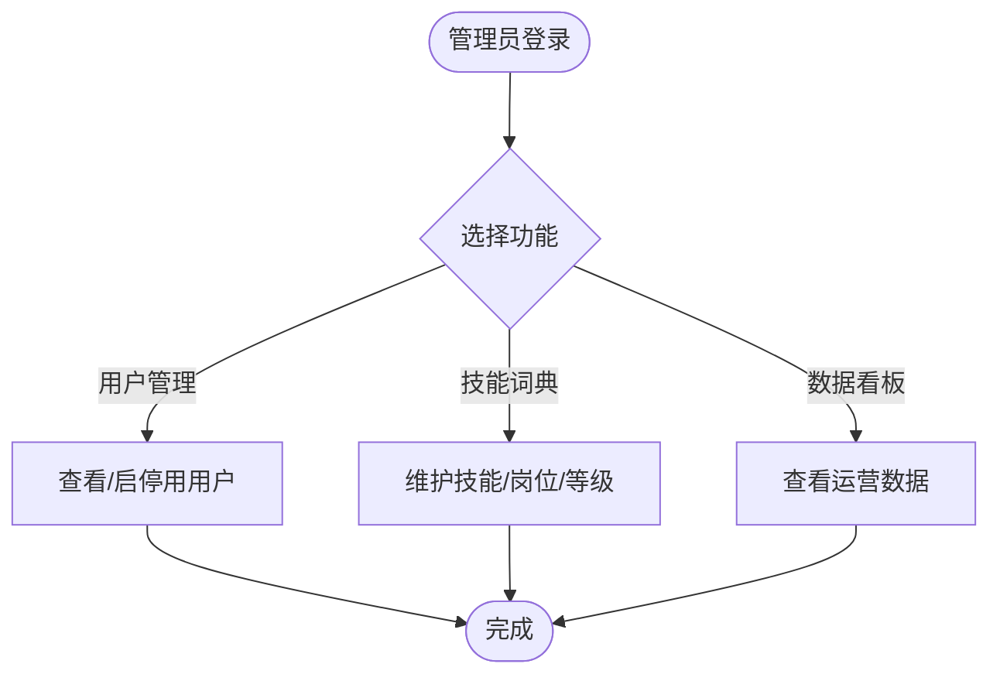
```mermaid
flowchart TD
    Start([管理员登录]) --> Choice{选择功能}
    Choice -->|用户管理| A[查看/启停用用户]
    Choice -->|技能词典| B[维护技能/岗位/等级]
    Choice -->|数据看板| C[查看运营数据]
    A --> End([完成])
    B --> End
    C --> End
```

---

### 2.2.2 分解描述

---

#### 2.2.2.1 模块 M1：用户认证模块

**1、简介**

用户认证模块负责系统的注册、登录和密码管理。支持三种角色（学生、企业HR、管理员）的统一认证，采用 JWT Token 进行无状态身份认证，密码使用 BCrypt 哈希加密存储。

**2、功能列表**

| 功能编号 | 功能名称 | 优先级 | 说明 |
|---|---|---|---|
| F1.1 | 用户注册 | A | 支持三种角色注册，校验账号唯一性 |
| F1.2 | 用户登录 | A | 账号密码登录，返回 JWT Token |
| F1.3 | 密码重置 | B | 管理员可为用户重置密码 |

---

##### F1.1 用户注册

**1 功能设计描述**

**（1）类**

**1）AuthController**

| 属性/方法 | 类型 | 说明 |
|---|---|---|
| `authService` | AuthService | 认证服务依赖注入 |
| `register(RegisterRequest req)` | `Result<LoginResponse>` | POST `/api/auth/register`，处理注册请求 |

**2）AuthService / AuthServiceImpl**

| 方法 | 参数 | 返回值 | 说明 |
|---|---|---|---|
| `register(RegisterRequest req)` | RegisterRequest (用户名、密码、手机号/邮箱、角色) | LoginResponse | 校验唯一性、加密密码、创建用户、生成 Token |
| `checkUsernameUnique(String username)` | 用户名 | boolean | 校验用户名是否已存在 |

**3）UserService / UserServiceImpl**

| 方法 | 参数 | 返回值 | 说明 |
|---|---|---|---|
| `createUser(User user)` | User 实体 | boolean | 保存新用户到数据库 |
| `getByUsername(String username)` | 用户名 | User | 根据用户名查询用户 |

**4）DTO 类：**

- `RegisterRequest`：username, password, phone, email, role
- `LoginResponse`：userId, username, role, token, expireTime

**（2）类与类之间关系**

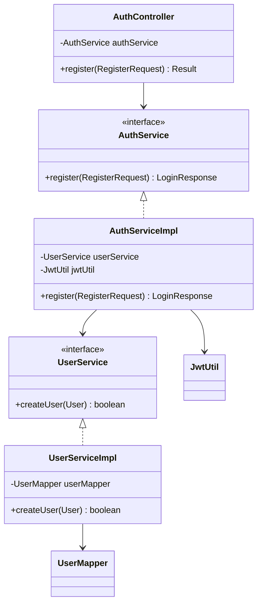
```mermaid
classDiagram
    class AuthController {
        -AuthService authService
        +register(RegisterRequest) Result
    }
    class AuthService {
        <<interface>>
        +register(RegisterRequest) LoginResponse
    }
    class AuthServiceImpl {
        -UserService userService
        -JwtUtil jwtUtil
        +register(RegisterRequest) LoginResponse
    }
    class UserService {
        <<interface>>
        +createUser(User) boolean
    }
    class UserServiceImpl {
        -UserMapper userMapper
        +createUser(User) boolean
    }

    AuthController --> AuthService
    AuthService <|.. AuthServiceImpl
    AuthServiceImpl --> UserService
    AuthServiceImpl --> JwtUtil
    UserService <|.. UserServiceImpl
    UserServiceImpl --> UserMapper
```

**（3）文件列表**

| 名称 | 类型 | 存放位置 | 说明 |
|---|---|---|---|
| AuthController.java | Java | controller/ | 认证控制器 |
| AuthService.java | Java | service/ | 认证服务接口 |
| AuthServiceImpl.java | Java | service/impl/ | 认证服务实现 |
| UserService.java | Java | service/ | 用户服务接口 |
| UserServiceImpl.java | Java | service/impl/ | 用户服务实现 |
| UserMapper.java | Java | mapper/ | 用户数据访问 |
| RegisterRequest.java | Java | dto/request/ | 注册请求 DTO |
| LoginResponse.java | Java | dto/response/ | 登录响应 DTO |
| User.java | Java | entity/ | 用户实体 |

**2 功能实现说明**

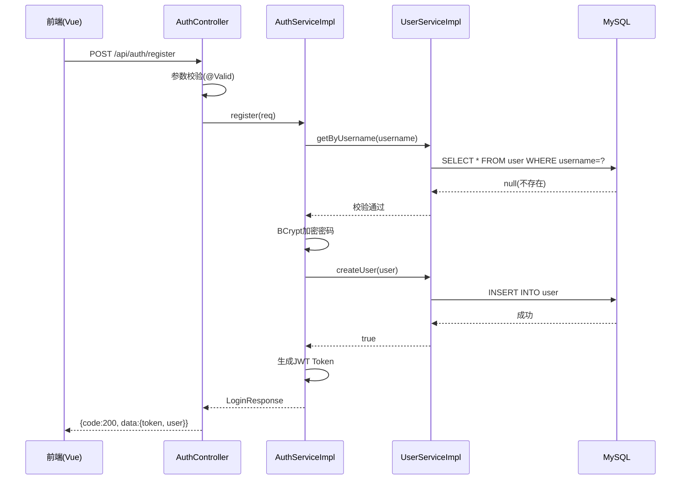
```mermaid
sequenceDiagram
    participant Client as 前端(Vue)
    participant AuthC as AuthController
    participant AuthS as AuthServiceImpl
    participant UserS as UserServiceImpl
    participant DB as MySQL

    Client->>AuthC: POST /api/auth/register
    AuthC->>AuthC: 参数校验(@Valid)
    AuthC->>AuthS: register(req)
    AuthS->>UserS: getByUsername(username)
    UserS->>DB: SELECT * FROM user WHERE username=?
    DB-->>UserS: null(不存在)
    UserS-->>AuthS: 校验通过
    AuthS->>AuthS: BCrypt加密密码
    AuthS->>UserS: createUser(user)
    UserS->>DB: INSERT INTO user
    DB-->>UserS: 成功
    UserS-->>AuthS: true
    AuthS->>AuthS: 生成JWT Token
    AuthS-->>AuthC: LoginResponse
    AuthC-->>Client: {code:200, data:{token, user}}
```

##### F1.2 用户登录

**1 功能设计描述**

**（1）类**

**1）AuthController**

| 方法 | 说明 |
|---|---|
| `login(LoginRequest req)` | POST `/api/auth/login`，处理登录请求 |

**2）AuthServiceImpl**

| 方法 | 参数 | 返回值 | 说明 |
|---|---|---|---|
| `login(LoginRequest req)` | LoginRequest (用户名、密码) | LoginResponse | 校验用户名密码、生成 Token |

**（2）文件列表**

| 名称 | 类型 | 存放位置 | 说明 |
|---|---|---|---|
| LoginRequest.java | Java | dto/request/ | 登录请求 DTO |

**2 功能实现说明**

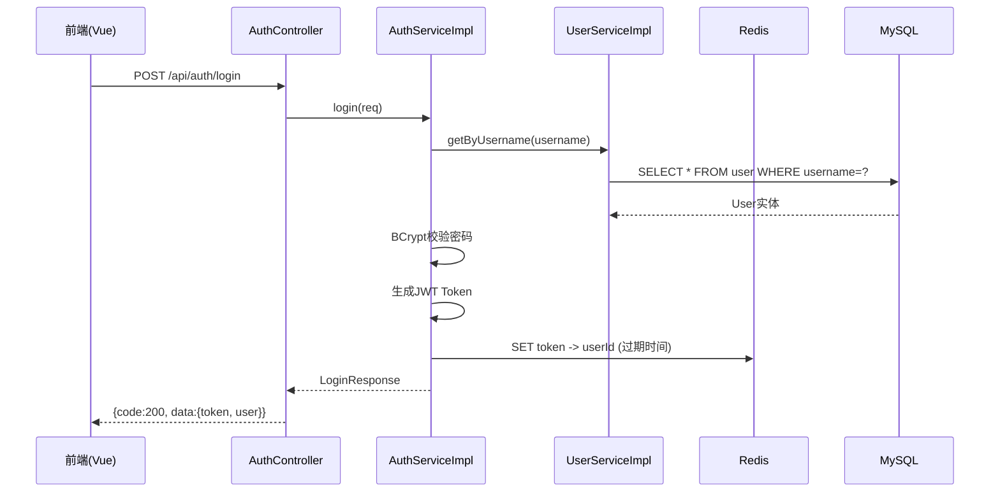
```mermaid
sequenceDiagram
    participant Client as 前端(Vue)
    participant AuthC as AuthController
    participant AuthS as AuthServiceImpl
    participant UserS as UserServiceImpl
    participant Redis as Redis
    participant DB as MySQL

    Client->>AuthC: POST /api/auth/login
    AuthC->>AuthS: login(req)
    AuthS->>UserS: getByUsername(username)
    UserS->>DB: SELECT * FROM user WHERE username=?
    DB-->>UserS: User实体
    AuthS->>AuthS: BCrypt校验密码
    AuthS->>AuthS: 生成JWT Token
    AuthS->>Redis: SET token -> userId (过期时间)
    AuthS-->>AuthC: LoginResponse
    AuthC-->>Client: {code:200, data:{token, user}}
```

##### F1.3 密码重置（管理员）

**1 功能设计描述**

**（1）类**

**1）AdminController**

| 方法 | 说明 |
|---|---|
| `resetPassword(Long userId)` | PUT `/api/admin/users/{userId}/reset-password` |

**2）AdminServiceImpl**

| 方法 | 参数 | 返回值 | 说明 |
|---|---|---|---|
| `resetPassword(Long userId)` | 用户ID | boolean | 重置为默认密码，BCrypt加密后保存 |

---

#### 2.2.2.2 模块 M2：学生求职辅导模块

**1、简介**

学生求职辅导模块是本系统的核心模块，涵盖"发现方向 → 定位差距 → 提升能力 → 准备求职"的完整闭环。包含求职画像、能力测评、AI 职业方向探索、岗位匹配推荐、能力差距分析、学习路径规划、简历智能优化、AI 模拟面试和学习进度展示九个子功能。

**2、功能列表**

| 功能编号 | 功能名称 | 优先级 | 说明 |
|---|---|---|---|
| F2.1 | 求职画像 | A | 填写学历、技能、目标岗位等信息 |
| F2.2 | 职业能力测评 | A | 五维度测评，生成能力基线 |
| F2.3 | AI 职业方向探索 | A | AI 推荐 3-5 个岗位方向 |
| F2.4 | 岗位匹配推荐 | A | 匹配岗位库中的合适岗位 |
| F2.5 | 能力差距分析 | A | 对比岗位要求和当前能力 |
| F2.6 | 学习路径规划 | A | 生成四阶段学习计划 |
| F2.7 | 简历智能优化 | A | AI 分析简历并给出优化建议 |
| F2.8 | AI 模拟面试 | A | AI 模拟面试并生成评估报告 |
| F2.9 | 学习进度展示与成长统计 | A | 聚合学习任务、技能差距、简历和面试记录，展示成长轨迹 |

---

##### F2.1 求职画像

**1 功能设计描述**

**（1）类**

**1）ProfileController**

| 方法 | URL | 说明 |
|---|---|---|
| `saveProfile(ProfileRequest req)` | POST `/api/student/profile` | 创建/更新求职画像 |
| `getProfile()` | GET `/api/student/profile` | 获取当前用户求职画像 |

**2）ProfileService / ProfileServiceImpl**

| 方法 | 参数 | 返回值 | 说明 |
|---|---|---|---|
| `saveProfile(Long userId, ProfileRequest req)` | userId + 画像信息 | CareerProfile | 保存画像，技能标签标准化映射 |
| `getProfile(Long userId)` | userId | ProfileResponse | 获取画像，含技能标准化标签 |
| `generateSummary(CareerProfile profile)` | 画像实体 | String | 根据专业、技能、目标岗位生成画像摘要 |

**3）DTO 类：**

- `ProfileRequest`：school, major, education, grade, skillTags[], targetRoles[], expectedCity, expectedSalary, jobStatus
- `ProfileResponse`：profileId, school, major, education, skills[], targetRoles[], summary

**（2）类与类之间关系**

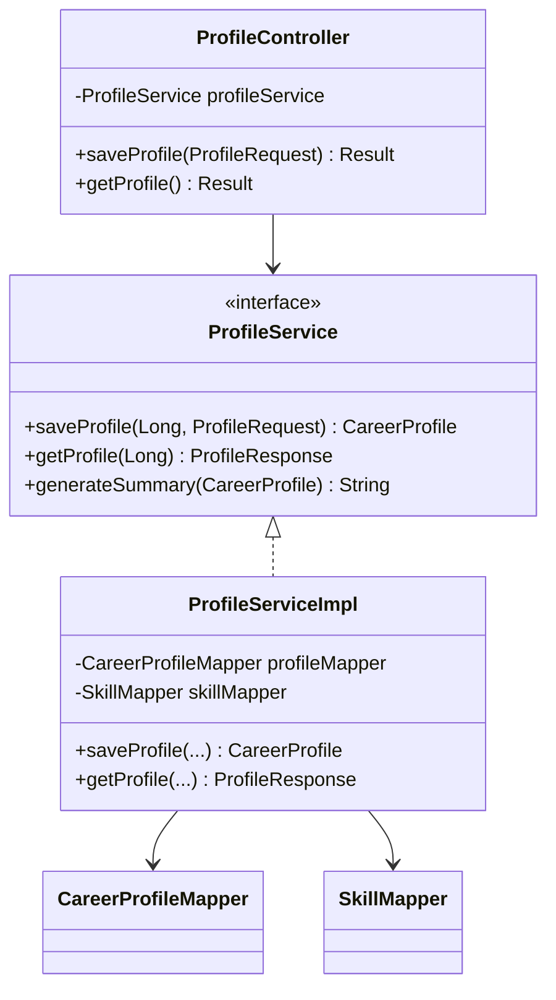
```mermaid
classDiagram
    class ProfileController {
        -ProfileService profileService
        +saveProfile(ProfileRequest) Result
        +getProfile() Result
    }
    class ProfileService {
        <<interface>>
        +saveProfile(Long, ProfileRequest) CareerProfile
        +getProfile(Long) ProfileResponse
        +generateSummary(CareerProfile) String
    }
    class ProfileServiceImpl {
        -CareerProfileMapper profileMapper
        -SkillMapper skillMapper
        +saveProfile(...) CareerProfile
        +getProfile(...) ProfileResponse
    }

    ProfileController --> ProfileService
    ProfileService <|.. ProfileServiceImpl
    ProfileServiceImpl --> CareerProfileMapper
    ProfileServiceImpl --> SkillMapper
```

**（3）文件列表**

| 名称 | 类型 | 存放位置 | 说明 |
|---|---|---|---|
| ProfileController.java | Java | controller/student/ | 画像控制器 |
| ProfileService.java | Java | service/ | 画像服务接口 |
| ProfileServiceImpl.java | Java | service/impl/ | 画像服务实现 |
| CareerProfileMapper.java | Java | mapper/ | 画像数据访问 |
| ProfileRequest.java | Java | dto/request/ | 画像请求 DTO |
| ProfileResponse.java | Java | dto/response/ | 画像响应 DTO |
| CareerProfile.java | Java | entity/ | 画像实体 |

---

##### F2.2 职业能力测评

**1 功能设计描述**

**（1）类**

**1）AssessmentController**

| 方法 | URL | 说明 |
|---|---|---|
| `getQuestions(String type)` | GET `/api/student/assessment/questions` | 获取测评题目 |
| `submitAssessment(AssessmentSubmitRequest req)` | POST `/api/student/assessment/submit` | 提交测评答案 |
| `getResult(Long resultId)` | GET `/api/student/assessment/result/{resultId}` | 查看测评结果 |
| `getHistory()` | GET `/api/student/assessment/history` | 查看测评历史 |

**2）AssessmentService / AssessmentServiceImpl**

| 方法 | 参数 | 返回值 | 说明 |
|---|---|---|---|
| `generateQuestions(Long userId, String type)` | userId, 测评类型 | List<Question> | 按维度从题库中抽取题目 |
| `calculateResult(Long userId, AssessmentSubmitRequest req)` | userId, 答案列表 | AssessmentReportResponse | 计算五维度得分和等级 |
| `getLatestResult(Long userId)` | userId | AssessmentReportResponse | 获取最新测评结果 |

**3）DTO 类：**

- `AssessmentSubmitRequest`：answers[{questionId, dimension, answer}]
- `AssessmentReportResponse`：totalScore, dimensionScores[{dimension, score, level}], strengths[], weaknesses[], radarChartData

**4）实体类：**

- `AssessmentResult`：user_id, programming_score, logic_score, product_score, tech_score, communication_score, total_score, created_at
- `AssessmentQuestion`：dimension, type, content, options, answer, score, difficulty

**（2）类与类之间关系**

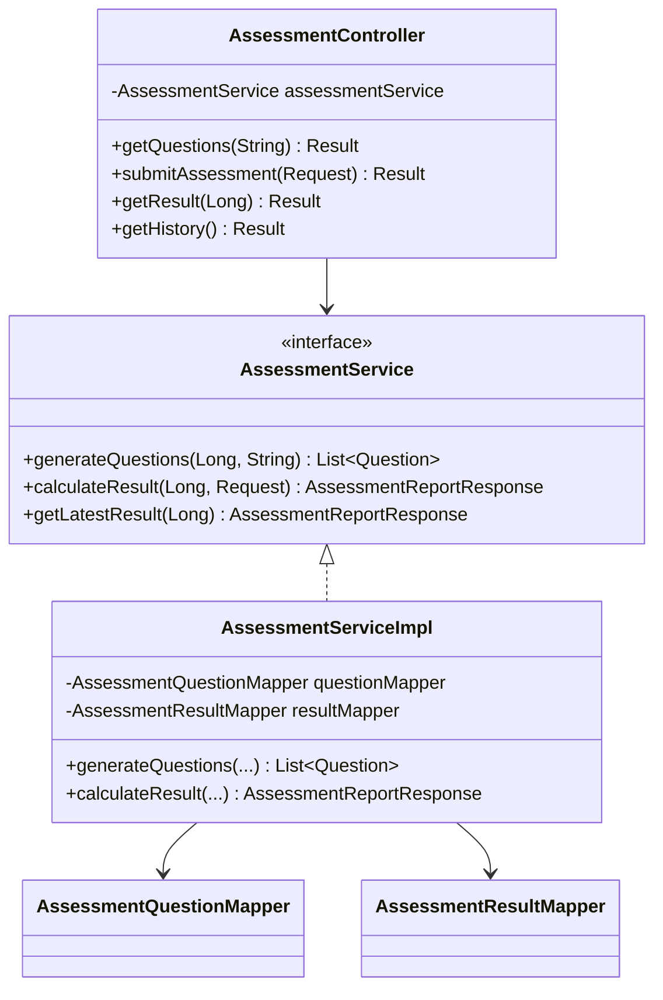
```mermaid
classDiagram
    class AssessmentController {
        -AssessmentService assessmentService
        +getQuestions(String) Result
        +submitAssessment(Request) Result
        +getResult(Long) Result
        +getHistory() Result
    }
    class AssessmentService {
        <<interface>>
        +generateQuestions(Long, String) List~Question~
        +calculateResult(Long, Request) AssessmentReportResponse
        +getLatestResult(Long) AssessmentReportResponse
    }
    class AssessmentServiceImpl {
        -AssessmentQuestionMapper questionMapper
        -AssessmentResultMapper resultMapper
        +generateQuestions(...) List~Question~
        +calculateResult(...) AssessmentReportResponse
    }

    AssessmentController --> AssessmentService
    AssessmentService <|.. AssessmentServiceImpl
    AssessmentServiceImpl --> AssessmentQuestionMapper
    AssessmentServiceImpl --> AssessmentResultMapper
```

**（3）文件列表**

| 名称 | 类型 | 存放位置 | 说明 |
|---|---|---|---|
| AssessmentController.java | Java | controller/student/ | 测评控制器 |
| AssessmentService.java | Java | service/ | 测评服务接口 |
| AssessmentServiceImpl.java | Java | service/impl/ | 测评服务实现 |
| AssessmentResultMapper.java | Java | mapper/ | 测评结果数据访问 |
| AssessmentQuestionMapper.java | Java | mapper/ | 测评题库数据访问 |
| AssessmentSubmitRequest.java | Java | dto/request/ | 测评提交 DTO |
| AssessmentReportResponse.java | Java | dto/response/ | 测评报告 DTO |
| AssessmentResult.java | Java | entity/ | 测评结果实体 |
| AssessmentQuestion.java | Java | entity/ | 测评题目实体 |

---

##### F2.3 AI 职业方向探索

**1 功能设计描述**

**（1）类**

**1）CareerExplorationController**

| 方法 | URL | 说明 |
|---|---|---|
| `explore(CareerExplorationRequest req)` | POST `/api/student/career/explore` | AI 探索职业方向 |
| `getHistory()` | GET `/api/student/career/explore/history` | 获取探索历史 |

**2）CareerExplorationService / CareerExplorationServiceImpl**

| 方法 | 参数 | 返回值 | 说明 |
|---|---|---|---|
| `exploreDirections(Long userId, CareerExplorationRequest req)` | userId, 补充兴趣/偏好 | CareerDirectionResponse | 组装画像+测评+偏好 → 调用 AI → 返回推荐 |
| `buildPrompt(ProfileResponse, AssessmentReport, String)` | 画像、测评、偏好 | String | 构建 DeepSeek Prompt |
| `parseAIResponse(String aiResponse)` | AI 返回 JSON | CareerDirectionResponse | 解析 AI 响应为结构化数据 |
| `fallbackRecommend(Long userId)` | userId | CareerDirectionResponse | AI 不可用时基于规则生成推荐 |

**3）DeepSeekService**

| 方法 | 参数 | 返回值 | 说明 |
|---|---|---|---|
| `callAPI(String prompt, String systemPrompt)` | Prompt | String (JSON) | 调用 DeepSeek API |
| `getCachedResult(String cacheKey)` | 缓存键 | String | 从 Redis 获取缓存结果 |

**4）DTO 类：**

- `CareerExplorationRequest`：interest, preference, valueOrientation
- `CareerDirectionResponse`：directions[{jobTitle, direction, matchScore, reason, learningPriority}]

**（2）类与类之间关系**

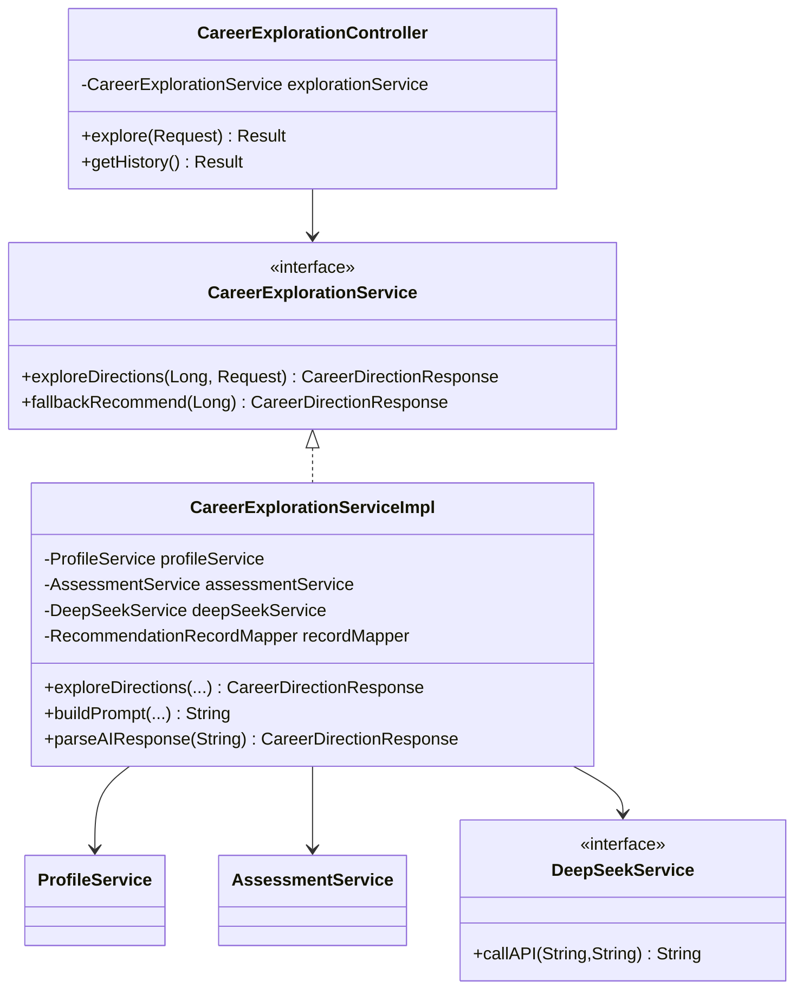
```mermaid
classDiagram
    class CareerExplorationController {
        -CareerExplorationService explorationService
        +explore(Request) Result
        +getHistory() Result
    }
    class CareerExplorationService {
        <<interface>>
        +exploreDirections(Long, Request) CareerDirectionResponse
        +fallbackRecommend(Long) CareerDirectionResponse
    }
    class CareerExplorationServiceImpl {
        -ProfileService profileService
        -AssessmentService assessmentService
        -DeepSeekService deepSeekService
        -RecommendationRecordMapper recordMapper
        +exploreDirections(...) CareerDirectionResponse
        +buildPrompt(...) String
        +parseAIResponse(String) CareerDirectionResponse
    }
    class DeepSeekService {
        <<interface>>
        +callAPI(String,String) String
    }

    CareerExplorationController --> CareerExplorationService
    CareerExplorationService <|.. CareerExplorationServiceImpl
    CareerExplorationServiceImpl --> ProfileService
    CareerExplorationServiceImpl --> AssessmentService
    CareerExplorationServiceImpl --> DeepSeekService
```

**2 功能实现说明**

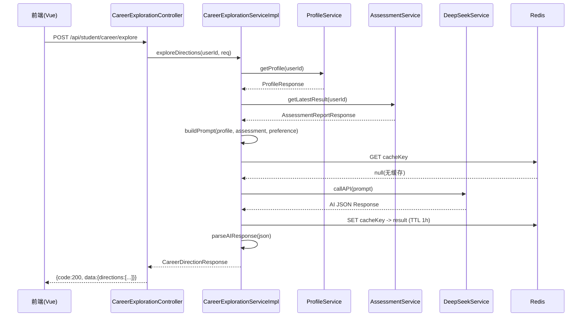
```mermaid
sequenceDiagram
    participant Client as 前端(Vue)
    participant CE_C as CareerExplorationController
    participant CE_S as CareerExplorationServiceImpl
    participant PS as ProfileService
    participant AS as AssessmentService
    participant DS as DeepSeekService
    participant Redis as Redis

    Client->>CE_C: POST /api/student/career/explore
    CE_C->>CE_S: exploreDirections(userId, req)
    CE_S->>PS: getProfile(userId)
    PS-->>CE_S: ProfileResponse
    CE_S->>AS: getLatestResult(userId)
    AS-->>CE_S: AssessmentReportResponse
    CE_S->>CE_S: buildPrompt(profile, assessment, preference)
    CE_S->>Redis: GET cacheKey
    Redis-->>CE_S: null(无缓存)
    CE_S->>DS: callAPI(prompt)
    DS-->>CE_S: AI JSON Response
    CE_S->>Redis: SET cacheKey -> result (TTL 1h)
    CE_S->>CE_S: parseAIResponse(json)
    CE_S-->>CE_C: CareerDirectionResponse
    CE_C-->>Client: {code:200, data:{directions:[...]}}
```

**（3）文件列表**

| 名称 | 类型 | 存放位置 | 说明 |
|---|---|---|---|
| CareerExplorationController.java | Java | controller/student/ | 方向探索控制器 |
| CareerExplorationService.java | Java | service/ | 方向探索服务接口 |
| CareerExplorationServiceImpl.java | Java | service/impl/ | 方向探索服务实现 |
| DeepSeekService.java | Java | service/ | AI 调用服务接口 |
| DeepSeekServiceImpl.java | Java | service/impl/ | AI 调用服务实现 |
| CareerExplorationRequest.java | Java | dto/request/ | 探索请求 DTO |
| CareerDirectionResponse.java | Java | dto/response/ | 方向推荐响应 DTO |

---

##### F2.4 岗位匹配推荐

**1 功能设计描述**

**（1）类**

**1）JobMatchingController**

| 方法 | URL | 说明 |
|---|---|---|
| `recommendJobs()` | POST `/api/student/jobs/recommend` | 推荐匹配岗位 |
| `getJobDetail(Long jobId)` | GET `/api/student/jobs/{jobId}` | 查看岗位详情 |
| `searchJobs(String keyword, String city)` | GET `/api/student/jobs/search` | 搜索岗位 |

**2）JobMatchingService / JobMatchingServiceImpl**

| 方法 | 参数 | 返回值 | 说明 |
|---|---|---|---|
| `recommendJobs(Long userId)` | userId | List<JobMatchResponse> | 计算技能匹配分(50%) + 测评适配分(30%) + 城市薪资分(20%)，加权排序 |
| `calculateSkillMatch(List<String> userSkills, List<JobSkillRequirement> reqs)` | 用户技能、岗位要求 | double | 计算技能匹配分数 |
| `calculateAssessmentFit(AssessmentReportResponse report, JobPosition job)` | 测评报告、岗位 | double | 计算测评适配度 |
| `getSkillGaps(Long userId, Long jobId)` | userId, jobId | List<SkillGapVO> | 获取技能差距列表 |

**3）DTO 类：**

- `JobMatchResponse`：jobId, title, direction, matchScore, skillGaps[{skillName, hasSkill, requiredLevel}], salaryRange, city
- `SkillGapVO`：skillName, category, currentLevel, requiredLevel, gap

**（2）类与类之间关系**

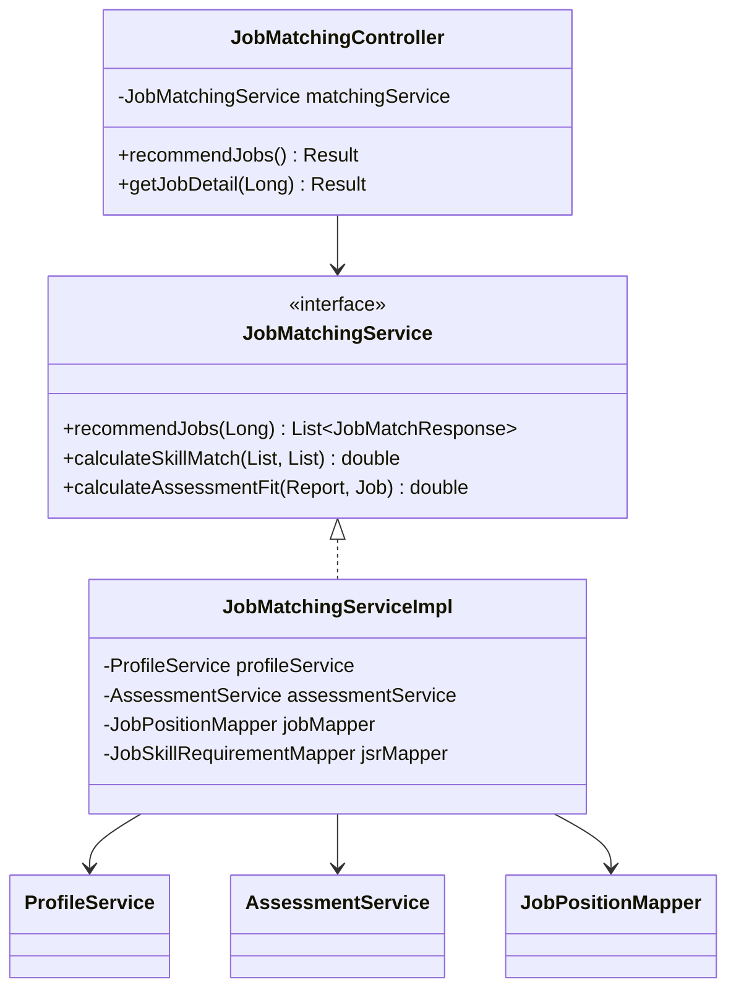
```mermaid
classDiagram
    class JobMatchingController {
        -JobMatchingService matchingService
        +recommendJobs() Result
        +getJobDetail(Long) Result
    }
    class JobMatchingService {
        <<interface>>
        +recommendJobs(Long) List~JobMatchResponse~
        +calculateSkillMatch(List, List) double
        +calculateAssessmentFit(Report, Job) double
    }
    class JobMatchingServiceImpl {
        -ProfileService profileService
        -AssessmentService assessmentService
        -JobPositionMapper jobMapper
        -JobSkillRequirementMapper jsrMapper
    }

    JobMatchingController --> JobMatchingService
    JobMatchingService <|.. JobMatchingServiceImpl
    JobMatchingServiceImpl --> ProfileService
    JobMatchingServiceImpl --> AssessmentService
    JobMatchingServiceImpl --> JobPositionMapper
```

**（3）文件列表**

| 名称 | 类型 | 存放位置 | 说明 |
|---|---|---|---|
| JobMatchingController.java | Java | controller/student/ | 岗位匹配控制器 |
| JobMatchingService.java | Java | service/ | 匹配服务接口 |
| JobMatchingServiceImpl.java | Java | service/impl/ | 匹配服务实现 |
| JobPositionMapper.java | Java | mapper/ | 岗位数据访问 |
| JobSkillRequirementMapper.java | Java | mapper/ | 岗位技能要求数据访问 |
| JobMatchingRequest.java | Java | dto/request/ | 匹配请求 DTO |
| JobMatchResponse.java | Java | dto/response/ | 匹配结果 DTO |
| SkillGapVO.java | Java | vo/ | 技能差距 VO |

---

##### F2.5 能力差距分析

**1 功能设计描述**

**（1）类**

**1）GapAnalysisController**

| 方法 | URL | 说明 |
|---|---|---|
| `analyze(Long jobId)` | POST `/api/student/gap/analyze/{jobId}` | 生成差距分析报告 |
| `getReport(Long reportId)` | GET `/api/student/gap/report/{reportId}` | 查看分析报告 |

**2）GapAnalysisService / GapAnalysisServiceImpl**

| 方法 | 参数 | 返回值 | 说明 |
|---|---|---|---|
| `analyzeGap(Long userId, Long jobId)` | userId, jobId | GapReportResponse | 查询岗位技能要求 → 对比用户技能等级 → 生成雷达图和差距矩阵 |
| `mapSkillLevel(Integer score)` | 测评分数 | SkillLevel | 将分数映射为"了解/掌握/熟练/精通" |
| `calculateGapDegree(String currentLevel, String requiredLevel)` | 当前等级、要求等级 | String | 计算差距程度（严重不足/需要提升/基本达标） |

**3）DTO 类：**

- `GapReportResponse`：jobTitle, overallMatch, radarChartData[{dimension, currentScore, requiredScore}], skillGaps[{skill, currentLevel, requiredLevel, degree}], actionSuggestions[]

**（2）类与类之间关系**

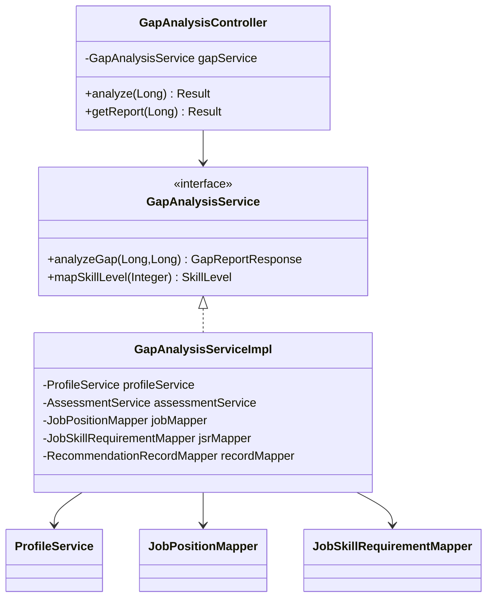
```mermaid
classDiagram
    class GapAnalysisController {
        -GapAnalysisService gapService
        +analyze(Long) Result
        +getReport(Long) Result
    }
    class GapAnalysisService {
        <<interface>>
        +analyzeGap(Long,Long) GapReportResponse
        +mapSkillLevel(Integer) SkillLevel
    }
    class GapAnalysisServiceImpl {
        -ProfileService profileService
        -AssessmentService assessmentService
        -JobPositionMapper jobMapper
        -JobSkillRequirementMapper jsrMapper
        -RecommendationRecordMapper recordMapper
    }

    GapAnalysisController --> GapAnalysisService
    GapAnalysisService <|.. GapAnalysisServiceImpl
    GapAnalysisServiceImpl --> ProfileService
    GapAnalysisServiceImpl --> JobPositionMapper
    GapAnalysisServiceImpl --> JobSkillRequirementMapper
```

**（3）文件列表**

| 名称 | 类型 | 存放位置 | 说明 |
|---|---|---|---|
| GapAnalysisController.java | Java | controller/student/ | 差距分析控制器 |
| GapAnalysisService.java | Java | service/ | 差距分析服务接口 |
| GapAnalysisServiceImpl.java | Java | service/impl/ | 差距分析服务实现 |
| GapReportResponse.java | Java | dto/response/ | 差距报告 DTO |
| RadarChartVO.java | Java | vo/ | 雷达图数据 VO |

---

##### F2.6 学习路径规划

**1 功能设计描述**

**（1）类**

**1）LearningPathController**

| 方法 | URL | 说明 |
|---|---|---|
| `generatePath(LearningPathRequest req)` | POST `/api/student/learning/generate` | 生成学习路径 |
| `getPath()` | GET `/api/student/learning/path` | 获取当前学习路径 |
| `updateTaskStatus(Long taskId, String status)` | PUT `/api/student/learning/tasks/{taskId}` | 更新任务完成状态 |
| `getTasks()` | GET `/api/student/learning/tasks` | 获取每日任务列表 |
| `listResources(String skill, String stage)` | GET `/api/student/learning/resources` | 按技能和阶段查询学习资源 |

**2）LearningPathService / LearningPathServiceImpl**

| 方法 | 参数 | 返回值 | 说明 |
|---|---|---|---|
| `generateLearningPath(Long userId, LearningPathRequest req)` | userId, 每日学习时长、目标时间 | LearningPathResponse | 按四阶段生成学习计划 |
| `sortSkillsByGap(List<SkillGapVO> gaps)` | 技能差距列表 | List<SkillGapVO> | 按缺口严重程度排序 |
| `assignLearningTasks(List<SkillGapVO> gaps, String stage)` | 差距列表、学习阶段 | List<LearningTask> | 从学习资源库匹配任务 |
| `getNextTask(Long userId)` | userId | LearningTask | 获取下一个待完成的任务 |
| `listResources(String skill, String stage)` | 技能、阶段 | List<LearningResource> | 查询预置学习资源，支撑岗位技能学习 |

**3）实体类：**

- `LearningPath`：user_id, target_job_id, daily_hours, total_days, status
- `LearningTask`：path_id, user_id, skill_id, title, description, resourceUrl, stage(BASIC/FRAMEWORK/PROJECT/INTERVIEW), status, due_date
- `LearningResource`：skill_id, stage, type, title, url, description, difficulty, estimated_hours

**4）DTO 类：**

- `LearningPathRequest`：dailyHours, targetDate
- `LearningPathResponse`：stages[{stageName, goal, tasks[{taskId, title, skill, duration, status}]}], totalDays

**（2）类与类之间关系**

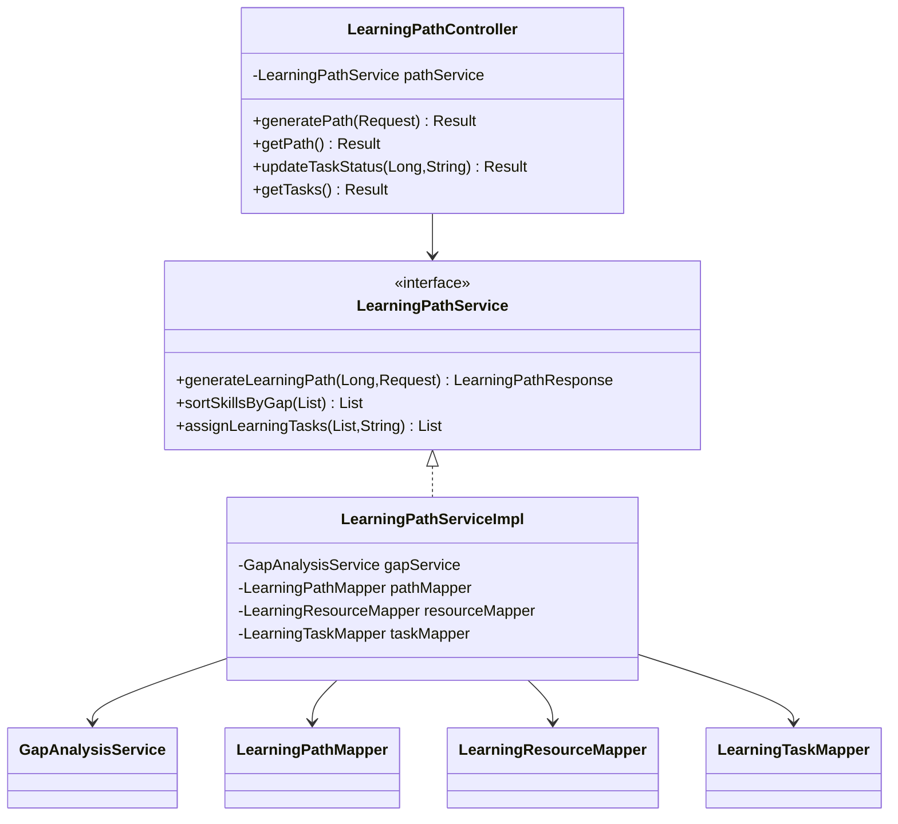
```mermaid
classDiagram
    class LearningPathController {
        -LearningPathService pathService
        +generatePath(Request) Result
        +getPath() Result
        +updateTaskStatus(Long,String) Result
        +getTasks() Result
    }
    class LearningPathService {
        <<interface>>
        +generateLearningPath(Long,Request) LearningPathResponse
        +sortSkillsByGap(List) List
        +assignLearningTasks(List,String) List
    }
    class LearningPathServiceImpl {
        -GapAnalysisService gapService
        -LearningPathMapper pathMapper
        -LearningResourceMapper resourceMapper
        -LearningTaskMapper taskMapper
    }

    LearningPathController --> LearningPathService
    LearningPathService <|.. LearningPathServiceImpl
    LearningPathServiceImpl --> GapAnalysisService
    LearningPathServiceImpl --> LearningPathMapper
    LearningPathServiceImpl --> LearningResourceMapper
    LearningPathServiceImpl --> LearningTaskMapper
```

**（3）文件列表**

| 名称 | 类型 | 存放位置 | 说明 |
|---|---|---|---|
| LearningPathController.java | Java | controller/student/ | 学习路径控制器 |
| LearningPathService.java | Java | service/ | 学习路径服务接口 |
| LearningPathServiceImpl.java | Java | service/impl/ | 学习路径服务实现 |
| LearningPathMapper.java | Java | mapper/ | 学习路径数据访问 |
| LearningResourceMapper.java | Java | mapper/ | 学习资源库数据访问 |
| LearningTaskMapper.java | Java | mapper/ | 学习任务数据访问 |
| LearningPathRequest.java | Java | dto/request/ | 路径请求 DTO |
| LearningPathResponse.java | Java | dto/response/ | 路径响应 DTO |
| LearningResourceResponse.java | Java | dto/response/ | 学习资源响应 DTO |
| LearningPath.java | Java | entity/ | 学习路径实体 |
| LearningTask.java | Java | entity/ | 学习任务实体 |
| LearningResource.java | Java | entity/ | 学习资源实体 |

---

##### F2.7 简历智能优化

**1 功能设计描述**

**（1）类**

**1）ResumeController**

| 方法 | URL | 说明 |
|---|---|---|
| `uploadResume(@RequestParam MultipartFile file)` | POST `/api/student/resume/upload` | 上传简历文件 |
| `analyzeResume(ResumeAnalysisRequest req)` | POST `/api/student/resume/analyze` | AI 分析简历 |
| `getAnalysis(Long analysisId)` | GET `/api/student/resume/analysis/{analysisId}` | 获取分析结果 |
| `getHistory()` | GET `/api/student/resume/history` | 获取分析历史 |

**2）ResumeService / ResumeServiceImpl**

| 方法 | 参数 | 返回值 | 说明 |
|---|---|---|---|
| `uploadFile(MultipartFile file)` | 简历文件(PDF/DOCX) | String (文件URL) | 校验格式和大小，存储到服务器 |
| `extractText(String fileUrl)` | 文件路径 | String | 从 PDF/DOCX 中提取文本 |
| `analyzeResume(Long userId, ResumeAnalysisRequest req)` | userId, 目标岗位ID | ResumeOptimizeResponse | 调用 AI 进行四维度分析 |
| `buildResumePrompt(String resumeText, JobPosition targetJob)` | 简历文本、目标岗位 | String | 构建简历优化 Prompt |
| `fallbackAnalyze(String resumeText)` | 简历文本 | ResumeOptimizeResponse | AI 不可用时返回预置检查清单 |

**3）DTO 类：**

- `ResumeAnalysisRequest`：targetJobId (可为空)
- `ResumeOptimizeResponse`：score, dimensionScores[{completeness, jobMatch, resultQuantification, expression}], issues[{severity, description, suggestion, exampleRewrite}], optimizedSnippets[{original, optimized}]

**（2）类与类之间关系**

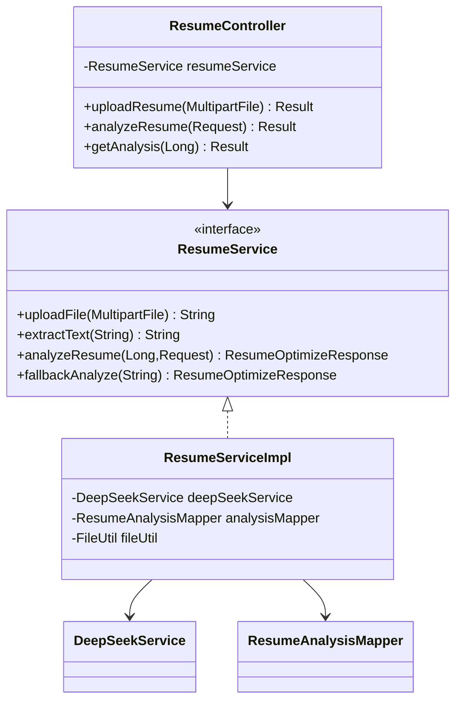
```mermaid
classDiagram
    class ResumeController {
        -ResumeService resumeService
        +uploadResume(MultipartFile) Result
        +analyzeResume(Request) Result
        +getAnalysis(Long) Result
    }
    class ResumeService {
        <<interface>>
        +uploadFile(MultipartFile) String
        +extractText(String) String
        +analyzeResume(Long,Request) ResumeOptimizeResponse
        +fallbackAnalyze(String) ResumeOptimizeResponse
    }
    class ResumeServiceImpl {
        -DeepSeekService deepSeekService
        -ResumeAnalysisMapper analysisMapper
        -FileUtil fileUtil
    }

    ResumeController --> ResumeService
    ResumeService <|.. ResumeServiceImpl
    ResumeServiceImpl --> DeepSeekService
    ResumeServiceImpl --> ResumeAnalysisMapper
```

**2 功能实现说明**

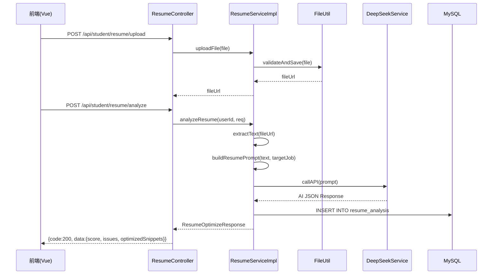
```mermaid
sequenceDiagram
    participant Client as 前端(Vue)
    participant RC as ResumeController
    participant RS as ResumeServiceImpl
    participant FU as FileUtil
    participant DS as DeepSeekService
    participant DB as MySQL

    Client->>RC: POST /api/student/resume/upload
    RC->>RS: uploadFile(file)
    RS->>FU: validateAndSave(file)
    FU-->>RS: fileUrl
    RS-->>RC: fileUrl

    Client->>RC: POST /api/student/resume/analyze
    RC->>RS: analyzeResume(userId, req)
    RS->>RS: extractText(fileUrl)
    RS->>RS: buildResumePrompt(text, targetJob)
    RS->>DS: callAPI(prompt)
    DS-->>RS: AI JSON Response
    RS->>DB: INSERT INTO resume_analysis
    RS-->>RC: ResumeOptimizeResponse
    RC-->>Client: {code:200, data:{score, issues, optimizedSnippets}}
```

**（3）文件列表**

| 名称 | 类型 | 存放位置 | 说明 |
|---|---|---|---|
| ResumeController.java | Java | controller/student/ | 简历控制器 |
| ResumeService.java | Java | service/ | 简历服务接口 |
| ResumeServiceImpl.java | Java | service/impl/ | 简历服务实现 |
| ResumeAnalysisMapper.java | Java | mapper/ | 简历分析数据访问 |
| FileUtil.java | Java | util/ | 文件处理工具 |
| ResumeAnalysisRequest.java | Java | dto/request/ | 分析请求 DTO |
| ResumeOptimizeResponse.java | Java | dto/response/ | 优化结果 DTO |
| ResumeAnalysis.java | Java | entity/ | 简历分析实体 |

---

##### F2.8 AI 模拟面试

**1 功能设计描述**

**（1）类**

**1）InterviewController**

| 方法 | URL | 说明 |
|---|---|---|
| `startInterview(InterviewRequest req)` | POST `/api/student/interview/start` | 开始模拟面试 |
| `submitAnswer(Long sessionId, String answer)` | POST `/api/student/interview/{sessionId}/answer` | 提交面试回答 |
| `endInterview(Long sessionId)` | POST `/api/student/interview/{sessionId}/end` | 结束面试并生成报告 |
| `getReport(Long recordId)` | GET `/api/student/interview/report/{recordId}` | 获取面试报告 |
| `getHistory()` | GET `/api/student/interview/history` | 获取面试历史 |

**2）InterviewService / InterviewServiceImpl**

| 方法 | 参数 | 返回值 | 说明 |
|---|---|---|---|
| `startInterview(Long userId, InterviewRequest req)` | userId, 目标岗位、面试类型 | InterviewSession | 生成 5-8 道题，返回第一题 |
| `processAnswer(Long sessionId, String answer)` | 会话ID、回答 | InterviewRound | 保存回答，生成追问或下一题 |
| `endInterview(Long sessionId)` | 会话ID | InterviewReportResponse | 调用 AI 五维度评分，生成报告 |
| `buildInterviewPrompt(JobPosition job, String type)` | 岗位、面试类型 | String | 构建面试 Prompt |
| `generateFallbackQuestions(String type)` | 面试类型 | List<Question> | AI 不可用时使用预置题库 |

**3）DTO 类：**

- `InterviewRequest`：jobId, interviewType (TECHNICAL/HR/COMPREHENSIVE)
- `InterviewSession`：sessionId, question, questionIndex, totalQuestions
- `InterviewReportResponse`：totalScore, dimensionScores[{dimension, score, comment}], highlights[], improvements[], radarChartData

**（2）类与类之间关系**

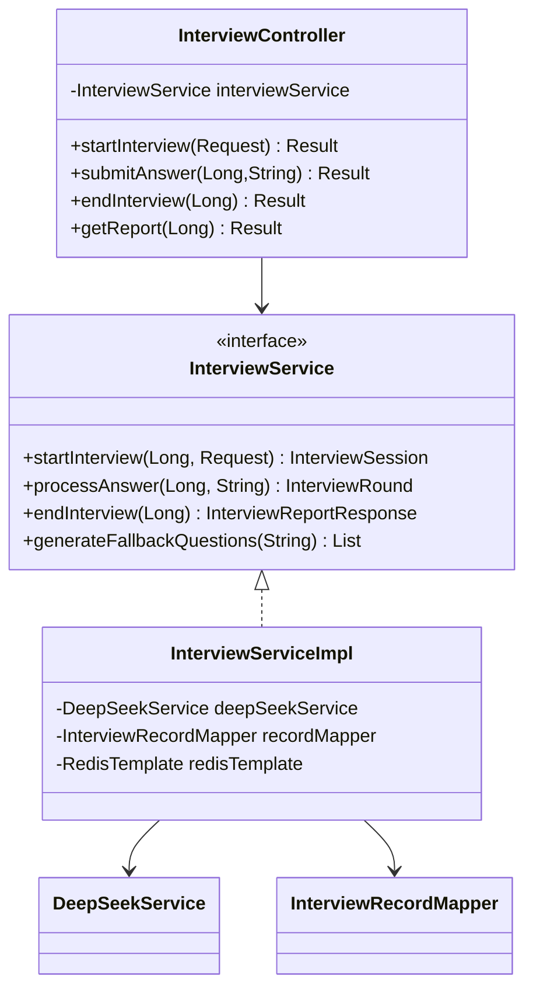
```mermaid
classDiagram
    class InterviewController {
        -InterviewService interviewService
        +startInterview(Request) Result
        +submitAnswer(Long,String) Result
        +endInterview(Long) Result
        +getReport(Long) Result
    }
    class InterviewService {
        <<interface>>
        +startInterview(Long, Request) InterviewSession
        +processAnswer(Long, String) InterviewRound
        +endInterview(Long) InterviewReportResponse
        +generateFallbackQuestions(String) List
    }
    class InterviewServiceImpl {
        -DeepSeekService deepSeekService
        -InterviewRecordMapper recordMapper
        -RedisTemplate redisTemplate
    }

    InterviewController --> InterviewService
    InterviewService <|.. InterviewServiceImpl
    InterviewServiceImpl --> DeepSeekService
    InterviewServiceImpl --> InterviewRecordMapper
```

**2 功能实现说明**

面试采用 Redis 维护会话上下文（问题历史、当前轮次），每轮对话：

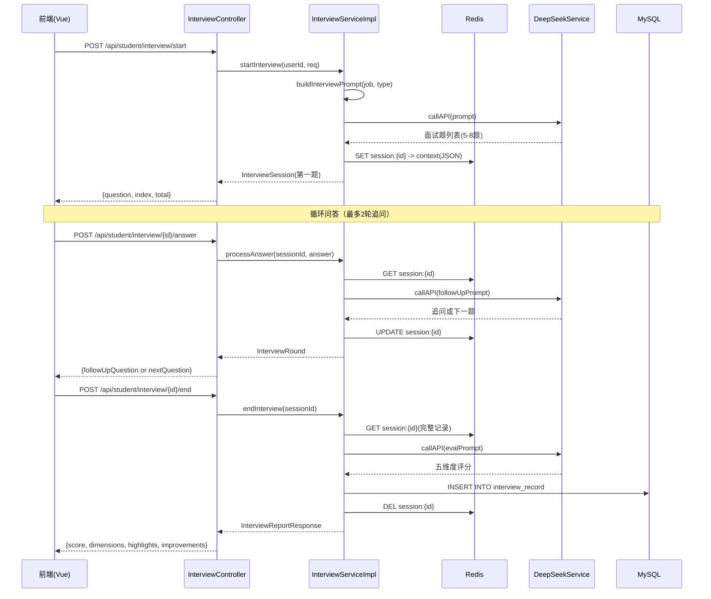
```mermaid
sequenceDiagram
    participant Client as 前端(Vue)
    participant IC as InterviewController
    participant IS as InterviewServiceImpl
    participant Redis as Redis
    participant DS as DeepSeekService
    participant DB as MySQL

    Client->>IC: POST /api/student/interview/start
    IC->>IS: startInterview(userId, req)
    IS->>IS: buildInterviewPrompt(job, type)
    IS->>DS: callAPI(prompt)
    DS-->>IS: 面试题列表(5-8题)
    IS->>Redis: SET session:{id} -> context(JSON)
    IS-->>IC: InterviewSession(第一题)
    IC-->>Client: {question, index, total}

    Note over Client,DB: 循环问答（最多2轮追问）

    Client->>IC: POST /api/student/interview/{id}/answer
    IC->>IS: processAnswer(sessionId, answer)
    IS->>Redis: GET session:{id}
    IS->>DS: callAPI(followUpPrompt)
    DS-->>IS: 追问或下一题
    IS->>Redis: UPDATE session:{id}
    IS-->>IC: InterviewRound
    IC-->>Client: {followUpQuestion or nextQuestion}

    Client->>IC: POST /api/student/interview/{id}/end
    IC->>IS: endInterview(sessionId)
    IS->>Redis: GET session:{id}(完整记录)
    IS->>DS: callAPI(evalPrompt)
    DS-->>IS: 五维度评分
    IS->>DB: INSERT INTO interview_record
    IS->>Redis: DEL session:{id}
    IS-->>IC: InterviewReportResponse
    IC-->>Client: {score, dimensions, highlights, improvements}
```

**（3）文件列表**

| 名称 | 类型 | 存放位置 | 说明 |
|---|---|---|---|
| InterviewController.java | Java | controller/student/ | 面试控制器 |
| InterviewService.java | Java | service/ | 面试服务接口 |
| InterviewServiceImpl.java | Java | service/impl/ | 面试服务实现 |
| InterviewRecordMapper.java | Java | mapper/ | 面试记录数据访问 |
| InterviewRequest.java | Java | dto/request/ | 面试请求 DTO |
| InterviewReportResponse.java | Java | dto/response/ | 面试报告 DTO |
| InterviewRecord.java | Java | entity/ | 面试记录实体 |

---

##### F2.9 学习进度展示与成长统计

**1 功能设计描述**

学习进度展示用于承接学习路径规划结果，按目标岗位持续展示用户的任务完成情况、技能成长情况、求职准备进展和阶段性成长报告。该功能不单独引入复杂学习系统，采用轻量聚合方式实现，数据来源包括 `learning_task`、`assessment_result`、`interview_record`、`resume_analysis` 和 `recommendation_record`。

**（1）类**

**1）ProgressController**

| 方法 | URL | 说明 |
|---|---|---|
| `getOverview()` | GET `/api/student/progress/overview` | 获取学习进度总览 |
| `getSkillProgress()` | GET `/api/student/progress/skills` | 获取技能掌握度和差距变化 |
| `getGrowthReport()` | GET `/api/student/progress/report` | 获取阶段性成长报告 |

**2）ProgressService / ProgressServiceImpl**

| 方法 | 参数 | 返回值 | 说明 |
|---|---|---|---|
| `getOverview(Long userId)` | userId | ProgressOverviewResponse | 聚合任务完成数、连续学习天数、当前阶段和求职准备进度 |
| `getSkillProgress(Long userId)` | userId | SkillProgressResponse | 根据学习任务和差距分析结果生成技能掌握度统计 |
| `generateGrowthReport(Long userId)` | userId | GrowthReportResponse | 汇总测评、学习、简历和面试数据，生成成长报告 |

**3）DTO 类：**

- `ProgressOverviewResponse`：targetJob, currentStage, totalTasks, completedTasks, completionRate, continuousDays, nextTask
- `SkillProgressResponse`：skills[{skillName, currentLevel, targetLevel, progressRate, status}], heatmapData
- `GrowthReportResponse`：summary, completedMilestones[], weakSkills[], interviewScoreTrend[], resumeScoreTrend[], suggestions[]

**2 功能实现说明**

进度统计采用 Service 层聚合查询，不在 V1.0 引入复杂事件流。用户完成学习任务时更新 `learning_task.status`，系统通过已完成任务数计算总进度；技能掌握度由任务完成情况、最近一次差距分析和最近一次测评结果共同估算；成长报告以 JSON 形式写入 `recommendation_record`，`type=GROWTH_REPORT`，避免新增过重的数据模型。

**（3）文件列表**

| 名称 | 类型 | 存放位置 | 说明 |
|---|---|---|---|
| ProgressController.java | Java | controller/student/ | 学习进度控制器 |
| ProgressService.java | Java | service/ | 学习进度服务接口 |
| ProgressServiceImpl.java | Java | service/impl/ | 学习进度服务实现 |
| ProgressOverviewResponse.java | Java | dto/response/ | 进度总览响应 DTO |
| SkillProgressResponse.java | Java | dto/response/ | 技能进度响应 DTO |
| GrowthReportResponse.java | Java | dto/response/ | 成长报告响应 DTO |

---

#### 2.2.2.3 模块 M3：企业项目推荐模块

**1、简介**

企业项目推荐模块为企业 HR 提供 AI 驱动的项目需求解析和候选人推荐能力。HR 输入项目描述文本，系统使用 DeepSeek 解析项目所需岗位、技能标签和人数建议，然后从预置候选人库中检索并推荐匹配的学生。

**V1.0 边界说明：** 本模块实现"项目描述/岗位需求输入 → 岗位建议 → 候选人推荐 → 推荐理由展示"的演示闭环。项目案例中的企业岗位人才搜索在 V1.0 中仅作为候选人推荐结果的筛选条件体现，不单独建设完整招聘后台；不实现批量收藏、多候选人横向对比、正式面试邀约、沟通记录、录用管理和推荐转化漏斗。

**2、功能列表**

| 功能编号 | 功能名称 | 优先级 | 说明 |
|---|---|---|---|
| F3.1 | 项目需求解析 | A | AI 解析项目描述，输出所需岗位和技能 |
| F3.2 | 岗位建议生成 | A | 根据解析结果生成岗位需求建议 |
| F3.3 | 候选人推荐 | A | 匹配候选人库，返回排名和理由 |

---

##### F3.1-3.3 企业项目推荐（合并功能）

**注：** 因三个子功能在一个请求流程中顺序执行，合并为一个功能设计描述。

**1 功能设计描述**

**（1）类**

**1）EnterpriseController**

| 方法 | URL | 说明 |
|---|---|---|
| `recommend(EnterpriseRecommendRequest req)` | POST `/api/enterprise/recommend` | 输入项目描述，获得岗位和候选人推荐 |
| `getHistory()` | GET `/api/enterprise/recommend/history` | 获取推荐历史 |

**2）EnterpriseService / EnterpriseServiceImpl**

| 方法 | 参数 | 返回值 | 说明 |
|---|---|---|---|
| `recommend(Long userId, EnterpriseRecommendRequest req)` | userId, 项目描述等 | EnterpriseRecommendResponse | 解析项目 → 生成岗位建议 → 匹配候选人 |
| `parseProject(String description)` | 项目描述 | ProjectParseResult | 调用 AI 解析项目为结构化数据 |
| `suggestPositions(ProjectParseResult parsed)` | 解析结果 | List<JobSuggestionVO> | 基于解析结果建议岗位和技能 |
| `matchCandidates(List<JobSuggestionVO> positions, CandidateFilter filter)` | 岗位建议、筛选条件 | List<CandidateVO> | 从学生画像库匹配候选人并评分 |
| `fallbackParse(String description)` | 项目描述 | ProjectParseResult | AI 不可用时使用关键词规则匹配 |

**3）VO 类：**

- `JobSuggestionVO`：positionTitle, skillRequirements[{skillName, requiredLevel}], headcount
- `CandidateVO`：userId, name(school+major), skills[], assessmentScore, matchScore, learningProgress
- `ProjectParseResult`：modules[], suggestedPositions[], overallSkillTags[]

**4）DTO 类：**

- `EnterpriseRecommendRequest`：projectDescription, preferredSkills[], educationRequirement, city
- `EnterpriseRecommendResponse`：positions[{JobSuggestionVO}], candidates[{CandidateVO, matchScore, recommendReason}]

**（2）类与类之间关系**

```mermaid
classDiagram
    class EnterpriseController {
        -EnterpriseService enterpriseService
        +recommend(Request) Result
    }
    class EnterpriseService {
        <<interface>>
        +recommend(Long, Request) EnterpriseRecommendResponse
        +parseProject(String) ProjectParseResult
        +suggestPositions(ParseResult) List
        +matchCandidates(List,Filter) List
        +fallbackParse(String) ProjectParseResult
    }
    class EnterpriseServiceImpl {
        -DeepSeekService deepSeekService
        -UserMapper userMapper
        -CareerProfileMapper profileMapper
        -AssessmentResultMapper resultMapper
        -JobPositionMapper jobMapper
        -RecommendationRecordMapper recordMapper
    }

    EnterpriseController --> EnterpriseService
    EnterpriseService <|.. EnterpriseServiceImpl
    EnterpriseServiceImpl --> DeepSeekService
    EnterpriseServiceImpl --> UserMapper
    EnterpriseServiceImpl --> CareerProfileMapper
    EnterpriseServiceImpl --> AssessmentResultMapper
```

**2 功能实现说明**

```mermaid
sequenceDiagram
    participant Client as 前端(Vue)
    participant EC as EnterpriseController
    participant ES as EnterpriseServiceImpl
    participant DS as DeepSeekService
    participant DB as MySQL

    Client->>EC: POST /api/enterprise/recommend
    EC->>ES: recommend(userId, req)

    Note over ES,DS: Step1 项目需求解析
    ES->>ES: 校验描述长度(>=20字)
    alt 描述过短
        ES-->>EC: 提示补充业务场景
    end
    ES->>DS: callAPI(parsePrompt)
    DS-->>ES: ProjectParseResult(JSON)

    Note over ES,DS: Step2 岗位建议
    ES->>ES: suggestPositions(parsed)
    ES->>DB: 查询技能词典映射

    Note over ES,DB: Step3 候选人匹配
    ES->>DB: 查询学生画像(skills, assessment)
    ES->>ES: 计算技能匹配+测评+学习完成度评分
    ES->>ES: 排序并生成推荐理由

    ES->>DB: INSERT INTO recommendation_record
    ES-->>EC: EnterpriseRecommendResponse
    EC-->>Client: {positions:[...], candidates:[...]}
```

**（3）文件列表**

| 名称 | 类型 | 存放位置 | 说明 |
|---|---|---|---|
| EnterpriseController.java | Java | controller/ | 企业端控制器 |
| EnterpriseService.java | Java | service/ | 企业服务接口 |
| EnterpriseServiceImpl.java | Java | service/impl/ | 企业服务实现 |
| EnterpriseRecommendRequest.java | Java | dto/request/ | 推荐请求 DTO |
| EnterpriseRecommendResponse.java | Java | dto/response/ | 推荐响应 DTO |
| JobSuggestionVO.java | Java | vo/ | 岗位建议 VO |
| CandidateVO.java | Java | vo/ | 候选人 VO |

---

#### 2.2.2.4 模块 M4：管理后台模块

**1、简介**

管理后台模块为管理员提供平台基础数据管理能力，包括用户管理（查看、启停用、重置密码）、岗位技能词典维护（增删改查技能标签和岗位技能要求）以及基础运营数据看板（用户总数、测评完成数、推荐次数等统计指标）。

**2、功能列表**

| 功能编号 | 功能名称 | 优先级 | 说明 |
|---|---|---|---|
| F4.1 | 用户管理 | B | 查看用户列表、启用/禁用、重置密码 |
| F4.2 | 技能词典维护 | B | 维护技能、岗位技能要求 |
| F4.3 | 数据看板 | B | 展示基础运营统计指标 |

---

##### F4.1 用户管理

**1 功能设计描述**

**（1）类**

**1）AdminController**

| 方法 | URL | 说明 |
|---|---|---|
| `listUsers(Integer page, Integer size, String role, String keyword)` | GET `/api/admin/users` | 分页查询用户列表 |
| `getUserDetail(Long userId)` | GET `/api/admin/users/{userId}` | 获取用户详情 |
| `updateUserStatus(Long userId, String status)` | PUT `/api/admin/users/{userId}/status` | 启用/禁用用户 |
| `resetPassword(Long userId)` | PUT `/api/admin/users/{userId}/reset-password` | 重置用户密码 |

**2）AdminService / AdminServiceImpl**

| 方法 | 参数 | 返回值 | 说明 |
|---|---|---|---|
| `listUsers(Integer page, Integer size, String role, String keyword)` | 分页参数、筛选条件 | PageResult<UserVO> | 分页查询 |
| `updateUserStatus(Long userId, String status)` | userId, status | boolean | 更新用户状态 |
| `resetPassword(Long userId)` | userId | boolean | 重置为默认密码 |

---

##### F4.2 技能词典维护

**1 功能设计描述**

**（1）类**

**1）AdminController**

| 方法 | URL | 说明 |
|---|---|---|
| `listSkills(Integer page, Integer size, String keyword)` | GET `/api/admin/skills` | 分页查询技能列表 |
| `addSkill(Skill skill)` | POST `/api/admin/skills` | 新增技能标签 |
| `updateSkill(Long skillId, Skill skill)` | PUT `/api/admin/skills/{skillId}` | 修改技能标签 |
| `deleteSkill(Long skillId)` | DELETE `/api/admin/skills/{skillId}` | 删除技能标签 |
| `listJobSkills(Long jobId)` | GET `/api/admin/jobs/{jobId}/skills` | 查询岗位技能要求 |
| `updateJobSkills(Long jobId, List<JobSkillRequirement> reqs)` | PUT `/api/admin/jobs/{jobId}/skills` | 更新岗位技能要求 |
| `listPositions(Integer page, Integer size)` | GET `/api/admin/positions` | 查询岗位列表 |

**2）AdminServiceImpl**

| 方法 | 参数 | 返回值 | 说明 |
|---|---|---|---|
| `listSkills(page, size, keyword)` | 分页+关键词 | PageResult<Skill> | 查询技能列表 |
| `saveSkill(Skill skill)` | 技能实体 | boolean | 新增技能 |
| `updateSkill(Long id, Skill skill)` | ID + 修改内容 | boolean | 修改技能 |
| `deleteSkill(Long id)` | ID | boolean | 软删除技能 |
| `updateJobSkillRequirements(Long jobId, List<JobSkillRequirement> reqs)` | 岗位ID, 技能要求列表 | boolean | 批量更新岗位技能要求 |

**（3）文件列表**

| 名称 | 类型 | 存放位置 | 说明 |
|---|---|---|---|
| AdminController.java | Java | controller/ | 管理端控制器 |
| AdminService.java | Java | service/ | 管理服务接口 |
| AdminServiceImpl.java | Java | service/impl/ | 管理服务实现 |
| SkillMapper.java | Java | mapper/ | 技能数据访问 |
| Skill.java | Java | entity/ | 技能实体 |

---

##### F4.3 数据看板

**1 功能设计描述**

**（1）类**

**1）AdminController**

| 方法 | URL | 说明 |
|---|---|---|
| `getDashboard()` | GET `/api/admin/dashboard` | 获取运营数据看板 |

**2）AdminServiceImpl**

| 方法 | 参数 | 返回值 | 说明 |
|---|---|---|---|
| `getDashboardStats()` | 无 | DashboardResponse | 计算各基础指标 |

**3）DTO 类：**

- `DashboardResponse`：totalUsers, studentsCount, hrCount, assessmentsCompleted, jobMatchesCount, resumeOptimizationsCount, interviewSessionsCount, enterpriseRecommendCount, recent7DaysTrends[]

---

#### 2.2.2.5 模块 M5：智能客服模块

**1、简介**

智能客服模块提供文字问答能力，回答平台功能使用说明、常见互联网岗位介绍、学习路径建议和求职准备建议。MVP 阶段不实现语音交互和人工客服流转。

**2、功能列表**

| 功能编号 | 功能名称 | 优先级 | 说明 |
|---|---|---|---|
| F5.1 | 平台使用问答 | B | 回答系统功能使用问题 |
| F5.2 | 岗位介绍问答 | B | 回答互联网岗位相关问题 |
| F5.3 | 学习建议问答 | B | 回答学习路径和求职建议 |

---

**1 功能设计描述**

**（1）类**

**1）CustomerServiceController**

| 方法 | URL | 说明 |
|---|---|---|
| `chat(CustomerServiceRequest req)` | POST `/api/customer-service/chat` | 发送问题获取回答 |
| `getFAQs()` | GET `/api/customer-service/faqs` | 获取常见问题列表 |

**2）CustomerServiceService / CustomerServiceServiceImpl**

| 方法 | 参数 | 返回值 | 说明 |
|---|---|---|---|
| `answerQuestion(Long userId, CustomerServiceRequest req)` | userId, 问题文本 | String | 调用 AI 生成回答 |
| `getFAQList()` | 无 | List<FAQ> | 返回预置常见问题列表 |
| `matchFAQ(String question)` | 问题文本 | FAQ | 关键词匹配常见问题 |
| `checkRelevance(String answer)` | AI 回答 | boolean | 检查回答是否相关，不相关返回兜底提示 |

**3）DTO 类：**

- `CustomerServiceRequest`：question
- `ChatResponse`：answer, source (AI/FAQ/FALLBACK)

**4）实体类：**

- `Faq`：category, question, answer, keywords, sort_order

**（2）类与类之间关系**

```mermaid
classDiagram
    class CustomerServiceController {
        -CustomerServiceService csService
        +chat(Request) Result
        +getFAQs() Result
    }
    class CustomerServiceService {
        <<interface>>
        +answerQuestion(Long, Request) ChatResponse
        +getFAQList() List~FAQ~
        +matchFAQ(String) FAQ
    }
    class CustomerServiceServiceImpl {
        -FaqMapper faqMapper
        -DeepSeekService deepSeekService
        -RedisTemplate redisTemplate
    }

    CustomerServiceController --> CustomerServiceService
    CustomerServiceService <|.. CustomerServiceServiceImpl
    CustomerServiceServiceImpl --> FaqMapper
    CustomerServiceServiceImpl --> DeepSeekService
```

**2 功能实现说明**

优先匹配预置 FAQ，未匹配时调用 AI；AI 不可用时返回"建议联系平台管理员"。

```mermaid
sequenceDiagram
    participant Client as 前端(Vue)
    participant CSC as CustomerServiceController
    participant CSS as CustomerServiceServiceImpl
    participant Redis as Redis
    participant DS as DeepSeekService

    Client->>CSC: POST /api/customer-service/chat
    CSC->>CSS: answerQuestion(userId, req)
    CSS->>CSS: matchFAQ(question)
    alt FAQ匹配成功
        CSS-->>CSC: ChatResponse(source=FAQ)
    else FAQ未匹配
        CSS->>Redis: GET cache:cs:{hash}
        Redis-->>CSS: null
        CSS->>DS: callAPI(客服Prompt + question)
        alt AI成功
            DS-->>CSS: 回答文本
            CSS->>Redis: SET cache:cs:{hash}
        else AI失败
            CSS-->>CSS: 返回兜底提示
        end
        CSS->>CSS: checkRelevance(answer)
        CSS-->>CSC: ChatResponse
    end
    CSC-->>Client: {answer, source}
```

**（3）文件列表**

| 名称 | 类型 | 存放位置 | 说明 |
|---|---|---|---|
| CustomerServiceController.java | Java | controller/ | 客服控制器 |
| CustomerServiceService.java | Java | service/ | 客服服务接口 |
| CustomerServiceServiceImpl.java | Java | service/impl/ | 客服服务实现 |
| FaqMapper.java | Java | mapper/ | FAQ 数据访问 |
| CustomerServiceRequest.java | Java | dto/request/ | 客服请求 DTO |
| ChatResponse.java | Java | dto/response/ | 客服响应 DTO |
| Faq.java | Java | entity/ | FAQ 实体 |

---

#### 2.2.2.6 模块 M6：AI 集成模块

**1、简介**

AI 集成模块是对外对接 DeepSeek API 的公共服务模块。各业务模块通过依赖注入本模块的 `DeepSeekService` 来调用 AI 能力。模块包含 Prompt 模板管理、API 调用封装、超时重试、结果缓存和兜底降级逻辑。

**2、功能列表**

| 功能编号 | 功能名称 | 说明 |
|---|---|---|
| F6.1 | Prompt 模板管理 | 集中管理各业务场景的 Prompt 模板 |
| F6.2 | DeepSeek API 调用 | 封装 API 调用、超时重试、异常处理 |
| F6.3 | AI 结果缓存与兜底 | Redis 缓存、兜底策略 |

---

**1 功能设计描述**

**（1）类**

**1）DeepSeekService / DeepSeekServiceImpl**

| 方法 | 参数 | 返回值 | 说明 |
|---|---|---|---|
| `callAPI(String prompt, String systemPrompt)` | 用户Prompt、系统Prompt | String | 调用 DeepSeek API，含超时重试 |
| `callAPIWithCache(String cacheKey, String prompt, String systemPrompt, long ttlSeconds)` | 缓存键、Prompt、TTL | String | 带缓存的 API 调用 |
| `parseJSONResponse(String response)` | AI 返回文本 | JSONObject | 从 AI 响应中提取 JSON |
| `isAvailable()` | 无 | boolean | 检测 API 是否可用 |

**2）PromptTemplateUtil**

| 方法 | 参数 | 返回值 | 说明 |
|---|---|---|---|
| `loadTemplate(String templateName)` | 模板文件名 | String | 从 classpath:prompts/ 加载模板 |
| `renderTemplate(String template, Map<String, Object> params)` | 模板、参数 | String | 替换模板占位符 |

**3）配置类 DeepSeekConfig：**

```java
@ConfigurationProperties(prefix = "deepseek")
public class DeepSeekConfig {
    private String apiKey;       // API 密钥
    private String apiUrl;       // API 端点
    private String model;        // 模型名称
    private int timeoutSeconds;  // 超时时间（默认 60s）
    private int maxRetries;      // 最大重试次数（默认 1）
    private long cacheTtl;       // 缓存有效期（默认 3600s）
}
```

**（2）类与类之间关系**

```mermaid
classDiagram
    class DeepSeekService {
        <<interface>>
        +callAPI(String,String) String
        +callAPIWithCache(String,String,String,long) String
        +isAvailable() boolean
    }
    class DeepSeekServiceImpl {
        -RestTemplate restTemplate
        -RedisTemplate redisTemplate
        -DeepSeekConfig config
        +callAPI(...) String
        +callAPIWithCache(...) String
    }
    class PromptTemplateUtil {
        +loadTemplate(String) String$
        +renderTemplate(String,Map) String$
    }

    DeepSeekService <|.. DeepSeekServiceImpl
    DeepSeekServiceImpl --> DeepSeekConfig
```

**3 AI 调用兜底策略设计**

**统一调用链路：**

所有 AI 场景统一按以下链路执行：业务模块准备结构化上下文 → `PromptTemplateUtil` 加载模板并填充参数 → `DeepSeekService.callAPIWithCache` 调用 API → `parseJSONResponse` 提取 JSON → 业务 Service 校验字段完整性 → 成功结果写入业务表和 Redis 缓存 → 调用信息写入 `ai_call_log` → 失败时执行对应兜底策略并记录降级原因。

```mermaid
flowchart LR
    Context[业务上下文] --> Template[Prompt模板渲染]
    Template --> Cache{Redis缓存命中?}
    Cache -->|是| ReturnCache[返回缓存结果]
    Cache -->|否| API[调用DeepSeek API]
    API --> Parse[解析JSON]
    Parse --> Validate[字段校验]
    Validate --> Save[保存业务结果]
    Save --> Log[写入ai_call_log]
    API -->|失败/超时| Fallback[兜底策略]
    Parse -->|格式异常| Fallback
    Validate -->|缺字段| Fallback
    Fallback --> Log
```

**AI 场景输入输出约束：**

| 场景 | 输入上下文 | 期望 JSON 输出 | 兜底来源 |
|---|---|---|---|
| 职业方向探索 | 求职画像、测评结果、兴趣偏好、岗位词典 | `directions[{jobTitle,direction,matchScore,reason,learningPriority,growthPath}]` | 测评分数 + 技能标签规则 |
| 简历优化 | 简历文本、目标岗位、岗位技能要求 | `score, dimensionScores, issues[], optimizedSnippets[]` | 预置简历检查清单 |
| 模拟面试 | 目标岗位、面试类型、历史问答 | `questions[]` 或 `dimensionScores, highlights[], improvements[]` | 本地题库 + 模板评分 |
| 企业推荐 | 项目描述、筛选条件、技能词典 | `modules[], positions[{positionTitle,skillRequirements,headcount}]` | 项目关键词 → 岗位模板 |
| 智能客服 | 用户问题、FAQ 候选、角色信息 | `answer, source, relatedQuestions[]` | FAQ 关键词匹配 |

AI 返回结果必须能被解析为 JSON；如包含额外说明文本，`parseJSONResponse` 只截取首个合法 JSON 对象。字段缺失、类型错误或置信度明显不足时，业务模块按降级结果返回，并在响应中标记 `source=FALLBACK`。

当 DeepSeek API 不可用、超时或返回格式异常时，各业务模块的降级方式：

| 业务场景 | 降级策略 | 说明 |
|---|---|---|
| 职业方向推荐 | 规则推荐 | 使用测评分数排名 × 技能标签匹配 |
| 岗位匹配 | 技能词典规则匹配 | 直接计算技能 Jaccard 相似度 |
| 差距分析 | 直接对比 | 对比岗位技能等级 vs 用户技能等级 |
| 简历优化 | 返回预置检查清单 | 完整性/量化/表达三个维度的 checklist |
| 模拟面试 | 使用预置题库 | 本地题库按岗位类型出题，模板评分 |
| 企业推荐 | 关键词规则匹配 | 项目关键词 → 岗位模板 → 技能标签匹配 |
| 智能客服 | FAQ 匹配 | 关键词匹配预置 FAQ 库 |

```mermaid
flowchart TD
    Start([调用 DeepSeek API]) --> Call{API 调用}
    Call -->|成功| Parse{JSON 解析}
    Call -->|超时/异常| Retry{重试次数<br/>< 最大重试?}
    Retry -->|是| Call
    Retry -->|否| Fallback[执行兜底策略]
    Parse -->|格式正确| Return[返回 AI 结果]
    Parse -->|格式异常| RetryParse[重新请求 1 次]
    RetryParse -->|成功| Return
    RetryParse -->|失败| Fallback
    Fallback --> ReturnFallback[返回兜底结果]
```

**（3）文件列表**

| 名称 | 类型 | 存放位置 | 说明 |
|---|---|---|---|
| DeepSeekService.java | Java | service/ | AI 服务接口 |
| DeepSeekServiceImpl.java | Java | service/impl/ | AI 服务实现 |
| DeepSeekConfig.java | Java | config/ | AI 配置类 |
| PromptTemplateUtil.java | Java | util/ | Prompt 模板工具 |
| AiCallLogMapper.java | Java | mapper/ | AI 调用日志数据访问 |
| AiCallLog.java | Java | entity/ | AI 调用日志实体 |
| career_exploration.txt | 文本 | resources/prompts/ | 职业探索 Prompt |
| resume_optimize.txt | 文本 | resources/prompts/ | 简历优化 Prompt |
| mock_interview.txt | 文本 | resources/prompts/ | 模拟面试 Prompt |
| project_parse.txt | 文本 | resources/prompts/ | 项目解析 Prompt |
| customer_service.txt | 文本 | resources/prompts/ | 智能客服 Prompt |

---

### 2.2.3 接口描述

本节描述系统对外提供的 REST API 接口。所有接口统一返回格式：

```json
{
  "code": 200,
  "message": "success",
  "data": {},
  "timestamp": 1716969600000
}
```

**统一错误码：**

| 错误码 | 说明 |
|---|---|
| 200 | 成功 |
| 400 | 参数校验失败 |
| 401 | 未登录或 Token 过期 |
| 403 | 无权限 |
| 404 | 资源不存在 |
| 500 | 服务器内部错误 |
| 1001 | 用户名已存在 |
| 1002 | 密码错误 |
| 1003 | 文件格式不支持 |
| 1004 | AI 服务不可用（已使用兜底结果） |

---

#### 2.2.3.1 认证接口（Auth API）

**接口1：用户注册**

| 属性 | 说明 |
|---|---|
| Name | Register |
| Description | 新用户注册账号 |
| Definition | `POST /api/auth/register` |
| Content-Type | application/json |
| Auth | 无 |

**请求体 (RegisterRequest)：**
```json
{
  "username": "string (必填, 4-20位)",
  "password": "string (必填, 6-20位)",
  "phone": "string (可选)",
  "email": "string (可选)",
  "role": "string (必填, STUDENT/HR/ADMIN)"
}
```

**响应 (LoginResponse)：**
```json
{
  "code": 200,
  "data": {
    "userId": 1,
    "username": "student01",
    "role": "STUDENT",
    "token": "eyJhbGciOiJIUzI1NiJ9...",
    "expireTime": 1717056000000
  }
}
```

---

**接口2：用户登录**

| 属性 | 说明 |
|---|---|
| Name | Login |
| Description | 用户账号密码登录 |
| Definition | `POST /api/auth/login` |
| Auth | 无 |

**请求体 (LoginRequest)：**
```json
{
  "username": "string (必填)",
  "password": "string (必填)"
}
```

**响应：同注册接口 LoginResponse**

---

**接口3：获取验证码**

| 属性 | 说明 |
|---|---|
| Name | GetCaptcha |
| Description | 获取图形验证码（登录防刷） |
| Definition | `GET /api/auth/captcha` |
| Auth | 无 |

**响应：**
```json
{
  "code": 200,
  "data": {
    "captchaId": "uuid",
    "captchaImage": "base64..."
  }
}
```

---

#### 2.2.3.2 学生端接口（Student API）

**接口4：保存求职画像**

| 属性 | 说明 |
|---|---|
| Name | SaveCareerProfile |
| Description | 创建或更新学生求职画像 |
| Definition | `POST /api/student/profile` |
| Auth | JWT (角色: STUDENT) |

**请求体 (ProfileRequest)：**
```json
{
  "school": "string (必填)",
  "major": "string (必填)",
  "education": "string (必填, 本科/硕士/博士/专科)",
  "grade": "string (可选)",
  "skillTags": ["Java", "Spring Boot", "MySQL"],
  "targetRoles": ["后端开发", "Java工程师"],
  "expectedCity": "string (可选)",
  "expectedSalary": "string (可选)",
  "jobStatus": "string (可选, SEEKING/INTERNING/EMPLOYED)"
}
```

**响应 (ProfileResponse)：**
```json
{
  "code": 200,
  "data": {
    "profileId": 1,
    "school": "某某大学",
    "major": "计算机科学与技术",
    "education": "本科",
    "skills": [{"id": 1, "name": "Java", "category": "后端", "level": "掌握"}],
    "targetRoles": ["后端开发"],
    "summary": "计算机科学本科，掌握Java后端技能，目标后端开发岗位"
  }
}
```

---

**接口5：获取测评题目**

| 属性 | 说明 |
|---|---|
| Name | GetAssessmentQuestions |
| Description | 获取指定类型的能力测评题目 |
| Definition | `GET /api/student/assessment/questions?type=COMPREHENSIVE` |
| Auth | JWT (角色: STUDENT) |

**响应：**
```json
{
  "code": 200,
  "data": {
    "questions": [
      {
        "questionId": 1,
        "dimension": "PROGRAMMING",
        "type": "SINGLE_CHOICE",
        "content": "以下哪个是Java的基本数据类型？",
        "options": ["A. String", "B. int", "C. List", "D. Map"],
        "score": 10
      }
    ],
    "totalQuestions": 25,
    "estimatedTime": "15分钟"
  }
}
```

---

**接口6：提交测评答案**

| 属性 | 说明 |
|---|---|
| Name | SubmitAssessment |
| Description | 提交测评答案并获取评分结果 |
| Definition | `POST /api/student/assessment/submit` |
| Auth | JWT (角色: STUDENT) |

**请求体 (AssessmentSubmitRequest)：**
```json
{
  "type": "COMPREHENSIVE",
  "answers": [
    {"questionId": 1, "answer": "B"},
    {"questionId": 2, "answer": "A"}
  ]
}
```

**响应 (AssessmentReportResponse)：**
```json
{
  "code": 200,
  "data": {
    "resultId": 1,
    "totalScore": 78,
    "dimensionScores": [
      {"dimension": "编程基础", "score": 85, "level": "良好"},
      {"dimension": "逻辑推理", "score": 72, "level": "中等"},
      {"dimension": "产品思维", "score": 60, "level": "一般"},
      {"dimension": "技术理解", "score": 80, "level": "良好"},
      {"dimension": "沟通协作", "score": 90, "level": "优秀"}
    ],
    "strengths": ["沟通协作能力突出", "编程基础扎实"],
    "weaknesses": ["产品思维有待提升"],
    "radarChartData": {
      "dimensions": ["编程基础", "逻辑推理", "产品思维", "技术理解", "沟通协作"],
      "scores": [85, 72, 60, 80, 90]
    }
  }
}
```

---

**接口7：AI 职业方向探索**

| 属性 | 说明 |
|---|---|
| Name | ExploreCareerDirections |
| Description | AI 根据画像和测评推荐职业方向 |
| Definition | `POST /api/student/career/explore` |
| Auth | JWT (角色: STUDENT) |
| Timeout | 15 秒 |

**请求体 (CareerExplorationRequest)：**
```json
{
  "interest": "对人工智能和系统架构比较感兴趣",
  "preference": "希望从事技术岗位，有成长空间",
  "valueOrientation": "技术深度优先"
}
```

**响应 (CareerDirectionResponse)：**
```json
{
  "code": 200,
  "data": {
    "directions": [
      {
        "jobTitle": "Java后端开发工程师",
        "direction": "后端开发",
        "matchScore": 92,
        "reason": "你的Java编程基础和系统设计能力与该岗位高度匹配",
        "learningPriority": 1,
        "growthPath": "初级后端 → 中级后端 → 高级/架构师"
      }
    ],
    "source": "AI"
  }
}
```

---

**接口8：岗位匹配推荐**

| 属性 | 说明 |
|---|---|
| Name | RecommendJobs |
| Description | 根据学生画像和测评匹配推荐岗位 |
| Definition | `POST /api/student/jobs/recommend` |
| Auth | JWT (角色: STUDENT) |
| Timeout | 3 秒 |

**响应 (List<JobMatchResponse>)：**
```json
{
  "code": 200,
  "data": [
    {
      "jobId": 1,
      "title": "Java后端开发工程师",
      "direction": "后端开发",
      "matchScore": 85.5,
      "city": "武汉",
      "salaryRange": "8K-15K",
      "skillGaps": [
        {"skillName": "Java", "hasSkill": true, "requiredLevel": "熟练", "currentLevel": "掌握"},
        {"skillName": "Redis", "hasSkill": false, "requiredLevel": "熟练", "currentLevel": "未掌握"}
      ]
    }
  ]
}
```

---

**接口9：能力差距分析**

| 属性 | 说明 |
|---|---|
| Name | AnalyzeGap |
| Description | 对比目标岗位要求和当前能力生成差距报告 |
| Definition | `POST /api/student/gap/analyze/{jobId}` |
| Auth | JWT (角色: STUDENT) |

**响应 (GapReportResponse)：**
```json
{
  "code": 200,
  "data": {
    "jobTitle": "Java后端开发工程师",
    "overallMatch": 62.0,
    "radarChartData": {
      "dimensions": ["Java", "Spring", "MySQL", "Redis", "系统设计"],
      "currentScores": [70, 60, 80, 20, 30],
      "requiredScores": [80, 75, 80, 70, 60]
    },
    "skillGaps": [
      {"skill": "Redis", "currentLevel": "了解", "requiredLevel": "熟练", "degree": "严重不足"},
      {"skill": "系统设计", "currentLevel": "了解", "requiredLevel": "掌握", "degree": "需要提升"},
      {"skill": "Java", "currentLevel": "熟练", "requiredLevel": "熟练", "degree": "基本达标"}
    ],
    "actionSuggestions": [
      "优先学习Redis缓存技术，达到能独立使用的水平",
      "建议通过实操项目提升系统设计能力"
    ]
  }
}
```

---

**接口10：生成学习路径**

| 属性 | 说明 |
|---|---|
| Name | GenerateLearningPath |
| Description | 根据差距报告生成四阶段学习计划 |
| Definition | `POST /api/student/learning/generate` |
| Auth | JWT (角色: STUDENT) |

**请求体 (LearningPathRequest)：**
```json
{
  "dailyHours": 3,
  "targetDate": "2026-07-01"
}
```

**响应 (LearningPathResponse)：**
```json
{
  "code": 200,
  "data": {
    "totalDays": 28,
    "stages": [
      {
        "stageName": "基础夯实",
        "goal": "补齐基础知识短板",
        "duration": 7,
        "tasks": [
          {
            "taskId": 1,
            "title": "Redis 基础入门",
            "skill": "Redis",
            "duration": 3,
            "description": "学习Redis数据结构、持久化、过期策略",
            "resourceUrl": "https://...",
            "status": "PENDING"
          }
        ]
      },
      {
        "stageName": "框架掌握",
        "goal": "掌握主流框架使用",
        "duration": 7,
        "tasks": [...]
      },
      {
        "stageName": "项目实战",
        "goal": "通过项目实践巩固技能",
        "duration": 10,
        "tasks": [...]
      },
      {
        "stageName": "面试冲刺",
        "goal": "面试技巧和模拟演练",
        "duration": 4,
        "tasks": [...]
      }
    ]
  }
}
```

---

**接口11：查询学习资源**

| 属性 | 说明 |
|---|---|
| Name | ListLearningResources |
| Description | 按技能、阶段和资源类型查询岗位技能学习资源 |
| Definition | `GET /api/student/learning/resources?skill=Redis&stage=BASIC&type=ARTICLE` |
| Auth | JWT (角色: STUDENT) |

**响应 (LearningResourceResponse)：**
```json
{
  "code": 200,
  "data": [
    {
      "resourceId": 1,
      "skillName": "Redis",
      "stage": "BASIC",
      "type": "ARTICLE",
      "title": "Redis 基础入门",
      "url": "https://...",
      "difficulty": "EASY",
      "estimatedHours": 2
    }
  ]
}
```

---

**接口12：学习进度总览**

| 属性 | 说明 |
|---|---|
| Name | GetProgressOverview |
| Description | 获取当前目标岗位下的学习任务完成情况和下一步任务 |
| Definition | `GET /api/student/progress/overview` |
| Auth | JWT (角色: STUDENT) |

**响应 (ProgressOverviewResponse)：**
```json
{
  "code": 200,
  "data": {
    "targetJob": "Java后端开发工程师",
    "currentStage": "FRAMEWORK",
    "totalTasks": 28,
    "completedTasks": 11,
    "completionRate": 39.3,
    "continuousDays": 5,
    "nextTask": {
      "taskId": 12,
      "title": "完成 Spring Boot REST API 实战",
      "dueDate": "2026-06-08"
    }
  }
}
```

---

**接口13：技能进度统计**

| 属性 | 说明 |
|---|---|
| Name | GetSkillProgress |
| Description | 获取技能掌握度、目标等级和差距状态 |
| Definition | `GET /api/student/progress/skills` |
| Auth | JWT (角色: STUDENT) |

**响应 (SkillProgressResponse)：**
```json
{
  "code": 200,
  "data": {
    "skills": [
      {"skillName": "Java", "currentLevel": "熟练", "targetLevel": "熟练", "progressRate": 100, "status": "基本达标"},
      {"skillName": "Redis", "currentLevel": "了解", "targetLevel": "掌握", "progressRate": 40, "status": "需要提升"}
    ],
    "heatmapData": [
      {"date": "2026-06-01", "completedTasks": 2, "studyHours": 3}
    ]
  }
}
```

---

**接口14：成长报告**

| 属性 | 说明 |
|---|---|
| Name | GetGrowthReport |
| Description | 汇总学习、简历和面试记录，生成阶段性成长报告 |
| Definition | `GET /api/student/progress/report` |
| Auth | JWT (角色: STUDENT) |

**响应 (GrowthReportResponse)：**
```json
{
  "code": 200,
  "data": {
    "summary": "近7天完成11个学习任务，Redis和Spring Boot能力有明显提升",
    "completedMilestones": ["完成基础夯实阶段", "简历评分提升至78分"],
    "weakSkills": ["系统设计", "Redis高级特性"],
    "interviewScoreTrend": [68, 72, 76],
    "resumeScoreTrend": [65, 78],
    "suggestions": ["继续完成框架掌握阶段任务", "增加项目实战案例到简历"]
  }
}
```

---

**接口15：简历上传**

| 属性 | 说明 |
|---|---|
| Name | UploadResume |
| Description | 上传简历文件（支持 PDF/DOCX） |
| Definition | `POST /api/student/resume/upload` |
| Auth | JWT (角色: STUDENT) |
| Content-Type | multipart/form-data |
| 限制 | 大小 ≤ 5MB，格式: pdf/docx |

**响应：**
```json
{
  "code": 200,
  "data": {
    "fileId": "uuid",
    "fileName": "我的简历.pdf",
    "fileUrl": "/uploads/resume/xxx.pdf"
  }
}
```

---

**接口16：简历 AI 分析**

| 属性 | 说明 |
|---|---|
| Name | AnalyzeResume |
| Description | AI 分析简历内容并给出优化建议 |
| Definition | `POST /api/student/resume/analyze` |
| Auth | JWT (角色: STUDENT) |
| Timeout | 20 秒 |

**请求体 (ResumeAnalysisRequest)：**
```json
{
  "fileId": "uuid",
  "targetJobId": 1
}
```

**响应 (ResumeOptimizeResponse)：**
```json
{
  "code": 200,
  "data": {
    "analysisId": 1,
    "score": 72,
    "dimensionScores": {
      "completeness": 75,
      "jobMatch": 68,
      "resultQuantification": 60,
      "expression": 80
    },
    "issues": [
      {
        "severity": "WARNING",
        "category": "resultQuantification",
        "description": "项目经历缺乏量化成果",
        "suggestion": "建议将'负责系统开发'改为'主导开发了日活10万+的用户系统，性能提升30%'",
        "exampleRewrite": {
          "original": "负责后端系统开发工作",
          "optimized": "主导后端系统重构，接口响应时间从500ms降至100ms，支撑日均100万次调用"
        }
      }
    ],
    "optimizedSnippets": [
      {
        "section": "自我评价",
        "original": "我是一个勤奋好学的程序员",
        "optimized": "3年Java开发经验，主导过2个从0到1的微服务项目，擅长高并发场景的性能优化"
      }
    ]
  }
}
```

---

**接口17：开始模拟面试**

| 属性 | 说明 |
|---|---|
| Name | StartInterview |
| Description | 根据目标岗位生成面试题并返回第一题 |
| Definition | `POST /api/student/interview/start` |
| Auth | JWT (角色: STUDENT) |

**请求体 (InterviewRequest)：**
```json
{
  "jobId": 1,
  "interviewType": "TECHNICAL"
}
```

**响应：**
```json
{
  "code": 200,
  "data": {
    "sessionId": "interview-uuid",
    "question": "请简述Java中HashMap的实现原理？它的时间复杂度是多少？",
    "questionIndex": 1,
    "totalQuestions": 6
  }
}
```

---

**接口18：提交面试回答**

| 属性 | 说明 |
|---|---|
| Name | SubmitInterviewAnswer |
| Description | 提交当前题目的回答，获取追问或下一题 |
| Definition | `POST /api/student/interview/{sessionId}/answer` |
| Auth | JWT (角色: STUDENT) |
| Timeout | 15 秒 |

**请求体：**
```json
{
  "answer": "HashMap基于数组+链表+红黑树实现..."
}
```

**响应：**
```json
{
  "code": 200,
  "data": {
    "type": "FOLLOW_UP",
    "question": "你提到了红黑树，请问什么情况下链表会转为红黑树？阈值是多少？",
    "questionIndex": 1,
    "followUpRound": 1,
    "maxFollowUps": 2
  }
}
```

---

**接口19：结束面试**

| 属性 | 说明 |
|---|---|
| Name | EndInterview |
| Description | 结束当前面试会话，生成评估报告 |
| Definition | `POST /api/student/interview/{sessionId}/end` |
| Auth | JWT (角色: STUDENT) |
| Timeout | 20 秒 |

**响应 (InterviewReportResponse)：**
```json
{
  "code": 200,
  "data": {
    "recordId": 1,
    "totalScore": 76,
    "dimensionScores": [
      {"dimension": "逻辑性", "score": 80, "comment": "回答逻辑清晰，因果关系表达完整"},
      {"dimension": "专业度", "score": 72, "comment": "基础知识掌握较好，深度可继续加强"},
      {"dimension": "沟通力", "score": 75, "comment": "表达流畅，能够清晰地传达技术观点"},
      {"dimension": "应变力", "score": 70, "comment": "追问环节表现稳定，建议更灵活地应对"},
      {"dimension": "岗位匹配度", "score": 78, "comment": "对岗位技术栈有较好理解"}
    ],
    "highlights": [
      "对Java基础知识的理解较为扎实",
      "在系统设计相关问题上展现了较广的知识面"
    ],
    "improvements": [
      "建议加深对分布式系统原理的理解",
      "回答时可以更多结合实际项目经验"
    ],
    "radarChartData": {
      "dimensions": ["逻辑性", "专业度", "沟通力", "应变力", "岗位匹配度"],
      "scores": [80, 72, 75, 70, 78]
    }
  }
}
```

---

#### 2.2.3.3 企业端接口（Enterprise API）

**接口20：项目需求解析与候选人推荐**

| 属性 | 说明 |
|---|---|
| Name | EnterpriseRecommend |
| Description | 输入项目描述，AI 解析岗位并推荐候选人 |
| Definition | `POST /api/enterprise/recommend` |
| Auth | JWT (角色: HR) |
| Timeout | 20 秒 |

**请求体 (EnterpriseRecommendRequest)：**
```json
{
  "projectDescription": "开发一个在线商城，包含用户端、商家后台、推荐引擎、订单支付模块",
  "preferredSkills": ["Spring Boot", "Vue"],
  "educationRequirement": "本科",
  "city": "武汉"
}
```

**响应 (EnterpriseRecommendResponse)：**
```json
{
  "code": 200,
  "data": {
    "positions": [
      {
        "positionTitle": "Java后端开发工程师",
        "skillRequirements": [
          {"skillName": "Java", "requiredLevel": "熟练"},
          {"skillName": "Spring Boot", "requiredLevel": "熟练"},
          {"skillName": "MySQL", "requiredLevel": "掌握"},
          {"skillName": "Redis", "requiredLevel": "掌握"}
        ],
        "headcount": 2
      },
      {
        "positionTitle": "前端开发工程师",
        "skillRequirements": [
          {"skillName": "Vue.js", "requiredLevel": "熟练"},
          {"skillName": "JavaScript", "requiredLevel": "熟练"}
        ],
        "headcount": 2
      }
    ],
    "candidates": [
      {
        "userId": 101,
        "name": "张同学 (计算机科学-本科)",
        "school": "某某大学",
        "major": "计算机科学与技术",
        "skills": ["Java", "Spring Boot", "MySQL"],
        "assessmentScore": 82,
        "matchScore": 88.5,
        "recommendReason": "技能匹配度高，Java和Spring Boot达到熟练水平，测评总分82分",
        "learningProgress": 65
      }
    ]
  }
}
```

---

#### 2.2.3.4 管理端接口（Admin API）

**接口21：用户列表查询**

| 属性 | 说明 |
|---|---|
| Name | ListUsers |
| Description | 分页查询用户列表（支持角色和关键词筛选） |
| Definition | `GET /api/admin/users?page=1&size=20&role=STUDENT&keyword=张三` |
| Auth | JWT (角色: ADMIN) |

**响应：**
```json
{
  "code": 200,
  "data": {
    "total": 150,
    "pages": 8,
    "records": [
      {
        "userId": 1,
        "username": "student01",
        "role": "STUDENT",
        "phone": "138****1234",
        "email": "stu***@qq.com",
        "status": "ACTIVE",
        "createdAt": "2026-05-20T10:00:00"
      }
    ]
  }
}
```

---

**接口22：用户状态管理**

| 属性 | 说明 |
|---|---|
| Name | UpdateUserStatus |
| Description | 启用或禁用用户账号 |
| Definition | `PUT /api/admin/users/{userId}/status` |
| Auth | JWT (角色: ADMIN) |

**请求体：**
```json
{
  "status": "DISABLED"
}
```

---

**接口23：技能词典维护**

| 属性 | 说明 |
|---|---|
| Name | CRUD Skills |
| Description | 技能的增删改查 |
| Definition | 见下方列表 |
| Auth | JWT (角色: ADMIN) |

| 方法 | URL | 说明 |
|---|---|---|
| GET | `/api/admin/skills?page=1&size=50&keyword=` | 查询技能列表 |
| POST | `/api/admin/skills` | 新增技能 |
| PUT | `/api/admin/skills/{skillId}` | 修改技能 |
| DELETE | `/api/admin/skills/{skillId}` | 删除技能 |

**新增技能请求体：**
```json
{
  "name": "Docker",
  "category": "运维",
  "description": "容器化部署工具"
}
```

---

**接口24：数据看板**

| 属性 | 说明 |
|---|---|
| Name | GetDashboard |
| Description | 获取运营数据统计看板 |
| Definition | `GET /api/admin/dashboard` |
| Auth | JWT (角色: ADMIN) |

**响应 (DashboardResponse)：**
```json
{
  "code": 200,
  "data": {
    "totalUsers": 200,
    "studentsCount": 150,
    "hrCount": 45,
    "adminCount": 5,
    "assessmentsCompleted": 120,
    "jobMatchesCount": 85,
    "resumeOptimizationsCount": 60,
    "interviewSessionsCount": 40,
    "enterpriseRecommendCount": 25,
    "recent7DaysTrends": [
      {"date": "2026-05-22", "newUsers": 15, "assessments": 8, "matches": 5},
      {"date": "2026-05-23", "newUsers": 20, "assessments": 12, "matches": 7}
    ]
  }
}
```

---

#### 2.2.3.5 智能客服接口（Customer Service API）

**接口25：智能客服问答**

| 属性 | 说明 |
|---|---|
| Name | CustomerServiceChat |
| Description | 发送问题获取 AI 回答 |
| Definition | `POST /api/customer-service/chat` |
| Auth | JWT (角色: STUDENT/HR) |

**请求体 (CustomerServiceRequest)：**
```json
{
  "question": "Java后端开发需要掌握哪些技能？"
}
```

**响应：**
```json
{
  "code": 200,
  "data": {
    "answer": "Java后端开发需要掌握以下核心技能：1. Java语言基础...",
    "source": "AI"
  }
}
```

---

# 3 数据结构/数据库设计

## 3.1 概念模型

### E-R 图

```mermaid
erDiagram
    USER ||--o| CAREER_PROFILE : "拥有"
    USER ||--o{ ASSESSMENT_RESULT : "完成"
    USER ||--o{ RECOMMENDATION_RECORD : "产生"
    USER ||--o{ LEARNING_PATH : "生成"
    USER ||--o{ LEARNING_TASK : "执行"
    USER ||--o{ RESUME_ANALYSIS : "上传分析"
    USER ||--o{ INTERVIEW_RECORD : "参加"
    JOB_POSITION ||--o{ JOB_SKILL_REQUIREMENT : "要求"
    SKILL ||--o{ JOB_SKILL_REQUIREMENT : "被要求"
    SKILL ||--o{ LEARNING_RESOURCE : "学习资源"
    CAREER_PROFILE }o--o| JOB_POSITION : "目标岗位"
    LEARNING_PATH ||--o{ LEARNING_TASK : "包含"
    LEARNING_PATH }o--o| JOB_POSITION : "目标岗位"
    LEARNING_TASK }o--o| SKILL : "关联技能"

    USER {
        bigint id PK
        varchar username UK
        varchar password_hash
        varchar role
        varchar phone
        varchar email
        varchar status
        datetime created_at
        datetime updated_at
    }

    CAREER_PROFILE {
        bigint id PK
        bigint user_id FK
        varchar school
        varchar major
        varchar education
        varchar grade
        json skill_tags
        json target_roles
        varchar expected_city
        varchar expected_salary
        varchar job_status
        text summary
        datetime created_at
        datetime updated_at
    }

    SKILL {
        bigint id PK
        varchar name UK
        varchar category
        varchar description
    }

    JOB_POSITION {
        bigint id PK
        varchar title
        varchar direction
        text jd
        varchar city
        varchar salary_range
    }

    JOB_SKILL_REQUIREMENT {
        bigint id PK
        bigint job_id FK
        bigint skill_id FK
        varchar required_level
        int weight
    }

    ASSESSMENT_QUESTION {
        bigint id PK
        varchar dimension
        varchar type
        text content
        json options
        varchar answer
        int score
        varchar difficulty
    }

    ASSESSMENT_RESULT {
        bigint id PK
        bigint user_id FK
        int programming_score
        int logic_score
        int product_score
        int tech_score
        int communication_score
        int total_score
        datetime created_at
    }

    RECOMMENDATION_RECORD {
        bigint id PK
        bigint user_id FK
        varchar type
        text input_text
        json result_json
        varchar source
        datetime created_at
    }

    LEARNING_PATH {
        bigint id PK
        bigint user_id FK
        bigint target_job_id FK
        decimal daily_hours
        int total_days
        varchar status
        datetime created_at
    }

    LEARNING_RESOURCE {
        bigint id PK
        bigint skill_id FK
        varchar stage
        varchar type
        varchar title
        varchar url
        text description
        varchar difficulty
        decimal estimated_hours
    }

    LEARNING_TASK {
        bigint id PK
        bigint path_id FK
        bigint user_id FK
        bigint skill_id FK
        varchar title
        text description
        varchar resource_url
        varchar stage
        varchar status
        date due_date
    }

    RESUME_ANALYSIS {
        bigint id PK
        bigint user_id FK
        bigint target_job_id FK
        varchar file_url
        int score
        json result_json
        datetime created_at
    }

    INTERVIEW_RECORD {
        bigint id PK
        bigint user_id FK
        bigint target_job_id FK
        varchar interview_type
        json question_json
        json report_json
        datetime created_at
    }

    FAQ {
        bigint id PK
        varchar category
        varchar question
        text answer
        varchar keywords
        int sort_order
    }
```

**关系说明：**

- 一个用户 (USER) 最多对应一个求职画像 (CAREER_PROFILE)，为 1:0..1 关系
- 一个用户可拥有多条测评结果、推荐记录、简历分析和面试记录，均为 1:N 关系
- 一个用户可拥有多条学习路径 (LEARNING_PATH)，一条学习路径包含多条学习任务 (LEARNING_TASK)，均为 1:N 关系
- 一个岗位 (JOB_POSITION) 可关联多个技能要求 (JOB_SKILL_REQUIREMENT)，为 1:N 关系
- 一个技能 (SKILL) 可被多个岗位复用，也可关联多条学习资源 (LEARNING_RESOURCE)
- 测评题库 (ASSESSMENT_QUESTION) 与 FAQ 表为独立字典表，不与其他实体建立外键关系
- 企业 HR 的项目推荐结果复用用户画像、岗位、技能词典和推荐记录表
- 各表通过 `user_id`、`job_id`、`skill_id`、`path_id` 等外键建立逻辑关联

---

## 3.2 数据库表设计

### 3.2.1 user（用户账号表）

| 字段名 | 类型 | 长度 | 允许空 | 默认值 | 说明 |
|---|---|---|---|---|---|
| id | BIGINT | - | 否 | 自增 | 主键 |
| username | VARCHAR | 50 | 否 | - | 用户名，唯一索引 |
| password_hash | VARCHAR | 128 | 否 | - | BCrypt 加密密码 |
| role | VARCHAR | 20 | 否 | 'STUDENT' | 角色：STUDENT/HR/ADMIN |
| phone | VARCHAR | 20 | 是 | NULL | 手机号 |
| email | VARCHAR | 100 | 是 | NULL | 邮箱 |
| status | VARCHAR | 10 | 否 | 'ACTIVE' | 状态：ACTIVE/DISABLED |
| created_at | DATETIME | - | 否 | CURRENT_TIMESTAMP | 创建时间 |
| updated_at | DATETIME | - | 否 | CURRENT_TIMESTAMP ON UPDATE CURRENT_TIMESTAMP | 更新时间 |

**索引：** PRIMARY KEY (id), UNIQUE KEY uk_username (username), INDEX idx_role (role)

---

### 3.2.2 career_profile（求职画像表）

| 字段名 | 类型 | 长度 | 允许空 | 默认值 | 说明 |
|---|---|---|---|---|---|
| id | BIGINT | - | 否 | 自增 | 主键 |
| user_id | BIGINT | - | 否 | - | 用户ID，唯一索引 |
| school | VARCHAR | 100 | 否 | - | 学校名称 |
| major | VARCHAR | 100 | 否 | - | 专业名称 |
| education | VARCHAR | 20 | 否 | - | 学历：专科/本科/硕士/博士 |
| grade | VARCHAR | 20 | 是 | NULL | 年级 |
| skill_tags | JSON | - | 是 | NULL | 技能标签列表 |
| target_roles | JSON | - | 是 | NULL | 目标岗位列表 |
| expected_city | VARCHAR | 50 | 是 | NULL | 期望城市 |
| expected_salary | VARCHAR | 50 | 是 | NULL | 期望薪资 |
| job_status | VARCHAR | 20 | 是 | 'SEEKING' | 求职状态 |
| summary | TEXT | - | 是 | NULL | 画像摘要 |
| created_at | DATETIME | - | 否 | CURRENT_TIMESTAMP | 创建时间 |
| updated_at | DATETIME | - | 否 | CURRENT_TIMESTAMP ON UPDATE CURRENT_TIMESTAMP | 更新时间 |

**索引：** PRIMARY KEY (id), UNIQUE KEY uk_user_id (user_id)

---

### 3.2.3 skill（技能词典表）

| 字段名 | 类型 | 长度 | 允许空 | 默认值 | 说明 |
|---|---|---|---|---|---|
| id | BIGINT | - | 否 | 自增 | 主键 |
| name | VARCHAR | 50 | 否 | - | 技能名称，唯一 |
| category | VARCHAR | 50 | 否 | - | 类别：编程语言/框架/数据库/工具/软技能 |
| description | VARCHAR | 500 | 是 | NULL | 技能描述 |
| is_deleted | TINYINT | - | 否 | 0 | 逻辑删除标记 |
| created_at | DATETIME | - | 否 | CURRENT_TIMESTAMP | 创建时间 |

**索引：** PRIMARY KEY (id), UNIQUE KEY uk_name (name), INDEX idx_category (category)

---

### 3.2.4 job_position（岗位表）

| 字段名 | 类型 | 长度 | 允许空 | 默认值 | 说明 |
|---|---|---|---|---|---|
| id | BIGINT | - | 否 | 自增 | 主键 |
| title | VARCHAR | 100 | 否 | - | 岗位标题 |
| direction | VARCHAR | 50 | 否 | - | 岗位方向：后端开发/前端开发/数据/产品等 |
| jd | TEXT | - | 是 | NULL | 岗位职责描述 |
| city | VARCHAR | 50 | 是 | NULL | 工作城市 |
| salary_range | VARCHAR | 50 | 是 | NULL | 薪资范围 |
| is_deleted | TINYINT | - | 否 | 0 | 逻辑删除 |
| created_at | DATETIME | - | 否 | CURRENT_TIMESTAMP | 创建时间 |

**索引：** PRIMARY KEY (id), INDEX idx_direction (direction), INDEX idx_city (city)

---

### 3.2.5 job_skill_requirement（岗位技能要求表）

| 字段名 | 类型 | 长度 | 允许空 | 默认值 | 说明 |
|---|---|---|---|---|---|
| id | BIGINT | - | 否 | 自增 | 主键 |
| job_id | BIGINT | - | 否 | - | 岗位ID |
| skill_id | BIGINT | - | 否 | - | 技能ID |
| required_level | VARCHAR | 20 | 否 | '掌握' | 要求等级：了解/掌握/熟练/精通 |
| weight | INT | - | 否 | 1 | 权重（用于匹配计算） |

**索引：** PRIMARY KEY (id), INDEX idx_job_id (job_id), INDEX idx_skill_id (skill_id), UNIQUE KEY uk_job_skill (job_id, skill_id)

---

### 3.2.6 assessment_result（测评结果表）

| 字段名 | 类型 | 长度 | 允许空 | 默认值 | 说明 |
|---|---|---|---|---|---|
| id | BIGINT | - | 否 | 自增 | 主键 |
| user_id | BIGINT | - | 否 | - | 用户ID |
| type | VARCHAR | 30 | 否 | 'COMPREHENSIVE' | 测评类型 |
| programming_score | INT | - | 是 | NULL | 编程基础分 |
| logic_score | INT | - | 是 | NULL | 逻辑推理分 |
| product_score | INT | - | 是 | NULL | 产品思维分 |
| tech_score | INT | - | 是 | NULL | 技术理解分 |
| communication_score | INT | - | 是 | NULL | 沟通协作分 |
| total_score | INT | - | 否 | 0 | 总分 |
| result_json | JSON | - | 是 | NULL | 详细结果JSON |
| created_at | DATETIME | - | 否 | CURRENT_TIMESTAMP | 测评时间 |

**索引：** PRIMARY KEY (id), INDEX idx_user_id (user_id), INDEX idx_created_at (created_at)

---

### 3.2.7 recommendation_record（推荐记录表）

| 字段名 | 类型 | 长度 | 允许空 | 默认值 | 说明 |
|---|---|---|---|---|---|
| id | BIGINT | - | 否 | 自增 | 主键 |
| user_id | BIGINT | - | 否 | - | 用户ID |
| type | VARCHAR | 50 | 否 | - | 类型：CAREER_EXPLORATION/JOB_MATCH/GAP_ANALYSIS/ENTERPRISE_REC |
| input_text | TEXT | - | 是 | NULL | 输入文本摘要 |
| result_json | JSON | - | 是 | NULL | 结果JSON |
| source | VARCHAR | 20 | 否 | 'AI' | 来源：AI/FALLBACK/RULE |
| created_at | DATETIME | - | 否 | CURRENT_TIMESTAMP | 创建时间 |

**索引：** PRIMARY KEY (id), INDEX idx_user_type (user_id, type), INDEX idx_created_at (created_at)

---

### 3.2.8 learning_task（学习任务表）

| 字段名 | 类型 | 长度 | 允许空 | 默认值 | 说明 |
|---|---|---|---|---|---|
| id | BIGINT | - | 否 | 自增 | 主键 |
| path_id | BIGINT | - | 否 | - | 学习路径ID，外键关联learning_path |
| user_id | BIGINT | - | 否 | - | 用户ID |
| skill_id | BIGINT | - | 是 | NULL | 关联技能ID |
| title | VARCHAR | 200 | 否 | - | 任务标题 |
| description | TEXT | - | 是 | NULL | 任务描述 |
| resource_url | VARCHAR | 500 | 是 | NULL | 学习资源链接 |
| stage | VARCHAR | 20 | 否 | - | 阶段：BASIC/FRAMEWORK/PROJECT/INTERVIEW |
| status | VARCHAR | 20 | 否 | 'PENDING' | 状态：PENDING/IN_PROGRESS/COMPLETED |
| sort_order | INT | - | 否 | 0 | 排序 |
| due_date | DATE | - | 是 | NULL | 截止日期 |
| created_at | DATETIME | - | 否 | CURRENT_TIMESTAMP | 创建时间 |

**索引：** PRIMARY KEY (id), INDEX idx_path_id (path_id), INDEX idx_user_id (user_id), INDEX idx_stage (stage)

---

### 3.2.9 resume_analysis（简历分析表）

| 字段名 | 类型 | 长度 | 允许空 | 默认值 | 说明 |
|---|---|---|---|---|---|
| id | BIGINT | - | 否 | 自增 | 主键 |
| user_id | BIGINT | - | 否 | - | 用户ID |
| target_job_id | BIGINT | - | 是 | NULL | 目标岗位ID |
| file_url | VARCHAR | 500 | 否 | - | 简历文件路径 |
| score | INT | - | 是 | NULL | 综合评分 |
| result_json | JSON | - | 是 | NULL | 分析结果JSON |
| created_at | DATETIME | - | 否 | CURRENT_TIMESTAMP | 分析时间 |

**索引：** PRIMARY KEY (id), INDEX idx_user_id (user_id)

---

### 3.2.10 interview_record（模拟面试记录表）

| 字段名 | 类型 | 长度 | 允许空 | 默认值 | 说明 |
|---|---|---|---|---|---|
| id | BIGINT | - | 否 | 自增 | 主键 |
| user_id | BIGINT | - | 否 | - | 用户ID |
| target_job_id | BIGINT | - | 是 | NULL | 目标岗位ID |
| interview_type | VARCHAR | 20 | 否 | - | 面试类型：TECHNICAL/HR/COMPREHENSIVE |
| question_json | JSON | - | 是 | NULL | 问题与回答JSON |
| report_json | JSON | - | 是 | NULL | 评估报告JSON |
| score | INT | - | 是 | NULL | 综合评分 |
| created_at | DATETIME | - | 否 | CURRENT_TIMESTAMP | 面试时间 |

**索引：** PRIMARY KEY (id), INDEX idx_user_id (user_id)

---

### 3.2.11 assessment_question（测评题库表）

| 字段名 | 类型 | 长度 | 允许空 | 默认值 | 说明 |
|---|---|---|---|---|---|
| id | BIGINT | - | 否 | 自增 | 主键 |
| dimension | VARCHAR | 30 | 否 | - | 维度：PROGRAMMING/LOGIC/PRODUCT/TECH/COMMUNICATION |
| type | VARCHAR | 20 | 否 | 'SINGLE_CHOICE' | 题型 |
| content | TEXT | - | 否 | - | 题目内容 |
| options | JSON | - | 否 | - | 选项列表，如 [{"key":"A","text":"..."}] |
| answer | VARCHAR | 10 | 否 | - | 标准答案 |
| score | INT | - | 否 | 10 | 分值 |
| difficulty | VARCHAR | 10 | 否 | 'MEDIUM' | 难度：EASY/MEDIUM/HARD |
| is_deleted | TINYINT | - | 否 | 0 | 逻辑删除 |
| created_at | DATETIME | - | 否 | CURRENT_TIMESTAMP | 创建时间 |

**索引：** PRIMARY KEY (id), INDEX idx_dimension (dimension), INDEX idx_difficulty (difficulty)

---

### 3.2.12 learning_path（学习路径表）

| 字段名 | 类型 | 长度 | 允许空 | 默认值 | 说明 |
|---|---|---|---|---|---|
| id | BIGINT | - | 否 | 自增 | 主键 |
| user_id | BIGINT | - | 否 | - | 用户ID |
| target_job_id | BIGINT | - | 是 | NULL | 目标岗位ID |
| daily_hours | DECIMAL(3,1) | - | 否 | 2.0 | 每日学习时长 |
| total_days | INT | - | 是 | NULL | 预估总天数 |
| status | VARCHAR | 20 | 否 | 'ACTIVE' | 状态：ACTIVE/COMPLETED/ARCHIVED |
| created_at | DATETIME | - | 否 | CURRENT_TIMESTAMP | 创建时间 |

**索引：** PRIMARY KEY (id), INDEX idx_user_id (user_id), INDEX idx_status (status)

---

### 3.2.13 learning_resource（学习资源库表）

| 字段名 | 类型 | 长度 | 允许空 | 默认值 | 说明 |
|---|---|---|---|---|---|
| id | BIGINT | - | 否 | 自增 | 主键 |
| skill_id | BIGINT | - | 是 | NULL | 关联技能ID |
| stage | VARCHAR | 20 | 否 | - | 适用阶段：BASIC/FRAMEWORK/PROJECT/INTERVIEW |
| type | VARCHAR | 20 | 否 | - | 资源类型：ARTICLE/VIDEO/EXERCISE/PROJECT |
| title | VARCHAR | 200 | 否 | - | 资源标题 |
| url | VARCHAR | 500 | 是 | NULL | 资源链接 |
| description | TEXT | - | 是 | NULL | 资源描述 |
| difficulty | VARCHAR | 10 | 否 | 'MEDIUM' | 难度：EASY/MEDIUM/HARD |
| estimated_hours | DECIMAL(4,1) | - | 是 | NULL | 预估耗时(小时) |
| is_deleted | TINYINT | - | 否 | 0 | 逻辑删除 |
| created_at | DATETIME | - | 否 | CURRENT_TIMESTAMP | 创建时间 |

**索引：** PRIMARY KEY (id), INDEX idx_skill_id (skill_id), INDEX idx_stage (stage), INDEX idx_type (type)

---

### 3.2.14 faq（常见问题表）

| 字段名 | 类型 | 长度 | 允许空 | 默认值 | 说明 |
|---|---|---|---|---|---|
| id | BIGINT | - | 否 | 自增 | 主键 |
| category | VARCHAR | 30 | 否 | - | 分类：PLATFORM/POSITION/LEARNING |
| question | VARCHAR | 300 | 否 | - | 问题文本 |
| answer | TEXT | - | 否 | - | 答案文本 |
| keywords | VARCHAR | 200 | 是 | NULL | 匹配关键词，逗号分隔 |
| sort_order | INT | - | 否 | 0 | 排序 |
| is_deleted | TINYINT | - | 否 | 0 | 逻辑删除 |
| created_at | DATETIME | - | 否 | CURRENT_TIMESTAMP | 创建时间 |

**索引：** PRIMARY KEY (id), INDEX idx_category (category)

---

### 3.2.15 ai_call_log（AI 调用日志表）

| 字段名 | 类型 | 长度 | 允许空 | 默认值 | 说明 |
|---|---|---|---|---|---|
| id | BIGINT | - | 否 | 自增 | 主键 |
| user_id | BIGINT | - | 是 | NULL | 发起调用的用户ID |
| scene | VARCHAR | 50 | 否 | - | AI 场景：CAREER_EXPLORATION/RESUME/INTERVIEW/ENTERPRISE/CUSTOMER_SERVICE |
| prompt_summary | VARCHAR | 1000 | 是 | NULL | Prompt 摘要，禁止保存完整隐私文本 |
| request_hash | VARCHAR | 64 | 是 | NULL | 请求内容哈希，用于排查和缓存关联 |
| response_source | VARCHAR | 20 | 否 | 'AI' | 来源：AI/CACHE/FALLBACK/RULE |
| status | VARCHAR | 20 | 否 | - | 状态：SUCCESS/FAILED/FALLBACK |
| duration_ms | INT | - | 是 | NULL | 调用耗时，单位毫秒 |
| error_message | VARCHAR | 1000 | 是 | NULL | 异常摘要 |
| fallback_reason | VARCHAR | 500 | 是 | NULL | 降级原因 |
| created_at | DATETIME | - | 否 | CURRENT_TIMESTAMP | 创建时间 |

**索引：** PRIMARY KEY (id), INDEX idx_user_id (user_id), INDEX idx_scene (scene), INDEX idx_status (status), INDEX idx_created_at (created_at)

**说明：** 该表用于满足 AI 调用可追踪和问题排查要求。为降低隐私风险，仅保存 Prompt 摘要、请求哈希、状态和耗时，不保存完整简历内容、完整对话内容或敏感个人信息。

---

### 3.2.16 学习进度与成长报告存储说明

V1.0 不单独新增 `learning_progress` 表。学习进度由 `learning_task` 聚合生成，技能掌握度由 `learning_task`、最近一次 `assessment_result`、最近一次差距分析记录和 `interview_record` 综合计算。阶段性成长报告作为轻量结果存储在 `recommendation_record` 表中，约定：

- `type = GROWTH_REPORT`
- `input_text` 保存统计周期摘要，如"近7天学习成长报告"
- `result_json` 保存 `GrowthReportResponse` JSON
- `source = RULE` 或 `AI`，根据是否调用 DeepSeek 生成总结文案确定

该设计可支撑 V1.0 的进度展示和成长报告，不额外引入复杂学习事件表；后续若需要精细化学习时长、打卡和徽章系统，可扩展独立的 `learning_progress`、`study_checkin`、`achievement_badge` 表。

---

### 3.3 存储过程设计

MVP 阶段不涉及存储过程设计，所有数据操作通过 MyBatis-Plus ORM 完成。

## 3.4 视图设计

MVP 阶段不涉及数据库视图设计。数据看板统计通过 Service 层聚合查询实现。

## 3.5 触发器设计

MVP 阶段不涉及触发器设计。

## 3.6 函数设计

MVP 阶段不涉及数据库函数设计。

## 3.7 基础数据配置

系统初始化时需通过 SQL 脚本导入以下基础数据：

**（1）预置技能词典数据：**

预置约 50+ 个互联网常见技能标签，按类别分组：
- 编程语言：Java, Python, JavaScript, Go, C++, TypeScript
- 后端框架：Spring Boot, Spring Cloud, MyBatis, Django, Express.js
- 前端框架：Vue.js, React, Angular, HTML5, CSS3, Element Plus
- 数据库：MySQL, Redis, MongoDB, PostgreSQL, Elasticsearch
- 运维/工具：Docker, Git, Linux, Nginx, Maven, Jenkins, K8s
- 产品/设计：Axure, Figma, 需求分析, 原型设计, 用户研究
- 软技能：沟通表达, 团队协作, 项目管理, 文档编写, 时间管理

**（2）预置岗位及技能要求数据：**

预置 10-15 个常见互联网岗位及对应技能要求，覆盖以下方向：
- 后端开发（Java后端、Python后端、Go后端）
- 前端开发（Vue前端、React前端）
- 数据方向（数据分析师、大数据开发）
- 产品方向（产品助理、产品经理）
- 测试方向（测试工程师）

**（3）预置测评题库（assessment_question 表）：**

预置约 100 道测评题目，按五个维度均匀分布，每个维度 20 题。题型为单选题，每道题配分值和标准答案。
- 维度：PROGRAMMING（编程基础）、LOGIC（逻辑推理）、PRODUCT（产品思维）、TECH（技术理解）、COMMUNICATION（沟通协作）
- 难度分 EASY/MEDIUM/HARD 三档，每个维度按 5:10:5 比例分布
- 每题分值 10 分，满分 100 分/维度

**（4）预置学习资源库（learning_resource 表）：**

预置约 30+ 条学习资源，按四阶段和技能分类：
- BASIC 基础夯实：编程语言入门、数据结构基础、计算机网络等
- FRAMEWORK 框架掌握：Spring Boot 实战、Vue.js 入门到精通、数据库设计与优化等
- PROJECT 项目实战：校园项目、开源项目贡献、系统设计实战等
- INTERVIEW 面试冲刺：常见面试题、系统设计面试、简历技巧等

每条资源包含标题、类型（ARTICLE/VIDEO/EXERCISE/PROJECT）、难度、预估耗时和资源链接。

**（5）预置常见问题库（faq 表）：**

预置约 20 个常见问题及答案，覆盖以下三类：
- 平台使用（PLATFORM）：注册登录、测评操作、简历上传等使用说明
- 岗位介绍（POSITION）：常见互联网岗位职责、技能要求、发展前景
- 学习建议（LEARNING）：学习路线规划、资源推荐、求职准备建议

**（6）管理员初始化账号：**

| 用户名 | 密码 | 角色 |
|---|---|---|
| admin | admin123（需首次登录修改） | ADMIN |

---

# 4 界面设计

## 4.1 登录注册页

**1 布局描述：**

页面居中显示系统 Logo 和名称"AI 智能求职辅导平台"，下方为登录表单。左侧或背景可配以求职主题插画。底部提供"还没有账号？立即注册"链接。

**2 组件与交互：**

- 登录表单：用户名输入框 + 密码输入框 + 图形验证码 + 登录按钮
- 注册表单：用户名、密码、确认密码、手机号/邮箱、角色选择（学生/HR）下拉框
- 表单验证：前端 Element Plus 表单校验（必填、长度、格式）+ 后端二次校验
- 登录成功后根据角色跳转：学生 → 学生首页、HR → 企业首页、管理员 → 管理后台
- 错误处理：账号不存在、密码错误、账号已禁用分别提示

---

## 4.2 学生首页

**1 布局描述：**

顶部导航栏（Logo + 功能菜单 + 用户头像下拉）+ 左侧求职进度步骤条 + 中间内容区（推荐岗位卡片 + 学习任务概览）+ 右侧快捷操作区。

**2 组件与交互：**

- 求职进度步骤条：显示当前处于"填画像 → 测评 → 探索方向 → 匹配岗位 → 差距分析 → 学习路径 → 求职准备"中的哪一步
- 推荐岗位卡片：展示 3 个推荐岗位，含岗位名称、匹配度、城市、薪资范围
- 学习任务概览：今日任务数、完成数、进度百分比
- 快捷操作：下一步操作按钮高亮提示

---

## 4.3 求职画像页

**1 布局描述：**

表单式页面，从上至下为：学校及学历信息区 → 技能标签选择区 → 岗位方向选择区 → 求职偏好区 → 保存按钮。

**2 组件与交互：**

- 学校/专业/学历：Element Plus Input/Select 组件
- 技能标签：多选标签输入框，支持从技能词典下拉搜索选择 + 自定义输入
- 目标岗位：多选下拉框，关联岗位方向
- 期望城市/薪资：Select 下拉 + Input
- 保存后自动生成画像摘要显示在顶部

---

## 4.4 能力测评页

**1 布局描述：**

测评前：测评介绍说明 + 开始按钮。测评中：进度条 + 题目区（题干 + 选项）+ 上一题/下一题按钮。测评后：结果报告页（总分 + 五维度雷达图 + 优势/薄弱分析）。

**2 组件与交互：**

- 进度条：显示当前题号/总题数
- 题目区：每题单选，点击选项自动记录
- 支持暂存草稿（浏览器 LocalStorage）
- 提交后跳转结果报告页
- 雷达图使用 ECharts RadarChart 组件展示五维度得分
- 提供"去探索职业方向"入口按钮

---

## 4.5 AI 职业方向探索页

**1 布局描述：**

左侧对话区（聊天窗口样式）+ 右侧推荐结果展示区。

**2 组件与交互：**

- 对话区：AI 提示语 + 用户输入兴趣/偏好的输入框 + 发送按钮。支持 3-5 轮补充对话
- 结果展示区：对话结束后显示 3-5 个岗位方向卡片
- 每个卡片含：岗位名称、方向标签、匹配度百分比、推荐理由、学习优先级
- 卡片可点击展开查看详细能力成长建议
- Loading 状态：显示"AI 正在分析你的画像..."动画
- 错误状态：显示兜底推荐 + "AI 服务暂时不可用"提示

---

## 4.6 岗位匹配推荐页

**1 布局描述：**

顶部筛选栏 + 岗位卡片列表（网格布局）。

**2 组件与交互：**

- 筛选栏：城市、方向、薪资范围的筛选条件
- 岗位卡片：岗位名称、公司（模拟数据）、匹配度进度条、薪资、城市、技能标签
- 技能标签分色标记：绿色=已掌握、黄色=学习中、红色=未掌握
- 点击卡片展开详情：JD完整描述 + 技能要求对比表 + "设置为目标岗位"按钮
- 排序：默认按匹配度从高到低

---

## 4.7 能力差距分析页

**1 布局描述：**

顶部岗位信息栏 + 中间雷达图（ECharts）+ 下方差距矩阵表格 + 底部行动建议列表。

**2 组件与交互：**

- 岗位信息栏：目标岗位名称、综合匹配度环形图
- 雷达图：双线对比（蓝色=当前能力，红色=岗位要求），五维度
- 差距矩阵表格：技能名称 | 当前等级 | 要求等级 | 差距程度 | 状态标签
  - 严重不足（红色标签）、需要提升（黄色标签）、基本达标（绿色标签）
- 行动建议：按优先级排列的操作建议列表
- "生成学习路径"按钮（醒目位置）

---

## 4.8 学习路径页

**1 布局描述：**

顶部总体进度概览 → 四阶段时间轴 → 阶段展开显示每日任务列表。

**2 组件与交互：**

- 进度概览：总任务数、已完成数、进度百分比条、预计完成日期
- 四阶段时间轴：基础夯实 → 框架掌握 → 项目实战 → 面试冲刺
- 每个阶段可展开，显示每日任务卡片
- 任务卡片：任务名称、关联技能、预计耗时、学习资源链接、完成状态复选框
- 勾选复选框触发状态更新，进度条同步刷新
- 支持设置每日学习时长（InputNumber 组件）

---

## 4.9 简历优化页

**1 布局描述：**

三栏布局：左侧上传区 → 中间原始简历预览 → 右侧分析报告。

**2 组件与交互：**

- 上传区：拖拽上传区域 + 文件选择按钮，支持 PDF/DOCX
- 上传进度条 + 文件校验提示（格式/大小）
- 分析中状态：Loading 动画 + "AI 正在分析你的简历..."
- 分析报告：综合评分圆环图 + 四维度条形图 + 问题清单
- 问题清单：每条问题含严重程度图标、问题描述、修改建议、改写示例
- 改写示例支持"一键复制"

---

## 4.10 模拟面试页

**1 布局描述：**

聊天窗口样式：顶部面试信息栏（岗位+类型+进度）+ 中间对话区 + 底部输入区。

**2 组件与交互：**

- 面试信息栏：目标岗位、面试类型标签、当前题号/总题数
- 对话区：聊天气泡样式，AI 问题（左侧灰色气泡）+ 用户回答（右侧蓝色气泡）
- 输入区：多行文本输入框 + 发送按钮
- 追问轮次显示："追问 1/2"
- 结束面试按钮（手动结束或答题完成自动结束）
- 面试结束后跳转报告页（五维度雷达图 + 亮点 + 改进建议）
- Loading 状态："AI 正在生成追问 / 评估报告..."

---

## 4.11 学习进度展示页

**1 布局描述：**

页面从上至下分为三个区域：顶部目标岗位信息与总进度概览 → 中部技能掌握度热力图与对比雷达图 → 底部成长时间线与里程碑报告。

**2 组件与交互：**

- 进度总览卡片：目标岗位名称、当前学习阶段标签、总任务数/已完成数/完成率环形图、连续学习天数统计
- 阶段进度条：四阶段（基础夯实 → 框架掌握 → 项目实战 → 面试冲刺）横向步骤条，当前阶段高亮、已完成阶段打勾
- 下一步任务提示：显示最近一个待完成任务的标题、关联技能、截止日期
- 技能雷达图：ECharts 双线对比（当前掌握度 vs 目标要求），与差距分析页共用数据
- 技能热力图：以日历热力图展示每日学习时长/完成任务数
- 成长时间线：以时间轴展示已达成里程碑（如"完成基础夯实阶段，12 项技能达标""简历评分提升至 78 分""首次模拟面试评分 76 分"）
- 面试评分趋势：折线图展示历次模拟面试评分变化
- 简历评分趋势：折线图展示历次简历优化评分变化
- 生成成长报告按钮：调用 AI 汇总生成阶段性文字总结，展示在时间线顶部
- Loading 状态：各图表独立加载 Skeleton 占位

---

## 4.12 企业项目推荐页

**1 布局描述：**

单页三步骤呈现：输入区（顶部）→ 岗位建议区（中部）→ 候选人推荐区（底部）。

**2 组件与交互：**

- 项目描述输入：多行文本域 + 可选筛选条件（技能偏好、学历、城市）
- 输入校验：描述少于 20 字时提示"请详细描述项目业务场景"
- 提交按钮 → AI 解析中 Loading → 二区三区同时展示结果
- 岗位建议区：岗位卡片列表（岗位名称 + 核心技能标签 + 建议人数）
- 候选人推荐区：表格展示（候选学生信息 | 匹配度 | 测评分 | 学习进度 | 推荐理由）
- 推荐理由支持展开查看详细说明

---

## 4.13 管理后台

**1 用户管理页：**

表格 + 搜索栏 + 操作按钮。表格列：用户名、角色、手机号、邮箱、状态、注册时间。操作：启用/禁用、重置密码。搜索支持按用户名和角色筛选。

**2 技能词典页：**

标签页切换：技能标签管理 | 岗位技能要求。
- 技能管理：搜索 + 新增按钮 + 表格（名称、类别、描述、操作），操作：编辑/删除
- 岗位技能要求：岗位下拉选择 → 显示技能要求表格 → 编辑/保存

**3 数据看板页：**

卡片式指标展示（用户总数、测评完成数、匹配推荐次数等）+ 近 7 天趋势折线图（ECharts）。

---

## 4.14 智能客服页

**1 布局描述：**

聊天窗口样式：左侧 FAQ 快捷问题列表 + 右侧对话区。

**2 组件与交互：**

- FAQ 列表：分类显示常见问题，点击直接发送
- 对话区：聊天气泡（用户问题右对齐、AI 回答左对齐）
- 回答来源标记："AI 生成"或"FAQ 匹配"
- 输入区：单行输入框 + 发送按钮
- 未匹配问题提示"建议联系平台管理员"

---

# 5 出错处理设计

## 5.1 前端异常处理

| 异常场景 | 处理方式 |
|---|---|
| 网络请求失败 | Axios 响应拦截器统一捕获，显示"网络异常，请检查网络连接" |
| Token 过期（401） | 自动清除本地 Token，跳转登录页并提示"登录已过期，请重新登录" |
| 无权限访问（403） | 提示"您没有权限访问此功能"，跳转首页 |
| 服务器错误（500） | 提示"服务器繁忙，请稍后再试" |
| 请求超时 | 设置 30s 超时，超时后提示"请求超时，请重试" |
| 表单校验失败 | Element Plus 表单组件实时校验提示，阻止提交 |
| 文件上传异常 | 前端校验格式和大小（≤ 5MB，仅 PDF/DOCX），不合法时阻止上传并提示 |

## 5.2 后端异常处理

| 异常场景 | 处理方式 |
|---|---|
| 参数校验失败 | @Valid + BindingResult 统一捕获，返回 400 + 具体校验错误信息 |
| 业务异常 | 自定义 BusinessException，GlobalExceptionHandler 统一捕获返回对应错误码 |
| 数据库异常 | MyBatis-Plus 异常捕获，记录日志，返回 500 + 通用错误信息 |
| 空指针等运行时异常 | GlobalExceptionHandler 兜底，记录完整堆栈，返回 500 + "系统内部错误" |
| 文件上传异常 | 校验格式、大小、文件完整性，异常时返回具体错误信息 |
| 并发冲突 | 乐观锁或先到先得策略，返回"操作冲突，请刷新后重试" |

## 5.3 AI 服务降级策略

| 场景 | 超时时间 | 重试次数 | 降级方案 |
|---|---|---|---|
| 职业方向探索 | 15s | 1次 | 规则推荐：测评分数排名 + 技能标签匹配 |
| 简历优化 | 20s | 1次 | 返回预置简历检查清单 |
| 模拟面试 | 15s/轮 | 1次 | 使用本地预置题库 + 模板评分 |
| 企业项目推荐 | 20s | 1次 | 关键词规则匹配岗位模板 |
| 智能客服 | 10s | 1次 | 关键词匹配预置 FAQ |
| API 不可用检测 | 5s | 0次 | 标记服务状态，后续请求直接走降级 |

**降级统一流程：**

```mermaid
flowchart TD
    Request[业务请求] --> Check{Redis缓存<br/>是否存在?}
    Check -->|是| ReturnCached[返回缓存结果<br/>标记source=CACHE]
    Check -->|否| Call[调用 DeepSeek API]
    Call -->|成功| Parse{JSON解析}
    Call -->|超时/网络异常| Retry{剩余重试<br/>次数 > 0?}
    Retry -->|是| Call
    Retry -->|否| Fallback
    Parse -->|成功| Cache[存入Redis缓存] --> ReturnAI[返回AI结果<br/>标记source=AI]
    Parse -->|格式异常| RetryParse[重新请求1次]
    RetryParse -->|成功| Cache
    RetryParse -->|失败| Fallback[执行降级策略]
    Fallback --> ReturnFallback[返回兜底结果<br/>标记source=FALLBACK]
```

## 5.4 日志与监控

| 日志类型 | 记录内容 | 日志级别 |
|---|---|---|
| 请求日志 | 接口路径、请求参数、响应状态、耗时 | INFO |
| AI 调用日志 | 调用时间、Prompt 摘要、响应长度、耗时、成功/失败状态 | INFO |
| 降级日志 | 降级原因（超时/格式异常/API不可用）、降级策略 | WARN |
| 业务异常日志 | 异常类型、堆栈、请求上下文 | ERROR |
| 数据库操作日志 | SQL 执行耗时（慢查询 > 1s 记录） | WARN |

日志框架采用 SLF4J + Logback，日志文件按天滚动，保留 30 天。

---

# 6 需求覆盖与架构评估

本章以《需求规格说明书 V1.0》为基线（需求编号 R-001 ~ R-014），建立需求与架构模块、接口、数据表、页面的完整追踪矩阵，并标注覆盖状态。同时将项目案例中超出 V1.0 范围的功能明确列为后续迭代，避免评审时产生"案例功能未体现"的误解。

## 6.1 需求追踪矩阵

### 6.1.1 学生端需求（R-001 ~ R-011）

| 需求编号 | 需求名称 | 对应模块 | 核心接口 | 数据表 | 页面 | 覆盖状态 |
|---|---|---|---|---|---|---|
| R-001 | 用户注册与登录 | M1 用户认证与授权 | `POST /api/auth/register`、`POST /api/auth/login` | `user` | 登录注册页 (4.1) | ✅ 已覆盖 |
| R-002 | 学生求职画像 | M2 F2.1 | `PUT /api/student/profile`、`GET /api/student/profile` | `user_profile` | 求职画像页 (4.3)、学生首页 (4.2) | ✅ 已覆盖 |
| R-003 | 职业能力基线测评 | M2 F2.2 | `GET /api/student/assessment/start`、`POST /api/student/assessment/submit`、`GET /api/student/assessment/report/{resultId}` | `assessment_question`、`assessment_option`、`assessment_result` | 能力测评页 (4.4) | ✅ 已覆盖 |
| R-004 | AI 职业方向探索 | M2 F2.3、M6 AI 集成 | `POST /api/student/career/explore` | `career_direction` | AI 职业方向探索页 (4.5) | ✅ 已覆盖 |
| R-005 | 岗位智能匹配与推荐 | M2 F2.4 | `POST /api/student/jobs/recommend` | `job`、`user_job_match` | 岗位匹配推荐页 (4.6) | ✅ 已覆盖 |
| R-006 | 能力差距分析 | M2 F2.5 | `POST /api/student/gap/analyze/{jobId}` | 聚合 `user_profile` + `job_skill_requirement` + `user_skill` | 能力差距分析页 (4.7) | ✅ 已覆盖 |
| R-007 | 个性化学习路径规划 | M2 F2.6 | `POST /api/student/learning/generate` | `learning_task` | 学习路径页 (4.8) | ✅ 已覆盖 |
| R-008 | AI 简历智能优化 | M2 F2.7、M6 AI 集成 | `POST /api/student/resume/upload`、`POST /api/student/resume/analyze` | `resume_analysis` | 简历优化页 (4.9) | ✅ 已覆盖 |
| R-009 | AI 模拟面试与评估 | M2 F2.8、M6 AI 集成 | `POST /api/student/interview/start`、`POST /api/student/interview/{sessionId}/answer`、`POST /api/student/interview/{sessionId}/end` | `interview_record` | 模拟面试页 (4.10) | ✅ 已覆盖 |
| R-010 | 学习进度展示与成长统计 | M2 F2.9 | `GET /api/student/progress/overview`、`GET /api/student/progress/skills`、`GET /api/student/progress/report` | 聚合 `learning_task` + `assessment_result` + `interview_record` + `resume_analysis` + `recommendation_record` | 学习进度展示页 (4.11) | ✅ 已覆盖 |
| R-011 | 学习资源浏览 | M2 F2.6 附带能力 | `GET /api/student/learning/resources` | `learning_resource` | 学习路径页内嵌 (4.8) | ✅ 已覆盖 |

### 6.1.2 企业端与管理端需求（R-012 ~ R-014）

| 需求编号 | 需求名称 | 对应模块 | 核心接口 | 数据表 | 页面 | 覆盖状态 |
|---|---|---|---|---|---|---|
| R-012 | 企业项目需求解析与候选人推荐 | M3 企业项目推荐、M6 AI 集成 | `POST /api/enterprise/recommend` | `enterprise_recommendation` | 企业项目推荐页 (4.12) | ✅ 已覆盖 |
| R-013 | 管理员用户管理与技能词典维护 | M4 管理后台 | `GET /api/admin/users`、`PUT /api/admin/users/{userId}/status`、CRUD `/api/admin/skills`、`GET /api/admin/dashboard` | `user`、`skill` | 管理后台 (4.13) | ✅ 已覆盖 |
| R-014 | AI 智能客服文字问答 | M5 智能客服、M6 AI 集成 | `POST /api/customer-service/chat` | `faq`、`ai_call_log` | 智能客服页 (4.14) | ✅ 已覆盖 |

### 6.1.3 需求编号与用例对照

| 需求编号 | 用例编号 | 用例名称 |
|---|---|---|
| R-001 | UC-01 | 用户注册与登录 |
| R-002 | UC-02 | 创建/编辑求职画像 |
| R-003 | UC-03 | 完成职业能力基线测评 |
| R-004 | UC-04 | AI 职业方向探索与规划咨询 |
| R-005 | UC-05 | 岗位智能匹配与推荐 |
| R-006 | UC-06 | AI 岗位能力差距分析 |
| R-007 | UC-07 | 个性化学习路径规划 |
| R-008 | UC-08 | AI 简历智能优化 |
| R-009 | UC-09 | AI 模拟面试与表现评估 |
| R-010 | —（闭环能力） | 学习进度展示与成长统计 |
| R-011 | —（辅助能力） | 学习资源浏览 |
| R-012 | UC-10 | 企业项目需求解析与候选人推荐 |
| R-013 | UC-11 | 管理员技能词典维护与用户管理 |
| R-014 | UC-12 | AI 智能客服文字问答 |

## 6.2 覆盖评估汇总

| 状态 | 数量 | 需求编号 |
|---|---|---|
| ✅ 已覆盖 | 14 | R-001 ~ R-014 |
| ⚠️ 部分覆盖 | 0 | — |
| ❌ 未覆盖 | 0 | — |

**结论**：《需求规格说明书 V1.0》中全部 14 项需求均已在本概要设计中找到对应的模块、接口、数据表和页面支撑，无遗漏项。

## 6.3 后续迭代清单

以下功能来自项目案例，但**超出《需求规格说明书 V1.0》的实现范围**，本版本仅预留扩展点，不纳入当前交付。

| 编号 | 功能 | 所属案例 | V1.0 预留扩展点 | 建议迭代 |
|---|---|---|---|---|
| R-015 | 企业完整招聘流程（批量收藏、横向对比、正式邀约、录用转化漏斗） | 案例 3、4 | `enterprise` 模块预留接口；数据表可扩展 `favorite`、`invitation`、`hire_record` | V2.0 |
| R-016 | 企业岗位人才搜索与独立招聘后台 | 案例 5 | 现有候选人推荐结果可增加筛选条件，但不独立建后台 | V2.0 |
| R-017 | 高校管理后台完整业务闭环（班级管理、就业跟踪、数据面板） | 案例 7、8 | `user` 表预留 `school_id`、`class_id` 字段；管理后台预留扩展菜单 | V2.0 |
| R-018 | 语音智能客服（TTS/STT）与人工客服工单流转 | 案例 10 | `customer_service` 模块预留 `message_type`（TEXT/VOICE）字段 | V2.0 |
| — | 互联网岗位技能学习完整知识体系（课程章节、练习评测、证书） | 案例 6 | `learning_resource` 表预留 `course_id`、`chapter_id` 字段 | V2.0 |
| — | 学习提醒与自律激励（Push 通知 / 微信推送） | 案例 9 | `user` 表预留 `push_token` 字段；进度模块预留通知触发点 | V2.0 |
| — | 外部招聘平台数据接入（Boss/拉勾等） | 案例 2 | `job` 表预留 `source_platform`、`external_id` 字段 | V2.0 |
| — | 运营管理平台（内容管理、公告发布、数据导出） | 案例 12 | 管理后台预留扩展菜单入口 | V2.0 |

**设计原则**：以上功能在当前设计中均预留了最小扩展点（字段或菜单入口），确保 V2.0 迭代时无需重大重构即可接入。

## 6.4 学生端功能闭环验证

验证学生端核心流程是否可完整串联为端到端闭环：

```
用户注册 (R-001)
  → 创建求职画像 (R-002)
    → 完成能力测评 (R-003)
      → AI 职业方向探索 (R-004)
        → 岗位智能匹配推荐 (R-005)
          → 能力差距分析 (R-006)
            → 个性化学习路径规划 (R-007)
              → [学习资源浏览 (R-011)] → [学习任务执行]
                → 学习进度展示与成长统计 (R-010)
                  → AI 简历智能优化 (R-008)
                    → AI 模拟面试 (R-009)
                      → [面试评分 → 进度模块聚合 → 下一轮循环]
```

| 衔接点 | 前一模块输出 | 后一模块输入 | 数据传递方式 | 验证结果 |
|---|---|---|---|---|
| 画像 → 测评 | 学生基本信息 | 测评基准维度 | `user_profile` 表共享 | ✅ 通畅 |
| 测评 → 方向探索 | 五维度评分 | AI Prompt 上下文 | `assessment_result` → CareerService | ✅ 通畅 |
| 方向 → 岗位推荐 | 职业方向结果 | 岗位匹配筛选条件 | `career_direction` → JobService | ✅ 通畅 |
| 推荐 → 差距分析 | 目标岗位 ID | 技能差距分析输入 | URL 参数 `{jobId}` | ✅ 通畅 |
| 差距分析 → 学习路径 | 技能差距列表 | 学习任务生成输入 | `skillGaps` → LearningService | ✅ 通畅 |
| 学习路径 → 进度展示 | 任务完成情况 | 进度聚合数据源 | `learning_task` 状态变更 → ProgressService | ✅ 通畅 |
| 进度 → 简历 | 技能提升数据 | 简历优化参考上下文 | `skillDiffs` → ResumeService | ✅ 通畅 |
| 简历 → 面试 | 目标岗位 + 技能 | 面试题生成上下文 | `targetJobId` → InterviewService | ✅ 通畅 |
| 面试 → 进度（反馈） | 面试评分记录 | 进度闭环聚合 | `interview_record` → ProgressService | ✅ 通畅 |

**结论**：学生端从前到后可形成完整的"测→学→练→评→优"闭环，每步衔接均有明确的数据传递路径。

## 6.5 企业端演示验证

验证企业端"项目描述输入 → 岗位建议 → 候选人推荐"的演示闭环：

| 步骤 | 输入 | 处理 | 输出 | 验证结果 |
|---|---|---|---|---|
| 1. 项目描述输入 | 项目业务描述文本 + 技能偏好 + 学历 + 城市 | `EnterpriseController.recommend()` → `EnterpriseService` | — | ✅ |
| 2. AI 岗位解析 | Prompt：项目描述 + 技术要求 | DeepSeek API 提取岗位类型、技能要求、建议人数 | 岗位列表 + 技能要求 JSON | ✅ |
| 3. 候选人匹配 | 岗位技能要求 + 学生画像/测评/技能 | 规则匹配（技能交集 + 测评分排名 + 城市筛选） | 候选人列表 + 匹配分 + 推荐理由 | ✅ |
| 4. 结果展示 | — | 前端渲染岗位卡片 + 候选人表格 | 页面 (4.12) | ✅ |

**V1.0 明确不实现**：批量收藏候选人、横向对比页、正式邀约/面试安排、录用转化漏斗。如需展示"岗位人才搜索"，仅作为候选人推荐结果的筛选条件增强，不作为独立企业招聘后台。

## 6.6 AI 降级兜底验证

验证每个 AI 功能在 DeepSeek 不可用时的兜底方案是否可支撑基本演示：

| AI 功能 | 正常路径 | 降级条件 | 降级方案 | 是否可演示 |
|---|---|---|---|---|
| 职业方向探索 (R-004) | DeepSeek 生成方向推荐 | API 超时/不可用 | 规则推荐：测评分数排名 + 技能标签 + 预置方向模板 | ✅ 可演示基础结果 |
| 简历优化 (R-008) | DeepSeek 逐句分析并给出重写建议 | API 超时/不可用 | 返回预置简历检查清单（完整性/量化/匹配度清单） | ✅ 可演示检查清单 |
| 模拟面试 (R-009) | DeepSeek 生成题目 + 追问 + 评估 | API 超时/不可用 | 使用本地预置题库（按岗位类型分类）+ 模板评分算法 | ✅ 可演示题库面试 |
| 企业推荐 (R-012) | DeepSeek 解析项目描述 | API 超时/不可用 | 关键词规则匹配岗位模板（如"电商"→后端+前端） | ✅ 可演示规则推荐 |
| 智能客服 (R-014) | DeepSeek 回答用户问题 | API 超时/不可用 | 关键词匹配预置 FAQ 库（约 50 条常见问题） | ✅ 可演示 FAQ 匹配 |

所有降级方案均通过 `ai_call_log` 表记录状态（`status=FALLBACK`，`fallback_reason` 注明原因），`response_source=FALLBACK` 返回前端用于区分展示来源。

**降级统一流程**（参见 5.3 节流程图）：

```
业务请求 → Redis 缓存检查（命中则返回）
  → DeepSeek API 调用（超时 10-20s）
    → 成功：JSON 解析 → 写缓存 → 返回 AI 结果
    → 失败：重试 1 次
      → 仍失败：执行对应降级策略 → 标记 source=FALLBACK → 返回兜底结果
```

**结论**：即使 DeepSeek API 完全不可用，平台各模块仍可通过规则、题库、FAQ 和技能词典完成基础功能演示，确保评审和验收不受 AI 服务状态影响。

---

**文档结束**
