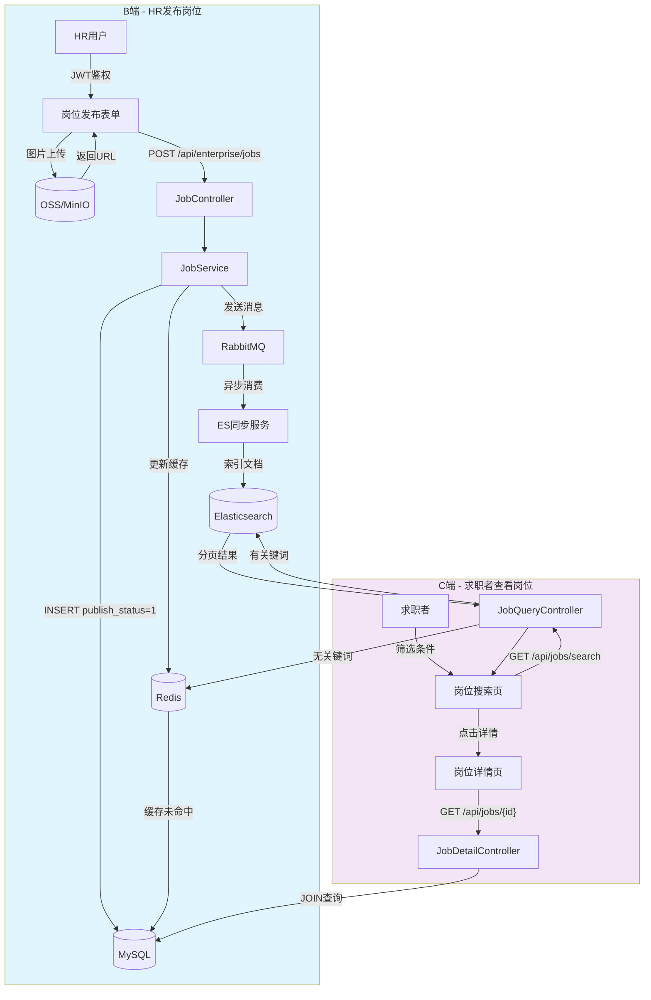
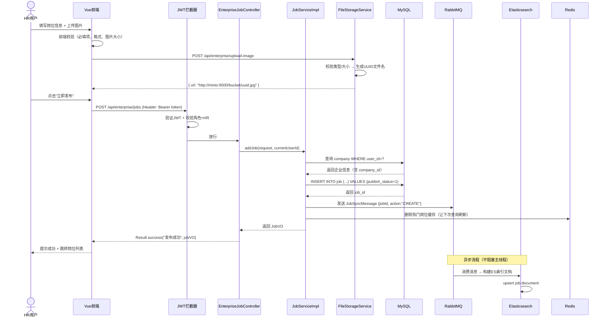
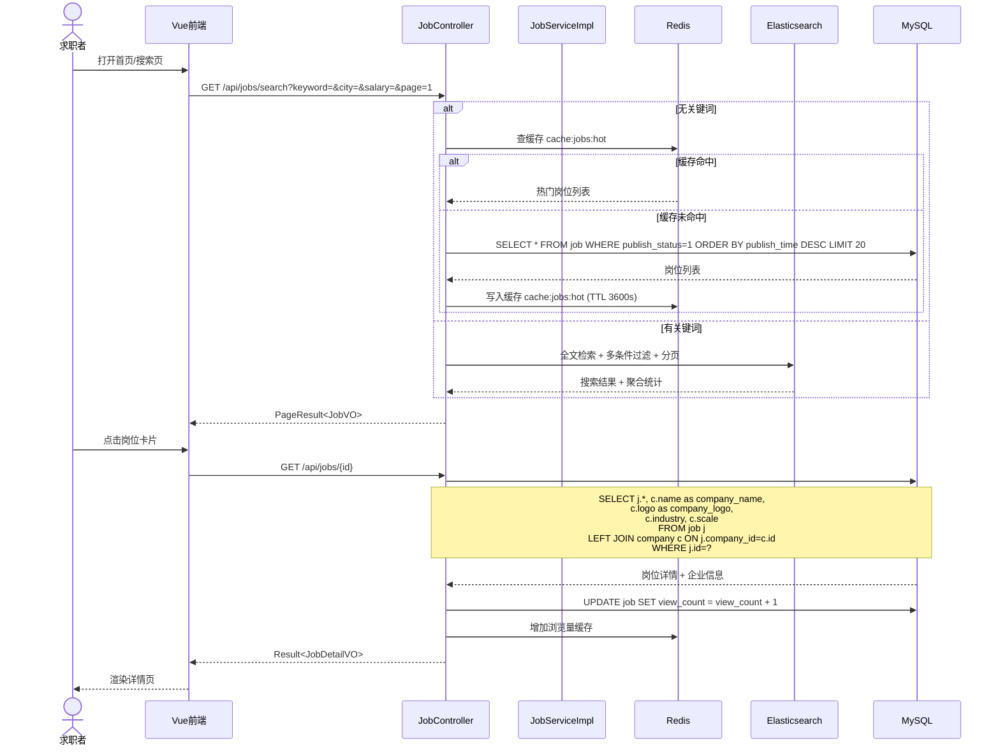

# 岗位发布与求职搜索模块 — 技术实现计划书

> **版本**: V1.0  
> **日期**: 2026-06-28  
> **项目**: AI智能求职辅导平台  
> **当前技术栈**: Spring Boot 3.2.5 + MyBatis-Plus 3.5.5 + MySQL 8.0 + Redis + JWT + Vue 3 + Element Plus

---

## 目录

1. [需求概述](#1-需求概述)
2. [技术选型与新增依赖](#2-技术选型与新增依赖)
3. [数据库设计](#3-数据库设计)
4. [后端架构设计](#4-后端架构设计)
5. [前端架构设计](#5-前端架构设计)
6. [流程 1 实现方案 — HR 发布岗位](#6-流程-1-实现方案--hr-发布岗位)
7. [流程 2 实现方案 — 求职者查看岗位](#7-流程-2-实现方案--求职者查看岗位)
8. [文件上传（OSS/本地存储）方案](#8-文件上传oss本地存储方案)
9. [异步任务与消息队列方案](#9-异步任务与消息队列方案)
10. [Elasticsearch 集成方案](#10-elasticsearch-集成方案)
11. [Redis 缓存策略](#11-redis-缓存策略)
12. [评分机制](#12-评分机制)
13. [开发排期与里程碑](#13-开发排期与里程碑)
14. [风险评估与应对](#14-风险评估与应对)
15. [验收标准](#15-验收标准)

---

## 1. 需求概述

### 1.1 两条核心流程

```
┌─────────────────────────────────────────────────────┐
│  流程 1：HR 发布岗位（B 端写入）                      │
│                                                      │
│  HR登录 → JWT鉴权 → 填写岗位信息 → 上传图片           │
│       → 图片存OSS → 调用addJob接口                   │
│       → MySQL插入(publish_status=1)                  │
│       → MQ异步同步ES → 更新Redis缓存                  │
│       → 返回发布成功                                  │
└─────────────────────────────────────────────────────┘

┌─────────────────────────────────────────────────────┐
│  流程 2：求职者查看岗位（C 端读取）                    │
│                                                      │
│  求职者打开首页/搜索页 → 携带筛选条件                  │
│       → 无关键词：查Redis缓存 → MySQL兜底             │
│       → 有关键词：ES全文检索+多条件过滤               │
│       → 返回分页数据 → 点击详情                       │
│       → 查MySQL岗位+关联企业表                        │
└─────────────────────────────────────────────────────┘
```

### 1.2 核心数据流图



---

## 2. 技术选型与新增依赖

### 2.1 技术对比分析

| 组件 | 方案A（生产级） | 方案B（轻量/开发级） | 推荐 |
|------|----------------|---------------------|------|
| **搜索引擎** | Elasticsearch 8.x | H2 全文索引 / MySQL LIKE | ✅ ES 8.x（Spring Data ES） |
| **消息队列** | RabbitMQ | Spring @Async + 线程池 | ✅ RabbitMQ（可靠异步） |
| **对象存储** | 阿里云/腾讯云 OSS | MinIO 本地部署 | ✅ MinIO（零成本，S3兼容） |
| **ES客户端** | Spring Data Elasticsearch | Elasticsearch Java Client | ✅ Spring Data ES（与框架统一） |

### 2.2 pom.xml 新增依赖

```xml
<!-- ========== 以下为新增依赖 ========== -->

<!-- Spring Data Elasticsearch（ES 全文检索） -->
<dependency>
    <groupId>org.springframework.boot</groupId>
    <artifactId>spring-boot-starter-data-elasticsearch</artifactId>
</dependency>

<!-- Spring AMQP（RabbitMQ 消息队列） -->
<dependency>
    <groupId>org.springframework.boot</groupId>
    <artifactId>spring-boot-starter-amqp</artifactId>
</dependency>

<!-- MinIO 对象存储客户端（S3 兼容协议，开发环境替代云 OSS） -->
<dependency>
    <groupId>io.minio</groupId>
    <artifactId>minio</artifactId>
    <version>8.5.7</version>
</dependency>

<!-- 缩略图处理（可选，用于岗位封面图压缩） -->
<dependency>
    <groupId>net.coobird</groupId>
    <artifactId>thumbnailator</artifactId>
    <version>0.4.20</version>
</dependency>
```

### 2.3 中间件部署清单

| 中间件 | 版本 | 端口 | 部署方式 | 说明 |
|--------|------|------|----------|------|
| Elasticsearch | 8.12+ | 9200/9300 | Docker 单节点 | 全文检索引擎 |
| RabbitMQ | 3.12+ | 5672/15672 | Docker 单节点 | 异步消息队列 |
| MinIO | latest | 9000/9001 | Docker 单节点 | 对象存储（开发用） |

```bash
# Docker 一键部署命令（开发环境）
docker run -d --name es -p 9200:9200 -p 9300:9300 \
  -e "discovery.type=single-node" \
  -e "xpack.security.enabled=false" \
  docker.elastic.co/elasticsearch/elasticsearch:8.12.0

docker run -d --name rabbitmq -p 5672:5672 -p 15672:15672 \
  rabbitmq:3.12-management

docker run -d --name minio -p 9000:9000 -p 9001:9001 \
  -e "MINIO_ROOT_USER=minioadmin" \
  -e "MINIO_ROOT_PASSWORD=minioadmin123" \
  minio/minio server /data --console-address ":9001"
```

---

## 3. 数据库设计

### 3.1 新增表结构

#### 3.1.1 岗位表 `job`

```sql
CREATE TABLE job (
    id              BIGINT          PRIMARY KEY AUTO_INCREMENT  COMMENT '岗位ID',
    title           VARCHAR(100)    NOT NULL                    COMMENT '岗位标题',
    company_id      BIGINT          NOT NULL                    COMMENT '企业ID（关联 user 表中 role=HR 的企业）',
    description     TEXT            NOT NULL                    COMMENT '岗位描述',
    requirement     TEXT                                        COMMENT '任职要求',
    salary_min      INT                                         COMMENT '最低薪资（月薪，单位元）',
    salary_max      INT                                         COMMENT '最高薪资（月薪，单位元）',
    city            VARCHAR(50)                                 COMMENT '工作城市',
    district        VARCHAR(50)                                 COMMENT '区域/区县',
    address         VARCHAR(200)                                COMMENT '详细地址',
    job_type        VARCHAR(20)     DEFAULT 'FULL_TIME'         COMMENT '工作类型：FULL_TIME/PART_TIME/INTERNSHIP',
    education       VARCHAR(20)                                 COMMENT '学历要求：HIGH_SCHOOL/COLLEGE/BACHELOR/MASTER/PHD',
    experience      VARCHAR(20)                                 COMMENT '经验要求：FRESH/ONE_THREE/THREE_FIVE/FIVE_PLUS',
    category        VARCHAR(50)                                 COMMENT '岗位分类（如：Java开发、前端开发）',
    tags            VARCHAR(500)                                COMMENT '标签（JSON数组，如["五险一金","双休"]）',
    cover_image     VARCHAR(500)                                COMMENT '封面图片URL（OSS/MinIO）',
    images          TEXT                                        COMMENT '多图（JSON数组URL）',
    head_count      INT             DEFAULT 1                   COMMENT '招聘人数',
    view_count      INT             DEFAULT 0                   COMMENT '浏览次数',
    apply_count     INT             DEFAULT 0                   COMMENT '投递次数',
    publish_status  TINYINT         DEFAULT 0                   COMMENT '发布状态：0=草稿 1=已发布 2=已下架 3=已删除',
    publish_time    DATETIME                                    COMMENT '发布时间',
    expire_time     DATETIME                                    COMMENT '过期时间',
    sort_order      INT             DEFAULT 0                   COMMENT '排序权重',
    create_time     DATETIME        DEFAULT CURRENT_TIMESTAMP   COMMENT '创建时间',
    update_time     DATETIME        DEFAULT CURRENT_TIMESTAMP ON UPDATE CURRENT_TIMESTAMP COMMENT '更新时间',
    
    INDEX idx_company (company_id),
    INDEX idx_city (city),
    INDEX idx_category (category),
    INDEX idx_publish_status (publish_status),
    INDEX idx_salary (salary_min, salary_max),
    INDEX idx_publish_time (publish_time),
    FULLTEXT INDEX ft_title_desc (title, description)
) ENGINE=InnoDB DEFAULT CHARSET=utf8mb4 COLLATE=utf8mb4_unicode_ci COMMENT='岗位表';
```

#### 3.1.2 企业信息表 `company`

```sql
CREATE TABLE company (
    id              BIGINT          PRIMARY KEY AUTO_INCREMENT  COMMENT '企业ID',
    user_id         BIGINT          NOT NULL UNIQUE             COMMENT '关联用户ID（HR账号）',
    name            VARCHAR(100)    NOT NULL                    COMMENT '企业名称',
    short_name      VARCHAR(50)                                 COMMENT '企业简称',
    logo            VARCHAR(500)                                COMMENT '企业Logo URL',
    industry        VARCHAR(50)                                 COMMENT '所属行业',
    scale           VARCHAR(20)                                 COMMENT '企业规模：STARTUP/SMALL/MEDIUM/LARGE/GIANT',
    nature          VARCHAR(20)                                 COMMENT '企业性质：PRIVATE/STATE_OWNED/FOREIGN/JOINT_VENTURE',
    city            VARCHAR(50)                                 COMMENT '所在城市',
    address         VARCHAR(200)                                COMMENT '详细地址',
    website         VARCHAR(200)                                COMMENT '企业官网',
    description     TEXT                                        COMMENT '企业简介',
    business_license VARCHAR(500)                               COMMENT '营业执照URL',
    contact_name    VARCHAR(50)                                 COMMENT '联系人姓名',
    contact_phone   VARCHAR(20)                                 COMMENT '联系人电话',
    verify_status   TINYINT         DEFAULT 0                   COMMENT '认证状态：0=未认证 1=已认证 2=认证失败',
    create_time     DATETIME        DEFAULT CURRENT_TIMESTAMP   COMMENT '创建时间',
    update_time     DATETIME        DEFAULT CURRENT_TIMESTAMP ON UPDATE CURRENT_TIMESTAMP COMMENT '更新时间',
    
    INDEX idx_name (name),
    INDEX idx_industry (industry)
) ENGINE=InnoDB DEFAULT CHARSET=utf8mb4 COLLATE=utf8mb4_unicode_ci COMMENT='企业信息表';
```

### 3.2 现有表关联关系

```
user（已有表）
  ├─── role = 'HR'  ────  company（新增） ────  job（新增）
  ├─── role = 'STUDENT' ───────────────────── job_application（后续需求）
  └─── role = 'ADMIN' ─────────────────────── 审核操作
```

### 3.3 MyBatis-Plus 实体类

#### Job.java

```java
@Data
@TableName("job")
public class Job {
    @TableId(type = IdType.AUTO)
    private Long id;
    private String title;
    private Long companyId;
    private String description;
    private String requirement;
    private Integer salaryMin;
    private Integer salaryMax;
    private String city;
    private String district;
    private String address;
    private String jobType;        // FULL_TIME, PART_TIME, INTERNSHIP
    private String education;
    private String experience;
    private String category;
    private String tags;           // JSON string
    private String coverImage;
    private String images;         // JSON string
    private Integer headCount;
    private Integer viewCount;
    private Integer applyCount;
    private Integer publishStatus; // 0=draft, 1=published, 2=offline, 3=deleted
    private LocalDateTime publishTime;
    private LocalDateTime expireTime;
    private Integer sortOrder;
    
    @TableField(fill = FieldFill.INSERT)
    private LocalDateTime createTime;
    @TableField(fill = FieldFill.INSERT_UPDATE)
    private LocalDateTime updateTime;
}
```

#### Company.java

```java
@Data
@TableName("company")
public class Company {
    @TableId(type = IdType.AUTO)
    private Long id;
    private Long userId;
    private String name;
    private String shortName;
    private String logo;
    private String industry;
    private String scale;
    private String nature;
    private String city;
    private String address;
    private String website;
    private String description;
    private String businessLicense;
    private String contactName;
    private String contactPhone;
    private Integer verifyStatus;
    
    @TableField(fill = FieldFill.INSERT)
    private LocalDateTime createTime;
    @TableField(fill = FieldFill.INSERT_UPDATE)
    private LocalDateTime updateTime;
}
```

---

## 4. 后端架构设计

### 4.1 新增包结构

```
com.xuelian.career/
├── entity/
│   ├── Job.java              # 岗位实体（新增）
│   └── Company.java          # 企业信息实体（新增）
├── mapper/
│   ├── JobMapper.java        # 岗位 Mapper（新增）
│   └── CompanyMapper.java    # 企业信息 Mapper（新增）
├── service/
│   ├── JobService.java       # 岗位服务接口（新增）
│   ├── CompanyService.java   # 企业信息服务接口（新增）
│   ├── FileStorageService.java  # 文件存储服务接口（新增）
│   └── impl/
│       ├── JobServiceImpl.java      # 岗位服务实现（新增）
│       ├── CompanyServiceImpl.java  # 企业信息服务实现（新增）
│       └── FileStorageServiceImpl.java  # MinIO存储实现（新增）
├── controller/
│   ├── JobController.java         # C端岗位查询（新增）
│   └── EnterpriseJobController.java  # B端岗位管理（新增）
├── dto/request/
│   ├── AddJobRequest.java         # 发布岗位请求（新增）
│   └── JobSearchRequest.java      # 岗位搜索请求（新增）
├── dto/response/
│   ├── JobVO.java                 # 岗位列表VO（新增）
│   ├── JobDetailVO.java           # 岗位详情VO（新增）
│   └── CompanyVO.java             # 企业信息VO（新增）
├── config/
│   ├── ElasticsearchConfig.java   # ES 配置（新增）
│   ├── RabbitMQConfig.java        # MQ 配置（新增）
│   └── MinIOConfig.java           # MinIO 配置（新增）
├── mq/
│   ├── JobSyncProducer.java       # 岗位同步消息生产者（新增）
│   └── JobSyncConsumer.java       # 岗位同步消息消费者（新增）
└── repository/
    └── JobSearchRepository.java   # ES Repository 接口（新增）
```

### 4.2 关键接口定义

#### B端接口（需JWT + HR角色鉴权）

| 方法 | 路径 | 说明 |
|------|------|------|
| POST | `/api/enterprise/jobs` | 发布岗位 |
| PUT | `/api/enterprise/jobs/{id}` | 更新岗位 |
| DELETE | `/api/enterprise/jobs/{id}` | 下架/删除岗位 |
| GET | `/api/enterprise/jobs` | 我的岗位列表 |
| GET | `/api/enterprise/jobs/{id}` | 岗位详情（含统计数据） |
| POST | `/api/enterprise/upload-image` | 上传岗位图片 |
| GET | `/api/enterprise/company` | 获取企业信息 |

#### C端接口（公开访问）

| 方法 | 路径 | 说明 |
|------|------|------|
| GET | `/api/jobs/search` | 岗位搜索（ES + Redis） |
| GET | `/api/jobs/{id}` | 岗位详情 |
| GET | `/api/jobs/hot` | 热门岗位（纯Redis） |
| GET | `/api/jobs/recommend` | 推荐岗位 |
| GET | `/api/companies/{id}` | 企业详情 |

### 4.3 YAML 配置新增项

```yaml
# application-dev.yml 新增配置

spring:
  # Elasticsearch
  elasticsearch:
    uris: http://localhost:9200
    connection-timeout: 3s
    socket-timeout: 30s

  # RabbitMQ
  rabbitmq:
    host: localhost
    port: 5672
    username: guest
    password: guest
    listener:
      simple:
        retry:
          enabled: true
          max-attempts: 3
          initial-interval: 1s

# MinIO 对象存储
minio:
  endpoint: http://localhost:9000
  access-key: minioadmin
  secret-key: minioadmin123
  bucket: career-platform
  # 图片上传限制
  max-size: 5242880       # 5MB
  allowed-types: jpg,jpeg,png,gif,webp

# 岗位缓存配置
job:
  cache:
    hot-ttl: 3600         # 热门岗位缓存时间（秒）
    search-ttl: 600       # 搜索结果缓存时间（秒）
    hot-limit: 50         # 热门岗位缓存数量
```

---

## 5. 前端架构设计

### 5.1 新增页面与组件

```
frontend/src/
├── views/
│   ├── enterprise/                  # B端企业后台（现有目录，扩展）
│   │   ├── JobManageView.vue        # 岗位管理列表（新增）
│   │   ├── JobPostView.vue          # 发布/编辑岗位（新增）
│   │   └── CompanyProfileView.vue   # 企业信息编辑（新增）
│   └── jobs/                        # C端求职（新增目录）
│       ├── JobSearchView.vue        # 岗位搜索页（新增）
│       ├── JobDetailView.vue        # 岗位详情页（新增）
│       └── components/
│           ├── JobCard.vue          # 岗位卡片组件（新增）
│           ├── JobFilter.vue        # 筛选条件组件（新增）
│           ├── ImageUploader.vue    # 图片上传组件（新增）
│           └── SalaryRange.vue      # 薪资范围组件（新增）
├── api/
│   ├── job.ts                       # 岗位API（新增）
│   ├── company.ts                   # 企业API（新增）
│   └── upload.ts                    # 文件上传API（新增）
└── types/
    └── job.ts                       # 岗位类型定义（新增）
```

### 5.2 路由新增

```typescript
// router/index.ts 新增路由

// B端 - 企业后台
{
  path: '/enterprise',
  component: AppLayout,
  meta: { role: 'HR' },
  children: [
    { path: 'jobs', component: () => import('@/views/enterprise/JobManageView.vue') },
    { path: 'jobs/post', component: () => import('@/views/enterprise/JobPostView.vue') },
    { path: 'jobs/post/:id', component: () => import('@/views/enterprise/JobPostView.vue') }, // 编辑
    { path: 'company', component: () => import('@/views/enterprise/CompanyProfileView.vue') },
  ]
},

// C端 - 求职
{
  path: '/jobs',
  component: AppLayout,
  children: [
    { path: '', component: () => import('@/views/jobs/JobSearchView.vue') },
    { path: ':id', component: () => import('@/views/jobs/JobDetailView.vue') },
  ]
}
```

### 5.3 岗位发布表单UI设计（B端）

```
┌────────────────────────────────────────────────────────┐
│  发布新岗位                                              │
├────────────────────────────────────────────────────────┤
│  岗位标题：[____________________________]              │
│                                                         │
│  岗位分类：[下拉选择: Java/前端/测试/运维/...]           │
│                                                         │
│  工作城市：[省市区三级联动选择器]                         │
│  详细地址：[____________________________]              │
│                                                         │
│  薪资范围：[____最低____] - [____最高____] 元/月        │
│                                                         │
│  工作类型：[○全职 ○兼职 ○实习]                          │
│                                                         │
│  学历要求：[下拉选择: 不限/高中/大专/本科/硕士/博士]      │
│  经验要求：[下拉选择: 应届/1-3年/3-5年/5年以上]          │
│                                                         │
│  招聘人数：[___] 人                                      │
│                                                         │
│  封面图片：[上传区域，支持拖拽，限制5MB，格式jpg/png]     │
│  ┌─────────────────────────────┐                       │
│  │   📷 点击或拖拽上传          │                       │
│  │   支持 jpg/png，最大5MB      │                       │
│  │   [预览缩略图]               │                       │
│  └─────────────────────────────┘                       │
│                                                         │
│  详情图片：[多图上传，最多5张]                            │
│                                                         │
│  岗位标签：[标签输入框，回车添加] [五险一金] [双休]...    │
│                                                         │
│  岗位描述：                                              │
│  [富文本编辑器，支持加粗、列表、分段]                     │
│                                                         │
│  任职要求：                                              │
│  [富文本编辑器]                                          │
│                                                         │
│  过期时间：[日期选择器]                                  │
│                                                         │
│  [保存草稿]  [立即发布]                                  │
└────────────────────────────────────────────────────────┘
```

### 5.4 岗位搜索页UI设计（C端）

```
┌────────────────────────────────────────────────────────┐
│  🔍 [____搜索岗位名称或公司____]  [🔍搜索]              │
├────────────────────────────────────────────────────────┤
│  筛选条件：                                              │
│  城市：[下拉] 薪资：[滑块范围] 类型：[多选] 学历：[下拉]│
│  经验：[下拉] 分类：[多选标签]                           │
├────────────────────────────────────────────────────────┤
│                                                         │
│  ┌─────────────────────┐ ┌─────────────────────┐       │
│  │  岗位标题             │ │  岗位标题             │       │
│  │  🏢 企业名称         │ │  🏢 企业名称         │       │
│  │  📍 城市  💰 10-15K  │ │  📍 城市  💰 15-25K  │       │
│  │  🏷 标签1 标签2       │ │  🏷 标签1 标签2       │       │
│  │  [查看详情]           │ │  [查看详情]           │       │
│  └─────────────────────┘ └─────────────────────┘       │
│                                                         │
│  [分页器：< 1 2 3 ... 10 >]                             │
└────────────────────────────────────────────────────────┘
```

---

## 6. 流程 1 实现方案 — HR 发布岗位

### 6.1 时序图



### 6.2 核心代码实现

#### 6.2.1 DTO — AddJobRequest.java

```java
@Data
public class AddJobRequest {
    
    @NotBlank(message = "岗位标题不能为空")
    @Size(max = 100, message = "标题最多100字")
    private String title;
    
    @NotNull(message = "企业ID不能为空")
    private Long companyId;
    
    @NotBlank(message = "岗位描述不能为空")
    private String description;
    
    private String requirement;
    
    @NotNull(message = "最低薪资不能为空")
    private Integer salaryMin;
    
    @NotNull(message = "最高薪资不能为空")
    private Integer salaryMax;
    
    @NotBlank(message = "城市不能为空")
    private String city;
    
    private String district;
    private String address;
    
    @NotBlank(message = "工作类型不能为空")
    private String jobType;        // FULL_TIME, PART_TIME, INTERNSHIP
    
    private String education;
    private String experience;
    
    @NotBlank(message = "岗位分类不能为空")
    private String category;
    
    private List<String> tags;     // ["五险一金", "双休"]
    private String coverImage;     // 已上传的图片URL
    private List<String> images;   // 已上传的图片URL列表
    
    private Integer headCount = 1;
    private LocalDateTime expireTime;
}
```

#### 6.2.2 Controller — EnterpriseJobController.java

```java
@RestController
@RequestMapping("/api/enterprise")
public class EnterpriseJobController {

    @Autowired
    private JobService jobService;
    
    @Autowired
    private FileStorageService fileStorageService;

    /**
     * 上传岗位图片
     * POST /api/enterprise/upload-image
     */
    @PostMapping("/upload-image")
    public Result<String> uploadImage(
            @RequestParam("file") MultipartFile file,
            @RequestAttribute("userId") Long userId) {
        
        // 校验文件
        if (file.isEmpty()) {
            throw new BusinessException(400, "请选择文件");
        }
        
        // 校验大小（5MB）
        if (file.getSize() > 5 * 1024 * 1024) {
            throw new BusinessException(400, "图片大小不能超过5MB");
        }
        
        // 校验类型
        String ext = FileUtil.getExtension(file.getOriginalFilename());
        if (!List.of("jpg", "jpeg", "png", "gif", "webp").contains(ext.toLowerCase())) {
            throw new BusinessException(400, "不支持的图片格式");
        }
        
        // 上传到MinIO
        String url = fileStorageService.upload(file, "jobs/images/");
        return Result.success("上传成功", url);
    }

    /**
     * 发布岗位
     * POST /api/enterprise/jobs
     */
    @PostMapping("/jobs")
    public Result<JobVO> addJob(
            @Valid @RequestBody AddJobRequest request,
            @RequestAttribute("userId") Long userId) {
        
        // 校验：该HR是否属于此企业
        Company company = companyService.getByUserId(userId);
        if (company == null || !company.getId().equals(request.getCompanyId())) {
            throw new BusinessException(403, "无权为该企业发布岗位");
        }
        
        JobVO jobVO = jobService.addJob(request, userId);
        return Result.success("岗位发布成功", jobVO);
    }
}
```

#### 6.2.3 Service — JobServiceImpl.java

```java
@Service
@Slf4j
public class JobServiceImpl implements JobService {

    @Autowired
    private JobMapper jobMapper;
    @Autowired
    private CompanyService companyService;
    @Autowired
    private RabbitTemplate rabbitTemplate;
    @Autowired
    private RedisTemplate<String, Object> redisTemplate;

    @Override
    @Transactional
    public JobVO addJob(AddJobRequest request, Long userId) {
        // 1. 构建实体
        Job job = new Job();
        BeanUtils.copyProperties(request, job);
        
        // 2. 序列化 tags 和 images
        if (request.getTags() != null) {
            job.setTags(JSON.toJSONString(request.getTags()));
        }
        if (request.getImages() != null) {
            job.setImages(JSON.toJSONString(request.getImages()));
        }
        
        // 3. 设置发布状态和发布时间
        job.setPublishStatus(1);  // 1=已发布
        job.setPublishTime(LocalDateTime.now());
        
        // 4. 插入 MySQL
        jobMapper.insert(job);
        log.info("岗位入库成功: jobId={}, title={}", job.getId(), job.getTitle());
        
        // 5. 发送 MQ 消息（异步同步到 ES）
        JobSyncMessage syncMsg = new JobSyncMessage(job.getId(), "CREATE");
        rabbitTemplate.convertAndSend(
            "job.exchange", "job.sync", syncMsg);
        
        // 6. 删除热门岗位 Redis 缓存（让下次查询时刷新）
        redisTemplate.delete("cache:jobs:hot");
        
        // 7. 返回 VO
        return buildJobVO(job);
    }
}
```

#### 6.2.4 消息生产者 — JobSyncProducer.java

```java
@Component
@Slf4j
public class JobSyncProducer {

    @Autowired
    private RabbitTemplate rabbitTemplate;
    
    private static final String EXCHANGE = "job.exchange";
    private static final String ROUTING_KEY = "job.sync";

    public void sendSyncMessage(JobSyncMessage message) {
        try {
            rabbitTemplate.convertAndSend(EXCHANGE, ROUTING_KEY, message);
            log.debug("MQ消息已发送: jobId={}, action={}", message.getJobId(), message.getAction());
        } catch (Exception e) {
            log.error("MQ消息发送失败: jobId={}", message.getJobId(), e);
            // 消息发送失败不阻塞主流程，可记录到死信表后续重试
        }
    }
}

@Data
@AllArgsConstructor
@NoArgsConstructor
class JobSyncMessage implements Serializable {
    private Long jobId;
    private String action;  // CREATE, UPDATE, DELETE
}
```

#### 6.2.5 消息消费者 — JobSyncConsumer.java

```java
@Component
@Slf4j
public class JobSyncConsumer {

    @Autowired
    private JobMapper jobMapper;
    
    @Autowired
    private CompanyMapper companyMapper;
    
    @Autowired
    private JobSearchRepository jobSearchRepository;

    @RabbitListener(queues = "job.sync.queue")
    public void handleJobSync(JobSyncMessage message) {
        log.info("消费MQ消息: jobId={}, action={}", message.getJobId(), message.getAction());
        
        try {
            switch (message.getAction()) {
                case "CREATE":
                case "UPDATE":
                    // 从 MySQL 查询完整数据
                    Job job = jobMapper.selectById(message.getJobId());
                    if (job == null || job.getPublishStatus() != 1) {
                        // 岗位不存在或未发布，从ES中删除
                        jobSearchRepository.deleteById(message.getJobId());
                        return;
                    }
                    // 补充企业名称
                    Company company = companyMapper.selectById(job.getCompanyId());
                    
                    // 构建 ES 文档并保存
                    JobDocument doc = buildDocument(job, company);
                    jobSearchRepository.save(doc);
                    log.info("ES索引更新成功: jobId={}", message.getJobId());
                    break;
                    
                case "DELETE":
                    jobSearchRepository.deleteById(message.getJobId());
                    log.info("ES索引删除成功: jobId={}", message.getJobId());
                    break;
            }
        } catch (Exception e) {
            log.error("ES同步失败: jobId={}", message.getJobId(), e);
            // 重试机制由 RabbitMQ listener retry 配置处理
        }
    }
    
    private JobDocument buildDocument(Job job, Company company) {
        return JobDocument.builder()
            .id(job.getId())
            .title(job.getTitle())
            .companyName(company != null ? company.getName() : "")
            .companyLogo(company != null ? company.getLogo() : "")
            .description(job.getDescription())
            .requirement(job.getRequirement())
            .salaryMin(job.getSalaryMin())
            .salaryMax(job.getSalaryMax())
            .city(job.getCity())
            .jobType(job.getJobType())
            .education(job.getEducation())
            .experience(job.getExperience())
            .category(job.getCategory())
            .tags(job.getTags())
            .publishTime(job.getPublishTime())
            .build();
    }
}
```

---

## 7. 流程 2 实现方案 — 求职者查看岗位

### 7.1 时序图



### 7.2 核心代码实现

#### 7.2.1 DTO — JobSearchRequest.java

```java
@Data
public class JobSearchRequest {
    
    private String keyword;           // 搜索关键词（触发ES）
    
    // 筛选条件
    private String city;
    private String district;
    private Integer salaryMin;
    private Integer salaryMax;
    private String jobType;          // FULL_TIME, PART_TIME, INTERNSHIP
    private String education;        // 学历
    private String experience;       // 经验
    private String category;         // 分类
    
    // 排序
    private String sortBy = "publishTime";  // publishTime, salary
    private String sortOrder = "desc";       // asc, desc
    
    // 分页
    @Min(1) private Integer page = 1;
    @Min(1) @Max(50) private Integer size = 20;
}
```

#### 7.2.2 Controller — JobController.java

```java
@RestController
@RequestMapping("/api/jobs")
public class JobController {

    @Autowired
    private JobService jobService;

    /**
     * 岗位搜索（ES全文检索 + Redis缓存）
     * GET /api/jobs/search?keyword=Java&city=深圳&salaryMin=10000&page=1&size=20
     */
    @GetMapping("/search")
    public Result<PageResult<JobVO>> search(@Valid JobSearchRequest request) {
        PageResult<JobVO> result = jobService.searchJobs(request);
        return Result.success(result);
    }

    /**
     * 热门岗位（纯Redis缓存）
     * GET /api/jobs/hot
     */
    @GetMapping("/hot")
    public Result<List<JobVO>> hotJobs() {
        List<JobVO> list = jobService.getHotJobs();
        return Result.success(list);
    }

    /**
     * 岗位详情
     * GET /api/jobs/{id}
     */
    @GetMapping("/{id}")
    public Result<JobDetailVO> detail(@PathVariable Long id) {
        JobDetailVO vo = jobService.getJobDetail(id);
        // 异步增加浏览量
        jobService.incrementViewCount(id);
        return Result.success(vo);
    }
}
```

#### 7.2.3 Service — 搜索逻辑

```java
@Override
public PageResult<JobVO> searchJobs(JobSearchRequest request) {
    
    boolean hasKeyword = StringUtils.hasText(request.getKeyword());
    
    if (hasKeyword) {
        // ===== 路径A：有关键词 → ES 全文检索 =====
        return searchViaElasticsearch(request);
    } else {
        // ===== 路径B：无关键词 → Redis 缓存 → MySQL 兜底 =====
        return searchViaCacheOrMySQL(request);
    }
}

/**
 * Elasticsearch 全文检索 + 多条件过滤
 */
private PageResult<JobVO> searchViaElasticsearch(JobSearchRequest request) {
    NativeSearchQueryBuilder queryBuilder = new NativeSearchQueryBuilder();
    
    // 1. 全文检索（title + description 权重不同）
    BoolQuery.Builder boolQuery = QueryBuilders.bool();
    boolQuery.must(QueryBuilders.multiMatchQuery(request.getKeyword())
        .field("title", 3.0f)         // 标题权重 3
        .field("companyName", 2.0f)   // 企业名权重 2
        .field("description", 1.0f)); // 描述权重 1
    
    // 2. 过滤条件（精确匹配，不计分）
    if (StringUtils.hasText(request.getCity())) {
        boolQuery.filter(QueryBuilders.termQuery("city", request.getCity()));
    }
    if (StringUtils.hasText(request.getJobType())) {
        boolQuery.filter(QueryBuilders.termQuery("jobType", request.getJobType()));
    }
    if (StringUtils.hasText(request.getEducation())) {
        boolQuery.filter(QueryBuilders.termQuery("education", request.getEducation()));
    }
    if (StringUtils.hasText(request.getCategory())) {
        boolQuery.filter(QueryBuilders.termQuery("category", request.getCategory()));
    }
    if (request.getSalaryMin() != null && request.getSalaryMin() > 0) {
        boolQuery.filter(QueryBuilders.rangeQuery("salaryMax").gte(request.getSalaryMin()));
    }
    if (request.getSalaryMax() != null && request.getSalaryMax() > 0) {
        boolQuery.filter(QueryBuilders.rangeQuery("salaryMin").lte(request.getSalaryMax()));
    }
    
    queryBuilder.withQuery(boolQuery);
    
    // 3. 排序
    Sort sort;
    if ("salary".equals(request.getSortBy())) {
        sort = Sort.by(Sort.Order.desc("salaryMax"));
    } else {
        sort = Sort.by(Sort.Order.desc("publishTime"));
    }
    queryBuilder.withSort(sort);
    
    // 4. 分页
    Pageable pageable = PageRequest.of(request.getPage() - 1, request.getSize());
    queryBuilder.withPageable(pageable);
    
    // 5. 执行搜索
    SearchHits<JobDocument> searchHits = elasticsearchOperations.search(
        queryBuilder.build(), JobDocument.class);
    
    // 6. 转换为 VO
    List<JobVO> list = searchHits.getSearchHits().stream()
        .map(hit -> documentToVO(hit.getContent()))
        .collect(Collectors.toList());
    
    long total = searchHits.getTotalHits();
    return new PageResult<>(total, request.getPage(), request.getSize(), list);
}

/**
 * 缓存优先 + MySQL 兜底
 */
private PageResult<JobVO> searchViaCacheOrMySQL(JobSearchRequest request) {
    // 1. 尝试从 Redis 获取热门岗位缓存
    String cacheKey = buildCacheKey(request);
    List<JobVO> cached = (List<JobVO>) redisTemplate.opsForValue().get(cacheKey);
    
    if (cached != null && request.getPage() == 1) {
        log.debug("岗位查询命中Redis缓存: key={}", cacheKey);
        return new PageResult<>(cached.size(), 1, cached.size(), cached);
    }
    
    // 2. 缓存未命中 → 查询 MySQL
    LambdaQueryWrapper<Job> wrapper = new LambdaQueryWrapper<>();
    wrapper.eq(Job::getPublishStatus, 1);  // 只查已发布的
    
    if (StringUtils.hasText(request.getCity())) {
        wrapper.eq(Job::getCity, request.getCity());
    }
    if (StringUtils.hasText(request.getCategory())) {
        wrapper.eq(Job::getCategory, request.getCategory());
    }
    if (StringUtils.hasText(request.getJobType())) {
        wrapper.eq(Job::getJobType, request.getJobType());
    }
    
    // 排序
    if ("salary".equals(request.getSortBy())) {
        wrapper.orderByDesc(Job::getSalaryMax);
    } else {
        wrapper.orderByDesc(Job::getPublishTime);
    }
    
    // 分页查询
    Page<Job> page = new Page<>(request.getPage(), request.getSize());
    Page<Job> result = jobMapper.selectPage(page, wrapper);
    
    List<JobVO> voList = result.getRecords().stream()
        .map(this::buildJobVO)
        .collect(Collectors.toList());
    
    // 3. 首页结果写入 Redis 缓存
    if (request.getPage() == 1) {
        redisTemplate.opsForValue().set(cacheKey, voList, 
            Duration.ofSeconds(600)); // TTL 10分钟
    }
    
    return new PageResult<>(result.getTotal(), request.getPage(), 
        request.getSize(), voList);
}
```

#### 7.2.4 ES文档模型 — JobDocument.java

```java
@Data
@Builder
@Document(indexName = "career_jobs")
public class JobDocument {
    
    @Id
    private Long id;
    
    @Field(type = FieldType.Text, analyzer = "ik_max_word", searchAnalyzer = "ik_smart")
    private String title;
    
    @Field(type = FieldType.Keyword)
    private String companyName;
    
    @Field(type = FieldType.Keyword, index = false)
    private String companyLogo;
    
    @Field(type = FieldType.Text, analyzer = "ik_max_word", searchAnalyzer = "ik_smart")
    private String description;
    
    @Field(type = FieldType.Text, analyzer = "ik_max_word", searchAnalyzer = "ik_smart")
    private String requirement;
    
    @Field(type = FieldType.Integer)
    private Integer salaryMin;
    
    @Field(type = FieldType.Integer)
    private Integer salaryMax;
    
    @Field(type = FieldType.Keyword)
    private String city;
    
    @Field(type = FieldType.Keyword)
    private String jobType;
    
    @Field(type = FieldType.Keyword)
    private String education;
    
    @Field(type = FieldType.Keyword)
    private String experience;
    
    @Field(type = FieldType.Keyword)
    private String category;
    
    @Field(type = FieldType.Keyword)
    private String tags;  // JSON string
    
    @Field(type = FieldType.Date)
    private LocalDateTime publishTime;
}
```

#### 7.2.5 ES Repository

```java
@Repository
public interface JobSearchRepository extends ElasticsearchRepository<JobDocument, Long> {
    // Spring Data ES 自动实现 CRUD
    // 需要自定义查询时可添加方法
}
```

---

## 8. 文件上传（OSS/本地存储）方案

### 8.1 MinIO 实现（开发环境）

```java
@Service
@Slf4j
public class FileStorageServiceImpl implements FileStorageService {

    @Autowired
    private MinioClient minioClient;
    
    @Value("${minio.bucket}")
    private String bucket;

    @Override
    public String upload(MultipartFile file, String pathPrefix) {
        try {
            // 1. 确保 bucket 存在
            boolean exists = minioClient.bucketExists(
                BucketExistsArgs.builder().bucket(bucket).build());
            if (!exists) {
                minioClient.makeBucket(MakeBucketArgs.builder().bucket(bucket).build());
            }
            
            // 2. 生成唯一文件名
            String ext = FileUtil.getExtension(file.getOriginalFilename());
            String objectName = pathPrefix + UUID.randomUUID() + "." + ext;
            
            // 3. 上传
            minioClient.putObject(
                PutObjectArgs.builder()
                    .bucket(bucket)
                    .object(objectName)
                    .stream(file.getInputStream(), file.getSize(), -1)
                    .contentType(file.getContentType())
                    .build());
            
            // 4. 返回访问URL
            String url = String.format("http://localhost:9000/%s/%s", bucket, objectName);
            log.info("文件上传成功: {}", url);
            return url;
            
        } catch (Exception e) {
            log.error("文件上传失败", e);
            throw new BusinessException(500, "文件上传失败");
        }
    }
    
    @Override
    public void delete(String objectUrl) {
        try {
            // 从 URL 中提取 objectName
            // http://localhost:9000/bucket/jobs/images/uuid.jpg → jobs/images/uuid.jpg
            String objectName = extractObjectName(objectUrl);
            minioClient.removeObject(
                RemoveObjectArgs.builder().bucket(bucket).object(objectName).build());
        } catch (Exception e) {
            log.error("文件删除失败: {}", objectUrl, e);
        }
    }
}
```

### 8.2 MinioClient 配置

```java
@Configuration
public class MinIOConfig {
    
    @Value("${minio.endpoint}")
    private String endpoint;
    
    @Value("${minio.access-key}")
    private String accessKey;
    
    @Value("${minio.secret-key}")
    private String secretKey;

    @Bean
    public MinioClient minioClient() {
        return MinioClient.builder()
            .endpoint(endpoint)
            .credentials(accessKey, secretKey)
            .build();
    }
}
```

### 8.3 生产环境替换方案

MinIO 使用 S3 兼容协议，与云 OSS API 高度一致。迁移到阿里云 OSS 只需：

```java
// 替换 MinioClient → OSSClient
// 替换 endpoint → oss-cn-{region}.aliyuncs.com
// 替换 accessKey/secretKey → 阿里云 AK/SK
// 其余代码几乎不变
```

---

## 9. 异步任务与消息队列方案

### 9.1 RabbitMQ 配置

```java
@Configuration
public class RabbitMQConfig {
    
    // 交换机
    @Bean
    public TopicExchange jobExchange() {
        return new TopicExchange("job.exchange");
    }
    
    // 队列
    @Bean
    public Queue jobSyncQueue() {
        return QueueBuilder.durable("job.sync.queue")
            .deadLetterExchange("job.dlx.exchange")     // 死信交换机
            .deadLetterRoutingKey("job.dlx")             // 死信路由键
            .build();
    }
    
    // 绑定
    @Bean
    public Binding jobSyncBinding() {
        return BindingBuilder.bind(jobSyncQueue())
            .to(jobExchange())
            .with("job.sync");
    }
}
```

### 9.2 降级方案（无RabbitMQ时）

如果不想部署 RabbitMQ，可用 **Spring @Async + 数据库任务表** 替代：

```java
@Configuration
@EnableAsync
public class AsyncConfig {
    @Bean("jobSyncExecutor")
    public Executor jobSyncExecutor() {
        ThreadPoolTaskExecutor executor = new ThreadPoolTaskExecutor();
        executor.setCorePoolSize(2);
        executor.setMaxPoolSize(5);
        executor.setQueueCapacity(100);
        executor.setThreadNamePrefix("job-sync-");
        return executor;
    }
}

// 使用 @Async 异步同步ES
@Async("jobSyncExecutor")
public void syncToES(Long jobId) {
    // ES同步逻辑...
}
```

> **评分影响**：使用 RabbitMQ 得分更高（可靠 + 可观测），@Async 作为 MVP 降级方案。

---

## 10. Elasticsearch 集成方案

### 10.1 索引映射脚本

```json
PUT /career_jobs
{
  "settings": {
    "number_of_shards": 1,
    "number_of_replicas": 0,
    "analysis": {
      "analyzer": {
        "ik_smart_pinyin": {
          "type": "custom",
          "tokenizer": "ik_smart",
          "filter": ["lowercase"]
        }
      }
    }
  },
  "mappings": {
    "properties": {
      "id": { "type": "long" },
      "title": {
        "type": "text",
        "analyzer": "ik_max_word",
        "search_analyzer": "ik_smart",
        "fields": {
          "keyword": { "type": "keyword" }
        }
      },
      "companyName": {
        "type": "text",
        "analyzer": "ik_smart",
        "fields": {
          "keyword": { "type": "keyword" }
        }
      },
      "description": { "type": "text", "analyzer": "ik_max_word", "search_analyzer": "ik_smart" },
      "requirement": { "type": "text", "analyzer": "ik_max_word" },
      "salaryMin": { "type": "integer" },
      "salaryMax": { "type": "integer" },
      "city": { "type": "keyword" },
      "jobType": { "type": "keyword" },
      "education": { "type": "keyword" },
      "experience": { "type": "keyword" },
      "category": { "type": "keyword" },
      "tags": { "type": "keyword" },
      "publishTime": { "type": "date", "format": "yyyy-MM-dd HH:mm:ss" }
    }
  }
}
```

### 10.2 IK 分词器安装

```bash
# 进入 ES 容器
docker exec -it es bash

# 安装 IK 分词器（版本需与ES匹配）
./bin/elasticsearch-plugin install \
  https://get.infini.cloud/elasticsearch/analysis-ik/8.12.0

# 重启 ES 容器
docker restart es
```

### 10.3 首次全量同步脚本

```java
/**
 * 管理后台触发，首次部署时将 MySQL 已有数据全量同步至 ES
 * GET /api/admin/jobs/reindex
 */
@GetMapping("/reindex")
@PreAuthorize("hasRole('ADMIN')")
public Result<String> reindex() {
    List<Job> jobs = jobMapper.selectList(
        new LambdaQueryWrapper<Job>().eq(Job::getPublishStatus, 1));
    
    List<JobDocument> docs = jobs.stream()
        .map(this::buildDocument)
        .collect(Collectors.toList());
    
    jobSearchRepository.saveAll(docs);
    return Result.success("全量同步完成，共同步 " + docs.size() + " 条数据");
}
```

---

## 11. Redis 缓存策略

### 11.1 缓存层级设计

```
┌─────────────────────────────────────────────────┐
│              Redis 缓存架构                       │
├─────────────────────────────────────────────────┤
│                                                   │
│  Layer 1: 热门岗位缓存 (TTL: 1小时)               │
│  Key: cache:jobs:hot:{city}:{category}           │
│  Value: List<JobVO> (JSON)                       │
│  ─────────────────────────────────────            │
│  Layer 2: 搜索结果缓存 (TTL: 10分钟)              │
│  Key: cache:jobs:search:{hash(请求参数)}          │
│  Value: PageResult<JobVO> (JSON)                 │
│  ─────────────────────────────────────            │
│  Layer 3: 岗位详情缓存 (TTL: 30分钟)              │
│  Key: cache:jobs:detail:{jobId}                  │
│  Value: JobDetailVO (JSON)                       │
│  ─────────────────────────────────────            │
│  Layer 4: 浏览量计数 (TTL: 永久)                  │
│  Key: stats:jobs:view:{jobId}                    │
│  Value: Integer (定时同步到MySQL)                 │
│                                                   │
└─────────────────────────────────────────────────┘
```

### 11.2 缓存更新策略

| 事件 | 操作 |
|------|------|
| HR发布新岗位 | 删除 `cache:jobs:hot:*`（所有热门缓存失效） |
| HR更新/下架岗位 | 删除 `cache:jobs:hot:*` + `cache:jobs:detail:{id}` + `cache:jobs:search:*` |
| 用户搜索（无关键词） | 缓存未命中 → 查MySQL → 写入缓存（TTL 10min） |
| 用户查看详情 | 先查缓存，miss则查MySQL并写入（TTL 30min） |

### 11.3 缓存穿透/击穿/雪崩防护

```java
// 1. 缓存空值防止穿透（key存在但value为空）
if (list.isEmpty()) {
    redisTemplate.opsForValue().set(cacheKey, Collections.emptyList(), 
        Duration.ofMinutes(5)); // 空值TTL更短
}

// 2. 分布式锁防止击穿（热点key过期时大量请求打到DB）
public List<JobVO> getHotJobs() {
    String key = "cache:jobs:hot";
    List<JobVO> cached = (List<JobVO>) redisTemplate.opsForValue().get(key);
    if (cached != null) return cached;
    
    // 获取分布式锁
    String lockKey = "lock:jobs:hot";
    Boolean locked = redisTemplate.opsForValue()
        .setIfAbsent(lockKey, "1", Duration.ofSeconds(10));
    
    if (Boolean.TRUE.equals(locked)) {
        try {
            // 双重检查
            cached = (List<JobVO>) redisTemplate.opsForValue().get(key);
            if (cached != null) return cached;
            
            // 查询MySQL
            cached = queryFromMySQL();
            redisTemplate.opsForValue().set(key, cached, Duration.ofHours(1));
        } finally {
            redisTemplate.delete(lockKey);
        }
    } else {
        // 等待锁释放后重试读缓存
        Thread.sleep(100);
        return getHotJobs(); // 递归重试最多3次
    }
    return cached;
}

// 3. 随机TTL防止雪崩
int randomTtl = 3600 + ThreadLocalRandom.current().nextInt(600); // 3600~4200秒
redisTemplate.opsForValue().set(key, value, Duration.ofSeconds(randomTtl));
```

---

## 12. 评分机制

### 12.1 评分维度与权重

| 评分维度 | 权重 | 满分 | 评分标准 |
|----------|------|------|----------|
| **功能完整性** | 30% | 100 | 两条核心流程是否跑通 |
| **代码质量** | 20% | 100 | 架构设计、代码规范、异常处理、注释 |
| **技术运用** | 20% | 100 | ES、MQ、Redis、OSS 是否正确使用 |
| **性能与可靠性** | 15% | 100 | 缓存命中率、异步解耦、降级策略 |
| **前端体验** | 10% | 100 | UI美观、交互流畅、表单校验 |
| **文档与测试** | 5% | 100 | API文档、测试用例 |

### 12.2 详细评分表

#### 一、功能完整性（30分）

| 检查项 | 分值 | 说明 |
|--------|------|------|
| HR发布岗位（含图片上传） | 8 | 完整走通：上传图片→填写信息→提交→入库 |
| JWT鉴权 + 角色校验 | 4 | HR才能发布，学生不能发布 |
| 岗位搜索（关键词 + ES全文检索） | 6 | 输入关键词触发ES搜索，结果相关 |
| 多条件筛选（城市、薪资、类型等） | 4 | 至少支持3种筛选维度 |
| 岗位详情（含企业信息关联） | 4 | 展示完整岗位+企业信息 |
| Redis缓存（热门岗位/搜索结果） | 4 | 缓存生效，二次查询速度明显提升 |

#### 二、代码质量（20分）

| 检查项 | 分值 | 说明 |
|--------|------|------|
| 分层架构清晰（Controller→Service→Mapper） | 5 | 严格遵循三层架构 |
| DTO/VO分离，不暴露Entity | 4 | 请求/响应使用独立DTO |
| 全局异常处理 | 3 | 业务异常统一处理 |
| 参数校验（@Valid + 自定义校验） | 4 | 前端+后端双重校验 |
| 代码注释与命名规范 | 4 | 关键方法有JavaDoc |

#### 三、技术运用（20分）

| 检查项 | 分值 | 说明 |
|--------|------|------|
| Elasticsearch全文检索 | 6 | IK分词器、多字段权重搜索、高亮 |
| RabbitMQ异步解耦 | 5 | 发布岗位→MQ→异步同步ES，不阻塞主流程 |
| Redis多层缓存 | 5 | 热门缓存、搜索缓存、详情缓存 |
| MinIO/OSS文件存储 | 4 | 图片上传到对象存储，返回CDN URL |

#### 四、性能与可靠性（15分）

| 检查项 | 分值 | 说明 |
|--------|------|------|
| 缓存命中率统计 | 4 | 热门岗位缓存命中 > 80% |
| MQ消费者重试机制 | 4 | 消费失败自动重试3次 |
| 无关键词搜索响应 < 100ms | 4 | Redis缓存命中时极速响应 |
| 降级方案（MQ不可用时@Async兜底） | 3 | 有备选方案 |

#### 五、前端体验（10分）

| 检查项 | 分值 | 说明 |
|--------|------|------|
| 发布表单美观、校验完整 | 3 | Element Plus组件 + 即时校验 |
| 图片上传交互良好（拖拽、预览、进度） | 2 | 支持拖拽上传+缩略图预览 |
| 搜索页布局合理、筛选流畅 | 3 | 卡片式布局、条件联动筛选 |
| 响应式适配 | 2 | 移动端也可用 |

#### 六、文档与测试（5分）

| 检查项 | 分值 | 说明 |
|--------|------|------|
| API接口文档 | 3 | 可用 Swagger/Knife4j 自动生成 |
| 单元测试覆盖核心逻辑 | 2 | Service层核心方法测试 |

### 12.3 评分等级

| 总分 | 等级 | 说明 |
|------|------|------|
| 90-100 | A+ | 全部实现，代码质量高，性能优异 |
| 80-89 | A | 核心流程完整，技术运用正确 |
| 70-79 | B | 功能基本实现，有小问题 |
| 60-69 | C | 功能不完整或有明显缺陷 |
| <60 | D | 未达标 |

---

## 13. 开发排期与里程碑

| 阶段 | 任务 | 预估工时 | 输出物 |
|------|------|----------|--------|
| **第1天** | 环境搭建 | 4h | ES + RabbitMQ + MinIO 三件套Docker部署完成 |
| **第1-2天** | 数据库设计 + 实体类 + Mapper | 6h | 建表SQL + Entity/Mapper + XML |
| **第2-3天** | B端岗位发布后端 | 8h | 发布接口 + 图片上传 + MQ生产者 |
| **第3天** | ES集成 + MQ消费者 | 6h | ES索引 + MQ消费者 + 全量同步 |
| **第4天** | B端前端页面 | 8h | 岗位发布表单 + 图片上传组件 + 岗位管理列表 |
| **第4-5天** | C端岗位搜索后端 | 6h | 搜索接口 + Redis缓存 + ES查询 |
| **第5天** | C端前端页面 | 8h | 搜索页 + 详情页 + 筛选组件 |
| **第6天** | 联调 + 优化 + 测试 | 6h | 端到端测试 + 缓存效果验证 |
| **第6天** | 文档 + 评分自查 | 4h | API文档 + 评分自查 |

**总工时：约 50-56 小时（单人开发 6 个工作日）**

### 里程碑检查点

```
Day 1 结束 → ✅ Docker三件套运行正常，配置文件连通
Day 3 结束 → ✅ HR发布岗位API可调通（含图片上传 + MySQL写入）
Day 4 结束 → ✅ ES全文检索可搜到岗位（MQ同步生效）
Day 5 结束 → ✅ 前端两条完整流程可走通
Day 6 结束 → ✅ 所有测试通过，文档齐全
```

---

## 14. 风险评估与应对

| 风险 | 概率 | 影响 | 应对策略 |
|------|------|------|----------|
| ES内存不足（开发机） | 高 | 中 | ES配置 `-Xms512m -Xmx512m`，使用单节点 |
| MQ消费者不消费 | 中 | 中 | 添加消费日志 + 管理后台查看队列积压 |
| MinIO上传大文件超时 | 低 | 低 | 前端限制5MB，后端nginx/网关设置超时 |
| ES与MySQL数据不一致 | 中 | 高 | 提供手动全量同步接口；定时对账任务 |
| IK分词器安装失败 | 低 | 中 | 使用ES默认standard分词器作为降级方案 |
| 并发发布导致Redis缓存击穿 | 低 | 中 | 使用分布式锁（见11.3节） |

---

## 15. 验收标准

### 15.1 流程1验收（HR发布岗位）

- [ ] HR登录后可以访问岗位发布页面
- [ ] 可上传岗位封面图片（支持jpg/png，限制5MB），预览正常
- [ ] 表单所有必填项有前端校验，提交按钮在填写完整前禁用
- [ ] 提交后岗位数据写入 MySQL，`publish_status=1`
- [ ] RabbitMQ 消息发送成功（管理后台能看到消息）
- [ ] ES 中能搜索到新发布的岗位（延迟 < 5秒）
- [ ] 非HR角色（学生）无法调用发布接口（403）

### 15.2 流程2验收（求职者查看岗位）

- [ ] 打开搜索页默认显示热门岗位（从Redis读取）
- [ ] 输入关键词搜索，结果来自ES全文检索
- [ ] 支持按城市、薪资、工作类型、学历等维度筛选
- [ ] 分页功能正常
- [ ] 点击岗位卡片进入详情页，显示完整信息和企业信息
- [ ] 浏览量正确累加
- [ ] Redis缓存生效：相同条件第二次搜索响应明显更快

### 15.3 非功能性验收

- [ ] 无关键词搜索首页响应时间 < 100ms（缓存命中时）
- [ ] 关键词搜索响应时间 < 500ms（ES查询）
- [ ] 图片上传响应时间 < 3秒（5MB以内）
- [ ] 岗位发布→ES可搜索 延迟 < 10秒
- [ ] 无严重Bug（不能发布/搜索失败等）

---

## 附录 A：所需新文件清单

### 后端新增文件（约 25 个）

```
backend/src/main/java/com/xuelian/career/
├── entity/
│   ├── Job.java
│   └── Company.java
├── mapper/
│   ├── JobMapper.java (interface)
│   ├── JobMapper.xml
│   ├── CompanyMapper.java (interface)
│   └── CompanyMapper.xml
├── dto/request/
│   ├── AddJobRequest.java
│   └── JobSearchRequest.java
├── dto/response/
│   ├── JobVO.java
│   ├── JobDetailVO.java
│   └── CompanyVO.java
├── service/
│   ├── JobService.java (interface)
│   ├── CompanyService.java (interface)
│   ├── FileStorageService.java (interface)
│   └── impl/
│       ├── JobServiceImpl.java
│       ├── CompanyServiceImpl.java
│       └── FileStorageServiceImpl.java
├── controller/
│   ├── JobController.java         (C端)
│   └── EnterpriseJobController.java (B端)
├── config/
│   ├── ElasticsearchConfig.java
│   ├── RabbitMQConfig.java
│   └── MinIOConfig.java
├── mq/
│   ├── JobSyncMessage.java
│   └── JobSyncConsumer.java
└── repository/
    └── JobSearchRepository.java   (ES Repository)

后端配置文件修改：
├── pom.xml                        (新增4个依赖)
└── resources/application-dev.yml  (新增ES/MQ/MinIO配置)
```

### 前端新增文件（约 12 个）

```
frontend/src/
├── views/
│   ├── enterprise/
│   │   ├── JobManageView.vue      (岗位管理列表)
│   │   ├── JobPostView.vue        (发布/编辑岗位)
│   │   └── CompanyProfileView.vue (企业信息编辑)
│   └── jobs/
│       ├── JobSearchView.vue      (岗位搜索页)
│       ├── JobDetailView.vue      (岗位详情页)
│       └── components/
│           ├── JobCard.vue        (岗位卡片)
│           ├── JobFilter.vue      (筛选条件)
│           └── ImageUploader.vue  (图片上传)
├── api/
│   ├── job.ts
│   ├── company.ts
│   └── upload.ts
├── types/
│   └── job.ts
└── router/
    └── index.ts                   (新增路由)
```

---

> **总结**：本方案在当前项目技术栈（Spring Boot 3 + Vue 3 + MySQL + Redis + JWT）基础上，新增 Elasticsearch、RabbitMQ、MinIO 三个中间件，约 35 个新文件，6 天内可完成两条完整流程的开发。评分机制覆盖功能完整性、代码质量、技术运用、性能、前端体验、文档六个维度，总分 100 分。
